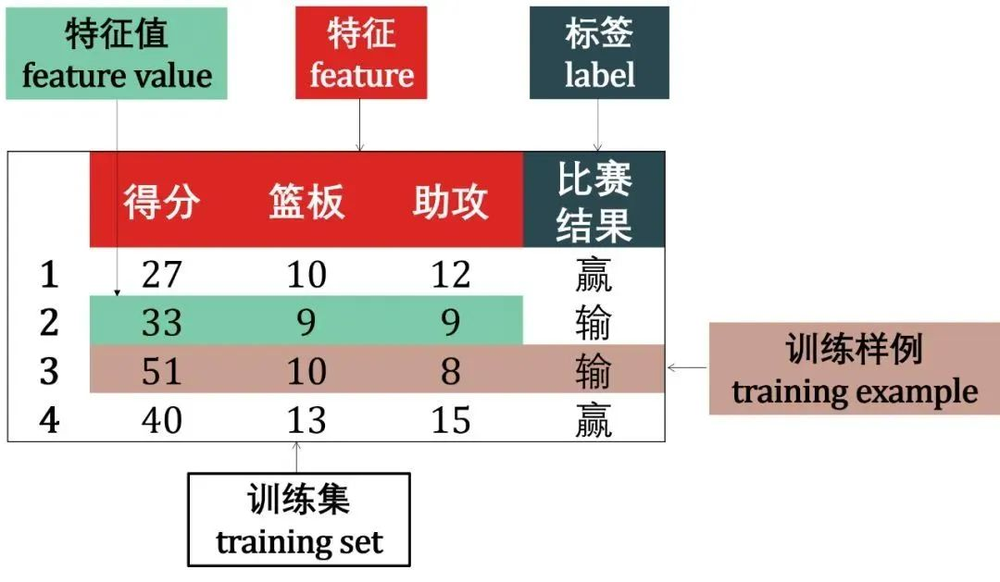
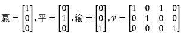
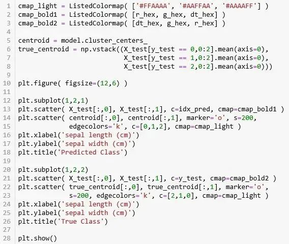

来源：https://mp.weixin.qq.com/s/dEc1Vbfk68e5on6reJPN9Q


Sklearn (全称 Scikit-Learn) 是基于 Python 语言的机器学习工具。它建立在 NumPy, SciPy, Pandas 和 Matplotlib 之上，里面的 API 的设计非常好，所有对象的接口简单，很适合新手上路。


在 Sklearn 里面有六大任务模块：分别是分类、回归、聚类、降维、模型选择和预处理，如下图从其官网的截屏。


要使用上述六大模块的方法，可以用以下的伪代码，注意 **import** 后面我用的都是一些通用名称，如 SomeClassifier, SomeRegressor, SomeModel，具体化的名称由具体问题而定，比如


- SomeClassifier = RandomForestClassifier
- SomeRegressor = LinearRegression
- SomeModel = KMeans, PCA
- SomeModel = GridSearchCV, OneHotEncoder


上面具体化的例子分别是随机森林分类器、线性回归器、K 均值聚类、主成分分析、网格追踪法、独热编码。


**分类 (Classification)**


```
from sklearn import SomeClassifier
from sklearn.linear_model import SomeClassifier
from sklearn.ensemble import SomeClassifier
```

**回归 (Regression)**

```
from sklearn import SomeRegressor
from sklearn.linear_model import SomeRegressor
from sklearn.ensemble import SomeRegressor
```

**聚类 (Clustering)**

```
from sklearn.cluster import SomeModel
```

**降维 (Dimensionality Reduction)**

```
from sklearn.decomposition import SomeModel
```

**模型选择 (Model Selection)**

```
from sklearn.model_selection import SomeModel
```

**预处理 (Preprocessing)**

```
from sklearn.preprocessing import SomeModel
```

SomeClassifier, SomeRegressor, SomeModel 其实都叫做估计器 (estimator)，就像 Python 里「万物皆对象」那样，Sklearn 里「**万物皆估计器**」。

此外，Sklearn 里面还有很多自带数据集供，引入它们的伪代码如下。

**数据集 (Dataset)**

```
from sklearn.datasets import SomeData
```

------

本贴我们用以下思路来讲解：

- 第一章介绍机器学习，从定义出发引出机器学习四要素：**数据、任务、性能度量****和****模型**。加这一章的原因是不把机器学习相关概念弄清楚之后很难完全弄明白 Sklearn。
- 第二章介绍 Sklearn，从其 API 设计原理出发分析其五大特点：**一致性、可检验、标准类、可组合****和****默认值**。最后再分析 Sklearn 里面自带数据以及储存格式。
- 第三章介绍 Sklearn 里面的三大核心 API，包括**估计器、预测器****和****转换器**。这一章的内容最重要，几乎所有模型都会用到这三大 API。
- 第四章介绍 Sklearn 里面的高级 API，即**元****估计器**，有可以大大简化代码量的流水线 (**Pipeline** **估计器**)，有集成模型 (**Ensemble** **估计器**)、有多类别-多标签-多输出分类模型 (**Multiclass 和 Multioutput** **估计器**) 和模型选择工具 (**Model Selection** **估计器**)。


本帖目录如下：

**目录**

**第一章 -** **机器学习简介**


  1.1 定义和组成元素

  1.2 数据

  1.3 任务

  1.4 性能指标

  1.5 模型


**第二章 - Sklearn 数据**


  2.1 数据格式

  2.2 自带数据集


**第三章 - 核心 API**


  3.1 估计器

  3.2 预测器

  3.3 转换器


**第四章 - 高级 API**


  4.1 Ensemble 估计器

  4.2 Multiclass 估计器

  4.3 Multioutput 估计器

  4.4 Model Selection 估计器

  4.5 Pipeline 估计器


**总结**


很多介绍 Sklearn 的文章是不会像我这么详细介绍「机器学习」里的概念的，但是不弄清出这些概念或术语，学 Sklearn 只是走马观花，只看到表面，抓不到实质。


**建议认真仔细读第一章！**

**建议认真仔细读第一章！**

**建议认真仔细读第一章！**


1机器学习简介


1.1**定义和组成元素**

什么是机器学习？字面上来讲就是 (人用) 计算机来学习。谈起机器学习就一定要提起汤姆米切尔 (Tom M.Mitchell)，就像谈起音乐就会提起贝多芬，谈起篮球就会提起迈克尔乔丹，谈起电影就会提起莱昂纳多迪卡普里奥。米切尔对机器学习定义的原话是：

*A computer program is said to learn from experience E with respect to some class of tasks  T and performance measure P if its performance at  tasks in T, as measured by P, improves with experience E.*

整段英文有点抽象难懂对吗？首先注意到两个词 computer program 和 learn，翻译成中文就是机器 (计算机程序) 和学习，再把上面英译中：


*假设用性能度量 P 来评估机器在某类任务 T 的性能，若该机器通利用经验 E 在任务 T 中改善其性能 P，那么可以说机器对经验 E 进行了学习。*


在该定义中，除了核心词机器和学习，还有关键词经验 E，性能度量 P 和任务 T。在计算机系统中，通常经验 E 是以数据 D 的形式存在，而机器学习就是给定不同的任务 T 从数据中产生模型 M，模型 M 的好坏就用性能度量 P 来评估。


由上述机器学习的定义可知机器学习包含四个元素


- 数据 (Data)
- 任务 (Task)
- 性能度量 (Quality Metric)
- 模型 (Model)


' fill='%23FFFFFF'%3E%3Crect x='249' y='126' width='1' height='1'%3E%3C/rect%3E%3C/g%3E%3C/g%3E%3C/svg%3E)


下面四小节分别介绍数据、任务、性能度量和模型。

1.2**数据**

数据 (data) 是经验的另一种说法，也是信息的载体。数据可分为

1. 结构化数据和非结构化数据 (按数据具体类型划分)
2. 原始数据和加工数据 (按数据表达形式划分)
3. 样本内数据和样本外数据 (按数据统计性质划分)

结构化和非结构化

结构数据 (structured data) 是由二维表结构来逻辑表达和实现的数据。非结构化数据是没有预定义的数据，不便用数据库二维表来表现的数据。


**非结构化数据**

非结构化数据包括图片，文字，语音和视屏等如下图。


对于以上的非结构数据，相关应用实例有

- 深度学习的**卷积神经网络** (convolutional neural network, CNN) 对图像数据做人脸识别或物体分类
- 深度学习的**循环神经网络** (recurrent neural network, RNN) 对语音数据做语音识别或机器对话，对文字数据做文本生成或阅读理解
- 增强学习的阿尔法狗 (AlphaGo) 对棋谱数据学习无数遍最终打败了围棋世界冠军李世石和柯洁

 

计算机追根到底还是只能最有效率的处理数值型的结构化数据，如何从原始数据加工成计算机可应用的数据会在后面讲明。


**结构化数据**


机器学习模型主要使用的是结构化数据，即二维的数据表。非结构化数据可以转换成结构化数据，比如把


- 图像类数据里像素张量重塑成一维数组
- 文本类数据用独热编码转成二维数组


对于结构化数据，我们用勒布朗詹姆斯 (Lebron James) 四场比赛的数据举例。



下面术语大家在深入了解机器学习前一定要弄清楚：

 

- 每行的记录 (这是一场比赛詹姆斯的个人统计) ，称为一个**示例** (instance)
- 反映对象在某方面的性质，例如得分，篮板，助攻，称为**特征** (feature) 或**输入** (input)
- 特征上的取值，例如「示例 1」对应的 27, 10, 12 称为**特征值** (feature value)
- 关于示例结果的信息，例如赢，称为**标签** (label) 或**输出** (output)
- 包含标签信息的示例，则称为**样例** (example)，即样例 = (特征, 标签)
- 从数据中学得模型的过程称为**学习** (learning) 或**训练** (training)
- 在训练数据中，每个样例称为**训练样例** (training example)，整个集合称为**训练集** (training set)


原始和加工


计算机处理数值型的结构型数据最有效率，但是现实世界到处出是原始数据，分为两类


- 非结构数据比如图片和文字型数据 (情况一)
- 结构型数据的分类型变量 (情况二)

 


**图像性数据**


拿情况一的图片为例，通过特定函数 imread 将彩色图片用 RGB 像素表示出来，再按红绿蓝的顺序，将所有像素排成一个数值列向量 (column vector)，而计算机可以接受这样的输入。具体转换过程见下图。


**文本型数据**

推特 (twitter) 的每条推文 (tweet) 规定只能发 280 个字符。在编码推文时，将 280 个字符的序列用独热编码 (one-hot encoding) 到包含 128 个字符的 ASCII 表，如下所示。


这样，每条推文都可以编码为 2 维张量形状 (280, 128)，比如一条 tweet 是 “I love python :)”，这句话映射到 ASCII 表变成：


如果收集到 1 百万条推文，那么整个数据集的形状为 (1000000, 280, 128)。传统机器学习的对率回归可以来做情感分析。


**分类型变量**

篮球比赛结果非输即赢，是一个二类 (binary class) 变量


二类变量用「0-1编码」，比如比赛结果= {赢, 输} 表示成 y= [1 0 0 1]，1 代表赢，0 代表输。

而足球比赛结果是有赢、平、输三种，是一个多类 (multi-class) 变量。


多类变量分别用 0, 1, 2 来表示，那么 y = [0 1 0 2]。但更常见的是用独热编码 (one-hot encoding)，即





样本内和样本外


在统计中，把研究对象的全体称为总体 (population)，而把组成总体的各个元素称为个体，把从总体中抽取的若干个体称为样本 (sample)。


举个调查中国男性平均身高的例子：

- 全国的男性就是总体
- 每个男性是个体

 

普查所有男性金钱花费和时间成本太高，通常会抽取若干男性作为样本，计算样本里的男性平均身高作为总体里的所有男性平均身高的推理 (inference)。


统计学中做的事情就是用样本数据的统计 (statistics) 来推出总体数据的参数 (parameter)。样本数据也叫做样本内数据，除样本内数据之外的总体数据叫做样本外数据。

 

在机器学习中，样本内和样本外数据的定义稍微有些不同，如下图：


**样本内数据**是用来训练模型的数据，也叫训练数据。它们是已知的，可计算统计的。


**样本外数据**是未来的没见过的新数据。它们是未知的，不可计算统计的。


机器学习在样本内数据训练模型用来预测：

- **样本内预测**：根据训练模型对样本内数据进行预测，可与已知标签比较来评估模型表现
- **样本外预测**：根据训练模型对样本外数据进行预测，不能与未知的标签比较


机器学习的难点就是如何用好的**样本内预测**来保证好的**样本外预测**，幸运的是我们有〖[**计算学习理论**](http://mp.weixin.qq.com/s?__biz=MzIzMjY0MjE1MA==&mid=2247484832&idx=1&sn=903213a432f8232c603885104c02c0f0&chksm=e89086a9dfe70fbf05503e72c7d1c0ae72b496c5b0062604ec33f9a319ebd336f3a7cc8784fa&scene=21#wechat_redirect)〗来保证它。


1.3**任务**

根据学习的任务模式 (训练数据是否有标签)，机器学习可分为四大类：

1. **有监督学习** (有标签)
2. **无监督学习** (无标签)
3. **半监督学习** (有部分标签)
4. **增强学习** (有评级标签)


**深度学习**只是一种方法，而不是任务模式，因此与上面四类不属于同一个维度，但是深度学习与它们可以叠加成：深度有监督学习、深度非监督学习、深度半监督学习和深度增强学习。**迁移学习**也是一种方法，也可以分类为有监督迁移学习、非监督迁移学习、半监督迁移学习和增强迁移学习。


下图画出机器学习各类之间的关系。


由于 Sklearn 里面模型主要处理「有监督学习」和「无监督学习」两类，我们接下来也只讨论这两类。


有监督学习

有监督学习 (supervised learning) 利用输入数据及其对应标签来训练模型。这种学习方法类似学生通过研究问题和参考答案来学习，在掌握问题和答案之间的对应关系后，学生可自己给出相似新问题的答案了。

 

在有监督学习中，数据 = (特征，标签)，而其主要任务是分类和回归。以上述詹姆斯的个人统计为例。


**分类**

如果预测的是离散值 (discrete value)，例如比赛结果赢或输，此类学习任务称为分类 (classification)。


**回归**

如果预测的是连续值 (continuous value)，例如詹姆斯效率 65.1, 70.3 等等，此类学习任务称为回归 (regression)。


无监督学习


无监督学习 (unsupervised learning) 是找出输入数据的模式。比如，它可以根据电影的各种特征做聚类，用这种方法收集数据为电影推荐系统提供标签。此外无监督学习还可以降低数据的维度，它可以帮助我们更好的理解数据。

 

在无监督学习中，数据 = (特征，)。


**聚类**

除了根据詹姆斯个人统计来预测骑士队输赢或者个人效率值外，我们还可以对该数据做聚类 (clustering)，即将训练集中的数据分成若干组，每组成为一个簇 (cluster)。


假设聚类方法将数据聚成二个簇 A 和 B，如下图


后来发现簇 A 代表赢，簇 B 代表输。聚类的用处就是可以找到一个潜在的原因来解释为什么样例 1 和 3 可以赢球。难道真的是只要詹姆斯三双就可以赢球？


**降维**

**注：下面对降维的理解不是那么严谨，只为了让小白对降维大概有个概念。**


詹姆斯完整统计数据还有抢断、盖帽和犯规，但这些对预测比赛输赢、效率值都没什么用，因此可以通过降维的方法将其去除。


1.4**性能度量**

回归和分类任务中最常见的误差函数以及一些有用的性能度量如下。


回归任务的误差函数估量在数据集 D 上模型的连续型预测值 h(x) 与连续型真实值 y 的距离，h(x) 和 y 可以取任意实数。误差函数是一个非负实值函数，通常使用 ED[h] 来表示。图表展示如下。


分类任务的误差函数估量在数据集 D 上模型的离散型预测值 h(x) 与离散型真实值 y 的不一致程度，惯例是 y 和 h(x) 取±1，比如正类取 1 负类取 -1。图表展示如下。


除上述损失函数之外，分类任务还有很多其他有用的性能度量。

 

**错误率**：分类错误的样本数占样本总数的比例称为错误率 (error rate)，相应的分类正确的样本数占样本总数的比例称为精度 (accuracy)。在 10 个样本中有 2 个样本分类错误，则错误率为 20%，而精度为 80%。

 

**查准率和查全率**：错误率和精度虽然常用，但是不能满足所有任务需求。假定用训练好的模型预测骑士赢球，显然，错误率衡量了多少比赛实际是赢球但预测成输球。但是若我们关心的是“预测出的比赛中有多少是赢球”，或“赢球的比赛中有多少被预测出了”，那么错误率这个单一指标显然就不够用了，这时需要引进更为细分的性能度量，即查准率 (precision) 和查全率 (recall)。


其他概念比如混淆矩阵、ROC、AUC 我们再下帖的实例用到时再细讲。


1.5**模型**

有监督模型如下图所示：


无监督模型包括各种聚类分析 (KMeans, DBSCAN)、主成分分析 (PCA)、独立成分分析 (ICA)、隐含狄利克雷分配 (LDA) 等等。


------

如要了解更多机器学习的细节，**请参考本帖次条的〖机器学习帖子汇总〗**，里面是我写的所有关于「有监督学习」的内容。


费了这么多时间来介绍机器学习，无非就是让大家在使用 Sklearn 时知道自己在做什么，知道那些概念在说什么就够了。


### 2.Sklearn 数据


Sklearn 和之前讨论的 NumPy, SciPy, Pandas, Matplotlib 相似，就是一个处理特殊任务的包，Sklearn 就是处理机器学习 (有监督学习和无监督学习) 的包，更精确的说，它里面有六个**任务模块**和一个**数据引入模块**：


- 有监督学习的**分类****任务**
- 有监督学习的**回归任务**
- 无监督学习的**聚类任务**
- 无监督学习的**降维任务**
- **数据预处理任务**
- **模型选择任务**
- **数据引入**


本节就来看看 Sklearn 里数据格式和自带数据集。


2.1**数据格式**

在 Sklean 里，模型能即用的数据有两种形式：

1. Numpy 二维数组 (ndarray) 的稠密数据 (dense data)，通常都是这种格式。

   

2. SciPy 矩阵 (scipy.sparse.matrix) 的稀疏数据 (sparse data)，比如文本分析每个单词 (字典有 100000 个词) 做独热编码得到矩阵有很多 0，这时用 ndarray 就不合适了，太耗内存。


上述数据在机器学习中通常用符号 X 表示，是模型自变量。它的大小 = [样本数, 特征数]，图下图所示。该房屋数据有 21000 条包括平方英尺，卧室数，楼层，日期，翻新年份等等 21 栏。该数据形状为 [21000, 21]


有监督学习除了需要特征 X 还需要标签 y，而 y 通常就是 Numpy 一维数组，无监督学习没有 y。


2.2**自带数据集**


Sklearn 里面有很多自带数据集供用户使用。

特例描述

还记得〖[**统计可视化之 Seaborn**](http://mp.weixin.qq.com/s?__biz=MzIzMjY0MjE1MA==&mid=2247486949&idx=1&sn=fdc5535c82356c2584933b8b655b329c&chksm=e8908eecdfe707fa20261f801c0bbda6428b848fb04bef5e95b32fc3921d2b134cf4a8b53be8&scene=21#wechat_redirect)〗一贴里鸢尾花的数据集吗？


数据集包括 150 条鸢尾花的四个特征 (萼片长/宽和花瓣长/宽) 和三个类别。在盘 Seaborn 时是从 csv 文件读取的，本帖从 Sklearn 里面的 datasets 模块中引入，代码如下：


```
from sklearn.datasets import load_iris
iris = load_iris()
```


数据是以「字典」格式存储的，看看 iris 的键有哪些。

```
iris.keys()
```

```
dict_keys(['data', 'target', 
            'target_names', 'DESCR',
            'feature_names', 'filename'])
```


键里面的名称解释如下：


- data：特征值 (数组)
- target：标签值 (数组)
- target_names：标签 (列表)
- DESCR：数据集描述
- feature_names：特征 (列表)
- filename：iris.csv 文件路径


具体感受一下 iris 数据中特征的大小、名称和前五个示例。

```
n_samples, n_features = iris.data.shape
print((n_samples, n_features))
print(iris.feature_names)
iris.data[0:5]

"""
(150, 4)

['sepal length (cm)', 'sepal width (cm)', 
  'petal length (cm)', 'petal width (cm)']

array([[5.1, 3.5, 1.4, 0.2],
        [4.9, 3. , 1.4, 0.2],
        [4.7, 3.2, 1.3, 0.2],
        [4.6, 3.1, 1.5, 0.2],
        [5. , 3.6, 1.4, 0.2]])
 """
```


150 个样本，4 个特征，没毛病！再感受一下标签的大小、名称和全部示例。

- 

```
print(iris.target.shape)
print(iris.target_names)
iris.target

"""
(150,)

['setosa' 'versicolor' 'virginica']

array([0, 0, 0, 0, 0, 0, 0, 0, 0, 0, 0, 0, 0, 0, 0, 0, 0, 0, 0, 0, 0, 0,
        0, 0, 0, 0, 0, 0, 0, 0, 0, 0, 0, 0, 0, 0, 0, 0, 0, 0, 0, 0, 0, 0,
        0, 0, 0, 0, 0, 0, 1, 1, 1, 1, 1, 1, 1, 1, 1, 1, 1, 1, 1, 1, 1, 1,
        1, 1, 1, 1, 1, 1, 1, 1, 1, 1, 1, 1, 1, 1, 1, 1, 1, 1, 1, 1, 1, 1,
        1, 1, 1, 1, 1, 1, 1, 1, 1, 1, 1, 1, 2, 2, 2, 2, 2, 2, 2, 2, 2, 2,
        2, 2, 2, 2, 2, 2, 2, 2, 2, 2, 2, 2, 2, 2, 2, 2, 2, 2, 2, 2, 2, 2,
        2, 2, 2, 2, 2, 2, 2, 2, 2, 2, 2, 2, 2, 2, 2, 2, 2, 2])
"""
```


150 个标签，3 类别 (分别用 0, 1, 2 数值来代表 setosa, versicolor, virginica)。


用 Pandas 的 DataFrame (将 X 和 y 合并) 和 Seaborn 的 pairplot (看每个特征之间的关系) 来用表格和图来展示一下数据集的内容。


**Pandas DataFrame**

```
iris_data = pd.DataFrame( iris.data,columns=iris.feature_names )
iris_data['species']=iris.target_names[iris.target]
iris_data.head(3).append(iris_data.tail(3))
```


**Seaborn Pairplot**

```
sns.pairplot( iris_data, hue='species', palette='husl' );
```


正规引入


看完鸢尾花的 iris 数据展示后，现在来看看 Sklearn 三种引入数据形式。


1. **打包好的数据**：对于小数据集，用 sklearn.datasets.load_*
2. **分流下载数据**：对于大数据集，用 `sklearn.datasets.fetch_*`
3. **随机创建数据**：为了快速展示，用 sklearn.datasets.make_*


上面这个星号 * 是什么意思，指的是具体文件名，敲完

- datasets.load_<TAB>
- datasets.fetch_<TAB>
- datasets.make_<TAB>


点击键盘上的 <TAB> 键就可以看到很多完整的文件名，看下面动图就明白了。


Load 一个数字小数据集 digits?

```
digits = datasets.load_digits()
digits.keys()
# dict_keys(['data', 'target', 'target_names','images', 'DESCR'])
```


Fetch 一个加州房屋大数据集 california_housing?


```
california_housing = datasets.fetch_california_housing()
california_housing.keys()
# dict_keys(['data', 'target', 'feature_names', 'DESCR'])
```


Make 一个高斯分位数数据集 gaussian_quantile？

```
gaussian_quantiles = datasets.make_gaussian_quantiles()
type(gaussian_quantiles), len(gaussian_quantiles)
# (tuple, 2)
```


好了，本节讲的就是通过 sklearn 获得数据三种方式。在自己做数据分析时，最常见的还是从 csv 和 txt 文件中通过 Pandas 读取并存储成 DataFrame 的形式，做法在〖[**数据结构之 Pandas (上)**](http://mp.weixin.qq.com/s?__biz=MzIzMjY0MjE1MA==&mid=2247486680&idx=1&sn=ee79e798cb2c00ff4dd02609ca9c494d&chksm=e8908fd1dfe706c71f998ceec4e8c6a44a76778b8382313a5f773319765e8b1116bf3dbbeeec&scene=21#wechat_redirect)〗一贴中讲得很详细了。


#### 3 核心 API


Sklearn 里万物皆估计器。估计器是个非常抽象的叫法，可把它不严谨的当成一个模型 (用来回归、分类、聚类、降维)，或当成一套流程 (预处理、网格最终)。

本节三大 API 其实都是估计器：

1. 估计器 (estimator) 当然是**估计器**
2. 预测器 (predictor) 是具有预测功能的**估计器**
3. 转换器 (transformer) 是具有转换功能的**估计器**


这三句看似废话，其实蕴藏了很多内容。其实我对第 1 点这个估计器的起名不太满意，我觉得应该叫拟合器 (fitter) - 具有拟合功能的估计器。看完这一节你就会明白「拟合器」这种叫法更合理。


3.1**估计器**

**定义：任何可以基于数据集对一些参数进行估计的对象都被称为估计器。**

两个核心点：1. 需要输入数据，2. 可以估计参数。估计器首先被创建，然后被拟合。


**创建估计器**：

需要设置一组超参数，比如

- 线性回归里超参数 normalize=True
- K 均值里超参数 n_clusters=3


在创建好的估计器 model 可以直接访问这些超参数，用 . 符号。

- model.normalize
- model.n_clusters

但 model 中有很多超参数，你不可能一开始都知道要设置什么值，没设置的用 Sklearn 会给个合理的默认值，因此新手不用担心。


**拟合估计器**：需要训练集。在有监督学习中的代码范式为

  model.fit( X_train, y_train )

在无监督学习中的代码范式为

  model.fit( X_train )

拟合之后可以访问 model 里学到的参数，比如线性回归里的特征前的系数 coef_，或 K 均值里聚类标签 labels_。

- model.coef_
- model.labels_


说了这么多抽象的东西，现在展示**有监督学习**的「线性回归」和**无监督学习**的「K 均值」的具体例子。

线性回归


首先从 sklearn 下的 linear_model 中引入 LinearRegression，再创建估计器起名 model，设置超参数 normalize 为 **True**，指的在每个特征值上做标准化，这样会加速数值运算。

```
from sklearn.linear_model import LinearRegression
model = LinearRegression(normalize=True)model
```


创建完后的估计器会显示所有的超参数，比如我们设置好的 normalize=**True**，其他没设置的都是去默认值，比如 n_jobs=**None** 是只用一个核，你可以将其设为 2 就是两核并行，甚至设为 -1 就是电脑里所有核并行。

自己创建一个简单数据集 (没有噪声完全线性) 只为了讲解估计器里面的特征。

```
x = np.arange(10)
y = 2 * x + 1
plt.plot( x, y, 'o' );
```


还记得 Sklearn 里模型要求特征 X 是个两维变量么 (样本数×特征数)？但在本例中 X 是一维，因为我们用 np.newaxis 加一个维度，它做的事情就是把 [1, 2, 3] 转成 [[1],[2],[3]]。再把 X 和 y 丢进 fit() 函数来拟合线性模型的参数。

```
X = x[:, np.newaxis]
model.fit( X, y )
```


拟合完后的估计器和创建完的样子看起来一样，但是已经用「model.param_」可以访问到学好的参数了，展示如下。

```
print( model.coef_ )
print( model.intercept_ )
# [2.]
# 1.0
```


斜率为 2，截距为 1，没毛病。和访问超参数时不一样，注意访问参数要加一个下划线 _。


#### K 均值


首先从 sklearn 下的 cluster 中引入 KMeans，再创建估计器起名 model，设置超参数 n_cluster 为 **3** (为了展示方便而我们知道用的 iris 数据集有 3 类，实际上应该选不同数量的 n_cluster，根据 elbow 图来决定，下帖细讲)。

再者，iris 数据里是有标签 y 的，我们假装没有 y 才能**无监督的聚类**啊，要不然应该做**有监督的分类**的。

```
from sklearn.cluster import KMeans
model = KMeans( n_clusters=3 )
model
```


创建完后的估计器会显示所有的超参数，比如我们设置好的 n_cluster=3，其他没设置的都是去默认值，比如 max_iter=300 是最多迭代次数为 300，算法不收敛也停了。


还记得 iris 里的特征有四个吗 (萼片长、萼片宽、花瓣长、花瓣宽)？四维特征很难可视化，因此我们只取两个特征 (萼片长、萼片宽) 来做聚类并且可视化结果。注意下面代码 X = iris.data[:,0:2]。

```
X = iris.data[:,0:2]
model.fit(X)
```


拟合完后的估计器和创建完的样子看起来一样，但是已经用「model.param_」可以访问到学好的参数了，展示如下。

```
print( model.cluster_centers_, '\n')
print( model.labels_, '\n' )
print( model.inertia_, '\n')
print( iris.target )
```


有点乱，解释一下 KMeans 模型这几个参数：


- model.cluster_centers_：簇中心。三个簇那么有三个坐标。
- model.labels_：聚类后的标签
- model.inertia_：所有点到对应的簇中心的距离平方和 (越小越好)


需要强调的是真实标签 iris.label 和聚类标签 model.labels_ 看起来差的很远。类别 0 都一致，但是类别 1 和 2 弄反了，这是因为在 KMeans 算法里标注的类别索引和真实类别索引不一样 (我现在也没找到什么方法能够让它们一致)。


最后画出两幅图，左图是根据**聚类得到的标签**画出散点图，而右图是根据**真实标签**画出散点图，对比两幅图看很像，聚类的效果还不错是把。画图的代码就不细说了，不懂的话看〖[**基本可视化之 Matplotlib**](http://mp.weixin.qq.com/s?__biz=MzIzMjY0MjE1MA==&mid=2247486895&idx=1&sn=ba9370c3c505e64c10a148d0893c87b6&chksm=e8908ea6dfe707b03697529ff9c4a07e661f68c61ce02247e5e9f91904eff0fa0e29dff18e8e&scene=21#wechat_redirect)〗帖子吧。


#### 小结

虽然上面以**有监督学习**的 LinearRegression 和**无监督学习**的 KMeans 举例，但实际上你可以将它们替换成其他别的模型，比如**有监督学习**的 LogisticRegression 和**无监督学习**的 DBSCAN。它们都是「估计器」，因此都有 fit() 方法。使用它们的通用伪代码如下：


```
# 有监督学习
from sklearn.xxx import SomeModel
# xxx 可以是 linear_model 或 ensemble 等
model = SomeModel( hyperparameter )
model.fit( X, y )
```


```
# 无监督学习
from sklearn.xxx import SomeModel
# xxx 可以是 cluster 或 decomposition 等
model = SomeModel( hyperparameter )
model.fit( X )
```


3.2**预测器**

**定义：预测器在估计器上做了一个延展，延展出预测的功能。**


两个核心点：1. 基于学到的参数预测，2. 预测有很多指标。最常见的就是 predict() 函数：

- model.predict(X_test)：**评估**模型在新数据上的表现
- model.predict(X_train)：**确认**模型在老数据上的表现


因为要做预测，首先将数据分成 80:20 的训练集 (X_train, y_train) 和测试集 (X_test, y_test)，在用从训练集上拟合 fit() 的模型在测试集上预测 predict()。


```
from sklearn.datasets import load_iris
iris = load_iris()
```


```
from sklearn.model_selection import train_test_split
X_train, X_test, y_train, y_test = train_test_split( iris['data'],                     iris['target'],                     test_size=0.2 )
print( 'The size of X_train is ', X_train.shape )print( 'The size of y_train is ', y_train.shape )print( 'The size of X_test is ', X_test.shape )print( 'The size of y_test is ', y_test.shape )
# The size of X_train is (120, 4)
# The size of y_train is (120,)
# The size of X_test is (30, 4)
# The size of y_test is (30,)
```


让我们来看个**有监督学习**的「对率回归」和继续上节**无监督学习**的「K 均值」的例子。


##### 对率回归

首先从 sklearn 下的 linear_model 中引入 LogisticRegression，再创建估计器起名 model，设置超参数 mutli_class 为 **multinomial** 因为有三种鸢尾花，是个多分类问题。

接着再训练集上拟合参数，这时估计器 model 里面已经可以访问这些参数了。


```
predict` & `predict_proba
```


对于分类问题，我们不仅想知道预测的类别是什么，有时还想知道预测该类别的信心如何。前者用 predict()，后者用 predict_proba()。


代码如下，在测试集上比较预测标签 y_pred 和真实标签 y_test 发现它们完全吻合，准确率 100% (iris 数据太简单)。

```
y_pred = model.predict( X_test )
p_pred = model.predict_proba( X_test )
print( y_test, '\n' )
print( y_pred, '\n' )
print( p_pred )
```


解释一下 p_pred - 测试集里有 30 个数据，鸢尾花有 3 类，因此 predict_proba() 生成一个 30×3 的数组，每行的概率加起来为 1。


为了验证我们的理解，我们看 Sklearn 是不是把「每行中最大概率值对应的那一类」作为预测结果。

```
s = ['Class 1 Prob', 'Class 2 Prob', 'Class 3 Prob']
prob_DF = pd.DataFrame( p_pred, columns=s )
prob_DF['Predicted Class'] = y_pred
prob_DF.head()
```


是的！前三行 Class 1 Prob 最大，预测是第一类；第四行 Class 2 Prob 最大，预测是第二类；第四行 Class 3 Prob 最大，预测是第三类。


```
score` & `decision_function
```


预测器里还有额外的两个函数可以使用。在分类问题中

- score() 返回的是分类准确率
- decision_function() 返回的是每个样例在每个类下的分数值


```
print( model.score( X_test, y_test ) )
print( np.sum(y_pred==y_test)/len(y_test) )
# 1.0
# 1.0
```


```
decision_score = model.decision_function( X_test )
print( decision_score )
```


为了验证我们的理解，我们看 Sklearn 是不是把「每行中最高得分值对应的那一类」作为预测结果。


```
s = ['Class 1 Score', 'Class 2 Score', 'Class 3 Score']
decision_DF = pd.DataFrame( decision_score, columns=s )
decision_DF['Predicted Class'] = y_pred
decision_DF.tail()
```


是的！前两行 Class 3 Score 最大，预测是第三类；后三行 Class 1 Score 最大，预测是第一类。


#### K 均值

继续上一节的 KMeans 模型，首先用 fit() 训练。


再用 predict() 在测试集上预测出类别 inx_pred，和真实标签 y_test 比对。再次强调，inx_pred 和 y_test 给三个类别的索引定义是不同的。

```
idx_pred = model.predict( X_test[:,0:2] )
print( index_pred )
print( y_test )
```


最后画出两幅图 (都是在测试集上)，左图是根据**聚类预测的标签**画出散点图，而右图是根据**真实标签**画出散点图，对比两幅图看很像，聚类的效果也不错。





KMeans 模型里也有 score() 函数，输出是值是它要优化的目标函数的对数。

```
model.score( X_test[:,0:2] )
# -9.662259042197803
```


#### 小节

估计器都有 fit() 方法，预测器都有 predict() 和 score() 方法，言外之意不是每个预测器都有 predict_proba() 和 decision_function() 方法，这个在用的时候查查官方文档就清楚了 (比如 RandomForestClassifier 就没有 decision_function() 方法)。


使用它们的通用伪代码如下：

```
# 有监督学习
from sklearn.xxx import SomeModel
# xxx 可以是 linear_model 或 ensemble 等
model = SomeModel( hyperparameter )
model.fit( X, y )
y_pred = model.predict( X_new )
s = model.score( X_new )
```


```
# 无监督学习
from sklearn.xxx import SomeModel
# xxx 可以是 cluster 或 decomposition 等
model = SomeModel( hyperparameter )
model.fit( X )
idx_pred = model.predict( X_new )
s = model.score( X_new )
```


3.3**转换器**

**定义：转换器也是一种估计器，两者都带拟合功能，但\**估计器做完\**拟合来预测，而\**转换器做完\**拟合来转换。**

核心点：估计器里 fit + predict，转换器里 fit + transform。


本节介绍两大类转换器

1. 将分类型变量 (categorical) 编码成数值型变量 (numerical)
2. 规范化 (normalize) 或标准化 (standardize) 数值型变量


#### 分类型变量编码

**LabelEncoder & OrdinalEncoder**


`LabelEncoder` 和 OrdinalEncoder 都可以将字符转成数字，但是


- `LabelEncoder` 的输入是一维，比如 1d ndarray
- OrdinalEncoder 的输入是二维，比如 DataFrame


首先给出要编码的列表 enc 和要解码的列表 dec。

```
enc = ['win','draw','lose','win']
dec = ['draw','draw','win']
```


从 sklearn 下的 preprocessing 中引入 LabelEncoder，再创建转换器起名 LE，不需要设置任何超参数。 


```
from sklearn.preprocessing import LabelEncoder
LE = LabelEncoder()
print( LE.fit(enc) )
print( LE.classes_ )
print( LE.transform(dec) )
# LabelEncoder()
# ['draw' 'lose' 'win']
# [0 0 2]
```


上面结果解释如下

- 第 4 行转换器 fit 之后还是转换器，只不过从数据 enc 上学到了些东西
- 第 5 行的 LE.classes_ 就是学到的东西之一，系统把 'draw', 'lose', 'win' 分别赋予 0, 1, 2
- 第 6 行用学到的东西来解码 ['draw','draw','win'] 得到 [0 0 2]


除了LabelEncoder 能编码，OrdinalEncoder 也可以。首先从 sklearn 下的 preprocessing 中引入 OrdinalEncoder，再创建转换器起名 OE，不需要设置任何超参数。下面结果和上面类似，就不再多解释了。

```
from sklearn.preprocessing import OrdinalEncoder
OE = OrdinalEncoder()
enc_DF = pd.DataFrame(enc)
dec_DF = pd.DataFrame(dec)
print( OE.fit(enc_DF) )
print( OE.categories_ )
print( OE.transform(dec_DF) )

"""
OrdinalEncoder(categories='auto', dtype=<class 'numpy.float64'>)

[array(['draw', 'lose', 'win'], dtype=object)]

[[0.]
 [0.]
 [2.]]
 """
```


------

上面这种编码的问题是，机器学习算法会认为两个临近的值比两个疏远的值要更相似。显然这样不对 (比如，**0 和 1** 比 **0 和 2** 距离更近，难道 **draw 和 win** 比 **draw 和 lose** 更相似？)。


要解决这个问题，一个常见的方法是给每个分类创建一个二元属性，即独热编码 (one-hot encoding)。如何用它看下段。


**OneHotEncoder**


独热编码其实就是把一个整数用向量的形式表现。下图就是对数字 0-9 做独热编码。


转换器 OneHotEncoder 可以接受两种类型的输入：


1. 用 LabelEncoder 编码好的一维数组
2. DataFrame 


------

**一.** 用 LabelEncoder 编码好的一维数组 (元素为整数)，重塑 (用 reshape(-1,1)) 成二维数组作为 OneHotEncoder 输入。

```
from sklearn.preprocessing import OneHotEncoder
OHE = OneHotEncoder()
num = LE.fit_transform( enc )
print( num )

OHE_y = OHE.fit_transform( num.reshape(-1,1) )
OHE_y
"""
[2 0 1 2]

<4x3 sparse matrix of type 
'<class 'numpy.float64'>'
with 4 stored elements 
in Compressed Sparse Row format>
"""
```


上面结果解释如下


- 第 5 行打印出编码结果 [2 0 1 2]
- 第 6 行将其转成独热形式，输出是一个「稀疏矩阵」形式，因为实操中通常类别很多，因此就一步到位用稀疏矩阵来节省内存


想看该矩阵里具体内容，用 toarray() 函数。

- 

```
OHE_y.toarray()
"""
array([[0., 0., 1.],
        [1., 0., 0.],
        [0., 1., 0.],
        [0., 0., 1.]])
"""
```


------

**二.** 用 DataFrame作为 OneHotEncoder 输入。

```
OHE = OneHotEncoder()
OHE.fit_transform( enc_DF ).toarray()
"""
array([[0., 0., 1.],
        [1., 0., 0.],
        [0., 1., 0.],
        [0., 0., 1.]])
"""
```


和上面结果类似，不解释了。


##### 特征缩放


数据要做的最重要的转换之一是特征缩放 (feature scaling)。当输入的数值的量刚不同时，机器学习算法的性能都不会好。


具体来说，对于某个特征，我们有两种方法：

 

- 标准化 (standardization)：每个维度的特征减去该特征均值，除以该维度的标准差。

  

- 规范化 (normalization)：每个维度的特征减去该特征最小值，除以该特征的最大值与最小值之差。


**MinMaxScaler**


整套转换器「先创建再 fit 在 transform」的流程应该很清楚了。自己读下面代码看看是不是秒懂。唯一需要注意的就是输入 X 要求是两维。


```
from sklearn.preprocessing import MinMaxScaler
X = np.array( [0, 0.5, 1, 1.5, 2, 100] )
X_scale = MinMaxScaler().fit_transform( X.reshape(-1,1) )
X_scale
"""
array([[0. ],
        [0.005],
        [0.01 ],
        [0.015],
        [0.02 ],
        [1. ]])
"""
```


**StandardScaler**

牢记转换器「先创建再 fit 在 transform」的流程就行了。

```
from sklearn.preprocessing import StandardScaler
X_scale = StandardScaler().fit_transform( X.reshape(-1,1) )
X_scale

"""
array([[-0.47424487],
        [-0.46069502],
        [-0.44714517],
        [-0.43359531],
        [-0.42004546],
        [ 2.23572584]])
"""
```


警示：fit() 函数只能作用在训练集上，千万不要作用在测试集上，要不然你就犯了数据窥探的错误了！拿标准化举例，用训练集 fit 出来的**均值**和**标准差**参数，来对测试集做标准化。


#### 4.高级 API

Sklearn 里核心 API 接口是估计器，那高级 API 接口就是元估计器 (meta-estimator)，即由很多基估计器 (base estimator) 组合成的估计器。


类比〖[**Python 入门篇 (下)**](http://mp.weixin.qq.com/s?__biz=MzIzMjY0MjE1MA==&mid=2247486498&idx=1&sn=b5409de0fe394c49359eac9b67fb9ce4&chksm=e8908f2bdfe7063d2bb71587d621ff46f541f556e8a1abe828509bf3fef9144afd74580b47f8&scene=21#wechat_redirect)〗一贴里的把函数当成参数的高阶函数，元估计器把估计器当成参数。代码范式大概如下：


  meta_model( base_model )


本节讨论五大元估计器，分别带集成功能的 ensemble，多分类和多标签的 multiclass，多输出的 multioutput，选择模型的 model_selection，和流水线的 pipeline。


- ensemble.BaggingClassifier
- ensemble.VotingClassifier
- multiclass.OneVsOneClassifier
- multiclass.OneVsRestClassifier
- multioutput.MultiOutputClassifier
- model_selection.GridSearchCV
- model_selection.RandomizedSearchCV
- pipeline.Pipeline


在下面五节，我们会用的鸢尾花数据 iris 和数字数据 digits，还有一些自己创建的数据。


4.1**Ensemble 估计器**

**Ensemble 估计器**是用来做集成学习，该估计器里面有若干个分类器 (classifier) 或回归器 (regressor)。详情参考〖[**集成学习前传**](http://mp.weixin.qq.com/s?__biz=MzIzMjY0MjE1MA==&mid=2247484557&idx=1&sn=f99383ad7968cbfa6da314f59d8b2c2d&chksm=e8908784dfe70e92d6ad3677aa00e53f4e5de7809e51e71283cc705fe35ef3106b82a0e407c9&scene=21#wechat_redirect)〗一贴。


- 分类器统计每个子分类器的预测类别数，再用「多数投票」原则得到最终预测。
- 回归器计算每个子回归器的预测平均值。


最常用的 Ensemble 估计器排列如下：


- `AdaBoostClassifier`: 逐步提升分类器
- `AdaBoostRegressor`: 逐步提升回归器
- `BaggingClassifier`: 装袋分类器
- `BaggingRegressor`: 装袋回归器
- `GradientBoostingClassifier`: 梯度提升分类器
- `GradientBoostingRegressor`: 梯度提升回归器
- `RandomForestClassifier`: 随机森林分类器
- `RandomForestRegressor`: 随机森林回归器
- `VotingClassifier`: 投票分类器
- `VotingRegressor`: 投票回归器


我们用鸢尾花数据 iris，拿


- 含**同质**估计器 RandomForestClassifier 
- 含**异质**估计器 VotingClassifier 


来举例。首先将数据分成 80:20 的训练集和测试集，并引入 metrics 来计算各种性能指标。

```
from sklearn.datasets import load_iris
iris = load_iris()
```

```
from sklearn.model_selection import train_test_split
from sklearn import metrics
X_train, X_test, y_train, y_test = train_test_split( iris['data'],iris['target'],test_size=0.2 )
```


**RandomForestClassifier**

随机森林 (random forest) 是决策树 (decision tree) 的一种集成模型，每棵决策树处理的数据用装袋法 (bagging) 生成。随机森林可以减小预测的方差，并且可以评估特征重要性。详情参考〖[**随机森林和提升树**](http://mp.weixin.qq.com/s?__biz=MzIzMjY0MjE1MA==&mid=2247484605&idx=1&sn=6e66f2751d91d8af0661d86f096f8e17&chksm=e89087b4dfe70ea2f42eed70683b5967c030b608da3dddb336f017fb9ab5acbf4fb880126f2f&scene=21#wechat_redirect)〗一贴。

RandomForestClassifier 通过控制 n_estimators 超参数来决定基估计器的个数，本例是 4 棵决策树 (森林由树组成)；此外每棵树的最大树深为 5 (max_depth=5)。

```
from sklearn.ensemble import RandomForestClassifier
RF = RandomForestClassifier( n_estimators=4, max_depth=5 )RF.fit( X_train, y_train )
```


估计器有 fit()，元估计器当然也有 fit()。在估计器那一套又可以照搬到元估计器 (起名 RF) 上了。看看 RF 里包含的估计器个数和其本身。

```
print( RF.n_estimators )
RF.estimators_
```


拟合 RF 完再做预测，用 metrics 里面的 accuracy_score 来计算准确率。训练准确率 98.33%，测试准确率 100%。

```
print ( "RF - Accuracy (Train):  %.4g" %metrics.accuracy_score(y_train, RF.predict(X_train)) )
print ( "RF - Accuracy (Test):  %.4g" %metrics.accuracy_score(y_test, RF.predict(X_test)) )
```


**VotingClassifier**

和随机森林由同质分类器「决策树」不同，投票分类器由若干个异质分类器组成。下例用 VotingClassifier 建立个含有对率回归 (LR)、随机森林 (RF) 和高斯朴素贝叶斯 (GNB) 三个分类器的集成模型。


RandomForestClassifier 的基分类器只能是决策树，因此只用通过控制 n_estimators 超参数来决定树的个数，而 VotingClassifier 的基分类器要实实在在的输入其本身。


看看 Ensemble 里包含的估计器个数和其本身。


```
print( len(Ensemble.estimators_) )
Ensemble.estimators_
```


比如元估计器和它三个组成元素的表现。还是集成后的 Ensemble 表现最好。

```
LR.fit( X_train, y_train )
RF.fit( X_train, y_train )
GNB.fit( X_train, y_train )
```


```
LR - Accuracy (Train): 0.975
RF - Accuracy (Train): 0.9833
GNB - Accuracy (Train): 0.95
Ensemble - Accuracy (Train): 0.9833

LR - Accuracy (Test): 1
RF - Accuracy (Test): 1
GNB - Accuracy (Test): 1
Ensemble - Accuracy (Test): 1
```


4.2**Multiclass 估计器**

sklearn.multiclass 可以处理多类别 (multi-class) 的多标签 (multi-label) 的分类问题。

从小节 4.2 到 4.4，我们都会使用数字数据集 digits。首先将数据分成 80:20 的训练集和测试集。


```
from sklearn.datasets import load_digits
digits = load_digits()
digits.keys()

# dict_keys(['data', 'target', 'target_names', 'images', 'DESCR'])
```


```
X_train, X_test, y_train, y_test = train_test_split( digits['data'],digits['target'],test_size=0.2 )
print( 'The size of X_train is ', X_train.shape )
print( 'The size of y_train is ', y_train.shape )
print( 'The size of X_test is ', X_test.shape )
print( 'The size of y_test is ', y_test.shape )

"""
The size of X_train is (1437, 64)
The size of y_train is (1437,)
The size of X_test is (360, 64)
The size of y_test is (360,)
"""
```


训练集和测试集分别有 1437 和 360 张图像。每张照片是包含 8×8 的像素，将其打平 (flatten) 把 2 维的 8×8 重塑成 1 维的 64。

看看训练集中前 100 张图片和对应的标签 (左下角蓝色小字)。像素很低 (为了我们跑模型快些)，但基本上还是能看清。


##### 多类别分类

手写数字有 0-9 十类，但手头上只有两分类估计器 (比如像支撑向量机) 怎么用呢？我们可以采取下面三种常见策略：

- **一对一** (One vs One, OvO)：一个分类器用来处理数字 0 和数字 1，一个用来处理数字 0 和数字 2，一个用来处理数字 1 和 2，以此类推。N 个类需要 N(N-1)/2 个分类器。

  

- **一对其他** (One vs All, OvA)：训练 10 个二分类器，每一个对应一个数字，第一个分类 1 和「非1」，第二个分类 2 和「非2」，以此类推。N 个类需要 N 个分类器。

  

**OneVsOneClassifier**

考虑一个具体天气多分类问题，天气可以是晴天、阴天和雨天，在 OvO 中，三个分类器为 f1 , f2 和 f3 。

- f1 负责分类三角形和正方形
- f2 负责分类三角形和圆形
- f3 负责分类圆形和正方形


结果如下

- f1 预测 ▲
- f2 预测 ▲ 
- f3 预测 ●


根据多数原则得到的结合预测为 ●，如下图所示。


回到数字分类问题上，代码如下：


10 类 45 个 OvO 分类器，没错，10*9/2 = 45。

```
print( len(ovo_lr.estimators_) )
ovo_lr.estimators_
```


训练集分类全对，测试集准确率 98%。


**OneVsRestClassifier**

在 OvA 中，把数据分成“某个”和“其他”

 

- 图一，某个 = 三角形，其他 = 正方形和圆形
- 图二，某个 = 正方形，其他 = 三角形和圆形
- 图三，某个 = 圆形，其他 = 三角形和正方形


三分类分解成三个二分类，对应的分类器为 f1 , f2 和 f3 。


- f1 预测负类，即预测 ● 和 ◼
- f2 预测负类，即预测 ▲ 和 ●
- f3 预测正类，即预测 ●


三个分类器都预测了 ●，根据多数原则得到的预测是 ●。


回到数字分类问题上，代码如下：


10 类 45 个 OvA 分类器，没错。

```
print( len(ova_lr.estimators_) )
ova_lr.estimators_
```


训练集准确率几乎 100%，测试集准确率 96%。


多标签分类


到目前为止，所有的样例都总是被分配到仅一个类。有些情况下，你也许想让分类器给一个样例输出多个类别。在无人驾驶的应用中，在下图识别出有车和指示牌，没有交通灯和人。


我们不打算深入物体识别。先看一个简单点的例子，仅仅是为了阐明「多标签分类」的原理。在手写数字的例子上，我们特意为每个数字设计了多标签：


- 标签 1 - 奇数、偶数
- 标签 2 - 小于等于 4，大于 4


再建立多标签 y_train_multilabel，代码如下 (OneVsRestClassifier 也可以用来做多标签分类)：

```
from sklearn.multiclass import OneVsRestClassifier
y_train_multilabel = np.c_[ y_train%2==0, y_train<=4 ]
print(y_train_multilabel)
"""
[[ True True]
 [False False]
 [False False]
 ...
 [False False]
 [False False]
 [False False]]
 """
```


看下图训练集第 1 和 2 个图片是数字 4 和 5，对应上面两标签当然是


- [True True]：4 是偶数，小于等于 4
- [False False]：5 不是偶数，大于 4


训练模型，只不过这时用的是 y_train_multilabel。


有两个估计器，每个对应一个标签。

```
print( len(ova_ml.estimators_) )ova_ml.estimators_
```


展示一下测试集上 100 张图片。


第一张图片是数字 2，它是偶数 (标签 1 为 true)，小于等于 4 (标签 2 为 true)。

```
print( y_test[:1] )
print( ova_ml.predict(X_test[:1,:]) )
"""
[2]
[[1 1]]
"""
```


4.3**Multioutput 估计器**

sklearn.multioutput 可以处理多输出 (multi-output) 的分类问题。


多输出分类是多标签分类的泛化，在这里每一个标签可以是多类别 (大于两个类别) 的。一个例子就是预测图片每一个像素(标签) 的像素值是多少 (从 0 到 255 的 256 个类别)。


Multioutput 估计器有两个：


- `MultiOutputRegressor`: 多输出回归  
- `MultiOutputClassifier`: 多输出分类


本节只关注多输出分类。


**MultiOutputClassifier**


首先引入 MultiOutputClassifier 和 RandomForestClassifier。你看，这两个都是元估计器，因此在 Sklearn 里面估计器可以随意组合。

```
from sklearn.multioutput import MultiOutputClassifier
from sklearn.ensemble import RandomForestClassifier
```

在手写数字的例子上，我们也为特意每个数字设计了多标签而且每个标签的类别都大于二。


- 标签 1 - 小于等于 4，4 和 7 之间，大于等于 7 (三类)

- 标签 2 - 数字本身 (十类)

  

代码如下：


用含有 100 棵决策树的随机森林来解决这个多输入分类问题。


看看这个模型在测试集前五张照片上的预测。

```
MO.predict( X_test[:5,:] )

"""
array([[0, 2],
        [0, 2],
        [0, 0],
        [2, 9],
        [1, 5]])
"""
```


这个 ndarray 第一列是标签 1 的类别，第二列是标签 2 的类别。预测结果是这五张照片分别显示数字 2, 2, 0, 9, 5 (标签 2)，它们前三个数 2, 2, 0 都**小于等于 4** (**标签 1 第一类**)，第四个数 9 **大于等于 7** (**标签 1 第二类**)，而第五个数 5 在 **4 和 7 之间** (**标签 1 第三类**)。


再看看真实标签。

```
y_test_1st = y_test.copy()y_test_1st[ y_test<=4 ] = 0y_test_1st[ np.logical_and(y_test>4, y_test<7) ] = 1y_test_1st[ y_test>=7 ] = 2
y_test_multioutput = np.c_[ y_test_1st, y_test ]
y_test_multioutput[:5]
array([[0, 2],
       [0, 2],
       [0, 0],
       [2, 9],
       [1, 5]])
```


相当好！


##### 4.4**Model Selection 估计器**

模型选择 (Model Selction) 在机器学习非常重要，它主要用于评估模型表现，常见的 Model Selection 估计器有以下几个：

- `cross_validate`: 评估交叉验证的表现。
- `learning_curve`: 建立学习曲线。  
- `GridSearchCV`: 用交叉验证从网格中一组超参数搜索出最佳超参数。
- `RandomizedSearchCV`: 用交叉验证从一组随机超参数搜索出最佳超参数。


本小节关注调节超参数的两个估计器，即上面列出的最后两个。它们都要用到交叉验证，先来了解一下这个知识点。


##### **交叉验证**


K-折交叉验证集 (K-fold cross validation set)，就是把整个数据集平均但随机分成 K 份，每份大概包含 m/K 个数据 (m 是总数据数)。

在这 K 份，每次选 1 份作为训练集在拟合参数 wλ，把参数用在剩下 K-1 份验证集上计算误差。由于遍历了这 K 份数据，因此该操作称为交叉验证。

如何通过选择交叉验证误差来选择模型描述如下。


接下来我们来看这两个调参的估计器，网格追踪和随机追踪。


**网格追踪**：**参数 1** 在 [1, 10, 100, 1000] 中取值，**参数 2** 在 [0.01, 0.1, 1 10] 中取值，注意并不是等间距取值。模型在所有 16 个组合跑，选取一对对应最小交叉验证误差的参数。


**随机追踪**：根据指定分布随机搜索，可以选择独立于参数个数，比如 log(**参数 1**) 服从 0 到 3 的均匀分布， log(**参数 2**) 服从 -2 到 1 的均匀分布。此外，会设定一个预算参数。


原理讲清楚了，看代码吧。


解释一下代码：


- 前 10 行就是引入各种包，并准备好 X 和 y，创建一个含 20 个决策树的随机森林模型，那么它有超参数最大树深、最多特征数、最小可分裂样本数、和分裂标准。

- 第 12-27 行是运行**随机追踪**，关键点是建立了一个参数分布 (param_dist)，而且还预先设定了个迭代组数 n_iter_search=20。

- 第 22-42 行是运行**网格追踪**，关键点是建立了一个参数网格 (param_grid)。


解释一下运行结果：

- 第一行输出每种追踪法运行的多少次和花的时间。
- 第二行输出最佳超参数的组合。
- 第三行输出最高得分。


由上面结果可知，**随机追踪**比***\*网格追踪\****用更短时间内找到一组超参数，获得了更高的得分。


##### 4.5**Pipeline 估计器**

Pipeline 估计器又叫流水线，把各种估计器串联 (Pipeline) 或并联 (FeatureUnion) 的方式组成一条龙服务。用好了它真的能大大提高效率。


**Pipeline**

Pipeline 将若干个估计器按顺序连在一起，比如

  **特征提取 -> 降维 -> 拟合 -> 预测**

在整个 Pipeline 中，它的属性永远和最后一个估计器属性一样

- 如果最后一个估计器是预测器，那么 Pipeline 是预测器
- 如果最后一个估计器是转换器，那么 Pipeline 是转换器


下面用一个简单例子来说明如果用 Pipeline 来做「先填补缺失值-再标准化」这两步的。先生成含缺失值 NaN 的数据 X。


首先引入 Pipeline，再引入

- 处理缺失值的转换器 SimpleImputer
- 做规划化的转换器 MinMaxScaler


第 4-7 行创建了流水线，范式非常简单，就在 Pipeline() 里一个输入「含名称的估计器的列表」。SimpleImputer 起名叫 impute，MinMaxScaler起名叫 normalize。


由于最后一个估计器是转换器，因此 pipe 也是个转换器。写好了就可以那它来做「先填补缺失值-再标准化」的重复工作了。


看看运行结果，值都被填满了，而且两列也被标准化了。


来验证上面流水线的参数，我们可以按顺序来运行这两个转换器，结果是一样的。


##### **FeatureUnion**


如果我们想在一个节点同时运行几个估计器，我们可用 FeatureUnion。下例首先建立一个 DataFrame，

- 前两列智力 IQ 和脾气 temper 都是分类型变量
- 后两列收入 income 和身高 height 都是数值型变量
- 每列中都有缺失值


我们现在按下列步骤来清洗数据。

- **对分类型变量**：获取 -> 中位数填充 -> 独热编码
- **对数值型变量**：获取 -> 均值填充 -> 标准化


上面两步是平行进行的。

首先我们自己定义一个从 DataFrame 里面获取每列的类，起名叫 `DataFrameSelector`。


**知识点**


代码不难，主要就是 transform 函数中，将输入的 DataFrame X 根据属性名称来获取其值。


接下来建立一个流水线 full_pipe，它并联着两个流水线


- categorical_pipe 处理分类型变量

  - DataFrameSelector 用来获取
  - SimpleImputer 用出现最多的值来填充 None
  - OneHotEncoder 来编码返回非稀疏矩阵

  

- numeric_pipe 处理数值型变量

  - DataFrameSelector 用来获取
  - SimpleImputer 用均值来填充 NaN
  - normalize 来规范化数值


下面代码非常漂亮。


将结果打印出来，齐活！

```
X_proc = full_pipe.fit_transform( X )
print( X_proc )
"""
[[1.         0.12 0. 1. 0. 0. 1. ]
 [0.77777778 0.72 1. 0. 0. 1. 0. ]
 [0.55555556 0.48 1. 0. 0. 0. 1. ]
 [0.         0.52 0. 0. 1. 1. 0. ]
 [0.04444444 1.   0. 1. 0. 1. 0. ]
 [0.11111111 0.   1. 0. 0. 1. 0. ]
 [0.08888889 0.92 0. 1. 0. 1. 0. ]
 [0.34166667 0.52 0. 1. 0. 1. 0. ]
 [0.15555556 0.4  0. 1. 0. 1. 0. ]]
 """
```


#### 5.总结


Sklearn 里面设计 API 遵循五大原则。

##### 一致性


所有对象的接口一致且简单，在「估计器」中

- 创建：model = Constructor(hyperparam)
- 拟参：
  - 有监督学习 - `model.fit(X_train, y_train)`
  - 无监督学习 - model.fit(X_train)


在「预测器」中

- 有监督学习里预测标签：`y_pred = model.predict(X_test)`
- 无监督学习里识别模式：idx_pred = model.predict( Xtest)


在「转换器」中

- 创建：`trm = Constructor(hyperparam)`
- 获参：trm.fit(X_train)
- 转换：X_trm = trm.transform(X_train)


##### 可检验

所有估计器里**设置的超参数**和**学到的参数**都可以通过实例的变量直接访问来检验其值，区别是**超参数**的名称最后没有下划线 _，而**参数**的名称最后有下划线 _。举例如下：

- 通例：model.hyperparameter
- 特例：SVC.kernel
- 通例：model.parameter_
- 特例：SVC.support_vectors_


##### 标准类

Sklearn 模型接受的数据集的格式只能是「Numpy 数组」和「Scipy 稀疏矩阵」。超参数的格式只能是「字符」和「数值」。

不接受其他的类！


##### 可组成

模块都能重复「连在一起」或「并在一起」使用，比如两种形式流水线 (pipeline)


1. 任意转换器序列 
2. 任意转换器序列 + 估计器


##### 有默认

Sklearn 给大多超参数提供了合理的默认值，大大降低了建模的难度。


------

结合本帖讲的总结一套机器学习的初级框架：

**确定任务**：是「有监督」的分类或回归？还是「无监督」的聚类或降维？确定好后基本就能知道用 Sklearn 里哪些模型了。

**数据预处理**：这步最繁琐，要处理缺失值、异常值；要编码分类型变量；要正规化或标准化数值型变量，等等。但是有了 Pipeline 神器一切变得简单高效。

**训练和评估**：这步最简单，训练用估计器 fit() 先拟合，评估用预测器 predict() 来评估。

**选择模型**：启动 Model Selection 估计器里的 GridSearchCV 和 RandomizedSearchCV，选择得分最高的那组超参数 (即模型)。


------

本帖讲的东西有点抽象，但最核心的东西就是弄懂**估计器**以及**元估计器**的原理。剩下的就是 

1) 了解各种模型，
2) 知道模型中每个参数的含义，
3) 查阅 Sklearn 官方文档。非深度的机器学习不像深度学习有那么多调参技巧 (tuning trick)，按照上面那套框架足够了。


如果你还是觉得抽象，下篇来做三件事

1. 画出各种估计器和元估计图的流程图
2. 用 Scikit-Learn 玩转一些实例并深入解释一些性能指标
3. 介绍在机器学习中用到可视化工具 Scikit-Plot