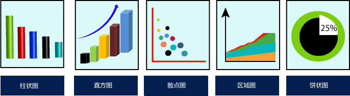
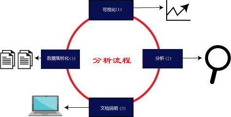

- 如果将文本数据与图表数据相比较，人类的思维模式更适合于理解后者，原因在于图表数据更加直观且形象化，它对于人类视觉的冲击更强，这种使用图表来表示数据的方法被叫做数据可视化。

  

  
  图1：数据可视化
   

  当使用图表来表示数据时，我们可以更有效地分析数据，并根据分析做出相应的决策。在学习 Matplotlib 之前，了解什么是数据可视化是非常有必要的。

  ## 数据可视化

  图表为更好地探索、分析数据提供了一种直观的方法，它对最终分析结果的展示具有重要的作用。

  数据可视化是一个新兴名词，它表示用图表的形式对数据进行展示。当您对一个数据集进行分析时，如果使用数据可视化的方式，那么您会很容易地确定数据集的分类模式、缺失数据、离群值等等。下图展示了五个常用的数据可视化图表：

  

  
  图2：数据可视化常用图表
   

  对于组织决策者而言，数据可视化也只是一种辅助工具，从寻找数据间关联到最终做出决定，大致分为以下四步。如下图所示：

  

  
  图3：组织者决策流程图

  
  下面对图 3 中的流程进行简要说明：

  - 可视化（Visualize）：使用不同种类的图表对原始数据进行可视化处理，使复杂的数据更容易理解与使用；
  - 分析（Analysis）：数据分析的目的是获取有用的信息，这个过程主要涉及对数据的清洗、检查、转换以及对数据的建模；
  - 文档说明（Document insight）：文档说明属于整理、汇总阶段，将有用的数据或者信息整理出来；
  - 数据集转换（Transform Data Set）：指将数据进行分类、分级、统计记录格式与编码格式等。

  ## 数据可视化应用场景

  数据可视化主要有以下应用场景：

  - 企业领域：利用直观多样的图表展示数据，从而为企业决策提供支持；
  - 股票走势预测：通过对股票涨跌数据的分析，给股民提供更合理化的建议；
  - 商超产品销售：对客户群体和所购买产品进行数据分析，促使商超制定更好的销售策略；
  - 预测销量：对产品销量的影响因素进行分析，可以预测出产品的销量走势。