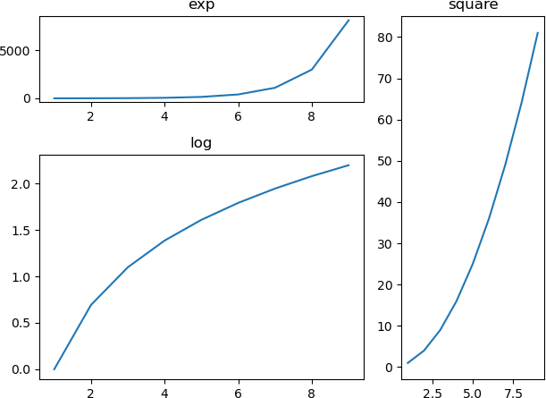

`matplotlib.pyplot` 模块提供了 subplot2grid() ，该函数能够在画布的特定位置创建 axes 对象（即绘图区域）。不仅如此，它还可以使用不同数量的行、列来创建跨度不同的绘图区域。与 subplot() 和 subplots() 函数不同，subplot2gird() 函数以非等分的形式对画布进行切分，并按照绘图区域的大小来展示最终绘图结果。

函数语法格式如下：

plt.subplot2grid(shape, location, rowspan, colspan)

参数含义如下：

- shape：把该参数值规定的网格区域作为绘图区域；
- location：在给定的位置绘制图形，初始位置 (0,0) 表示第1行第1列；
- rowsapan/colspan：这两个参数用来设置让子区跨越几行几列。


下面，在画布（figure）中添加了行、列跨度均不相同的绘图子区域，然后在每个绘图区上，绘制不同的图形。示例代码如下：

```python
import matplotlib.pyplot as plt
#使用 colspan指定列，使用rowspan指定行
a1 = plt.subplot2grid((3,3),(0,0),colspan = 2)
a2 = plt.subplot2grid((3,3),(0,2), rowspan = 3)
a3 = plt.subplot2grid((3,3),(1,0),rowspan = 2, colspan = 2)
import numpy as np
x = np.arange(1,10)
a2.plot(x, x*x)
a2.set_title('square')
a1.plot(x, np.exp(x))
a1.set_title('exp')
a3.plot(x, np.log(x))
a3.set_title('log')
plt.tight_layout()
plt.show()
```

输出结果如下：



图1：subplot2grid()输出结果