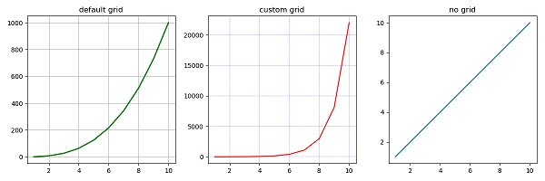

通过 Matplotlib axes 对象提供的 grid() 方法可以开启或者关闭画布中的网格（即是否显示网格）以及网格的主/次刻度。除此之外，grid() 函数还可以设置网格的颜色、线型以及线宽等属性。

grid() 的函数使用格式如下：

grid(color='b', ls = '-.', lw = 0.25)

参数含义如下：

- color：表示网格线的颜色；
- ls：表示网格线的样式；
- lw：表示网格线的宽度；


网格在默认状态下是关闭的，通过调用上述函数，网格会被自动开启，如果您只是想开启不带任何样式的网格，可以通过 grid(True) 来实现。

实例如下：

```python
import matplotlib.pyplot as plt
import numpy as np
#fig画布；axes子图区域
fig, axes = plt.subplots(1,3, figsize = (12,4))
x = np.arange(1,11)
axes[0].plot(x, x**3, 'g',lw=2)
#开启网格
axes[0].grid(True)
axes[0].set_title('default grid')
axes[1].plot(x, np.exp(x), 'r')
#设置网格的颜色，线型，线宽
axes[1].grid(color='b', ls = '-.', lw = 0.25)
axes[1].set_title('custom grid')
axes[2].plot(x,x)
axes[2].set_title('no grid')
fig.tight_layout()
plt.show()
```

上述代码执行后，输出结果：



图1：输出结果