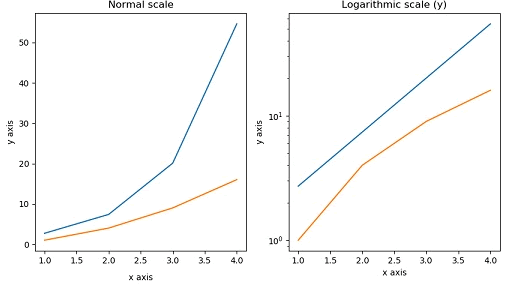
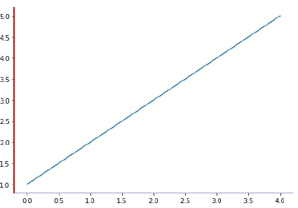

在一个函数图像中，有时自变量 x 与因变量 y 是指数对应关系，这时需要将坐标轴刻度设置为对数刻度。Matplotlib 通过 axes 对象的`xscale`或`yscale`属性来实现对坐标轴的格式设置。

示例：右侧的子图显示对数刻度，左侧子图则显示标量刻度。

```python
import matplotlib.pyplot as plt
import numpy as np
fig, axes = plt.subplots(1, 2, figsize=(10,4))
x = np.arange(1,5)
axes[0].plot( x, np.exp(x))
axes[0].plot(x,x**2)
axes[0].set_title("Normal scale")
axes[1].plot (x, np.exp(x))
axes[1].plot(x, x**2)
#设置y轴
axes[1].set_yscale("log")
axes[1].set_title("Logarithmic scale (y)")
axes[0].set_xlabel("x axis")
axes[0].set_ylabel("y axis")
axes[0].xaxis.labelpad = 10
#设置x、y轴标签
axes[1].set_xlabel("x axis")
axes[1].set_ylabel("y axis")
plt.show()
```


图1：对数关系图


轴是连接刻度的线，也就是绘图区域的边界，在绘图区域（axes 对象）的顶部、底部、左侧和右侧都有一个边界线（轴）。通过指定轴的颜色和宽度，从而对进行显示格式设置，比如将所有轴的颜色设置为 None，那么它们都会成为隐藏状态，或者也可以给轴添加相应的颜色。以下示例为左侧轴、底部轴分别设置了红色、蓝色，如下所示：

```python
import matplotlib.pyplot as plt
fig = plt.figure()
ax = fig.add_axes([0,0,1,1])
#为左侧轴，底部轴添加颜色
ax.spines['bottom'].set_color('blue')
ax.spines['left'].set_color('red')
ax.spines['left'].set_linewidth(2)
#将侧轴、顶部轴设置为None
ax.spines['right'].set_color(None)
ax.spines['top'].set_color(None)
ax.plot([1,2,3,4,5])
plt.show()
```

输出结果如下：


图2：输出结果