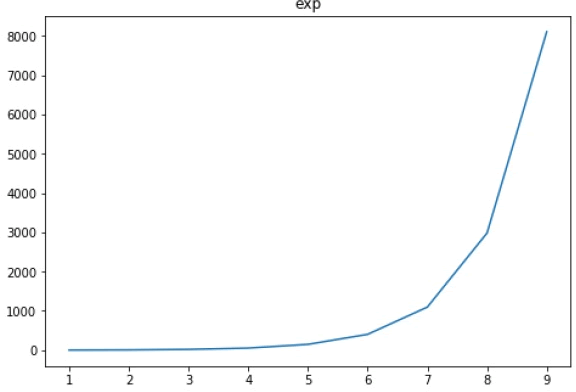
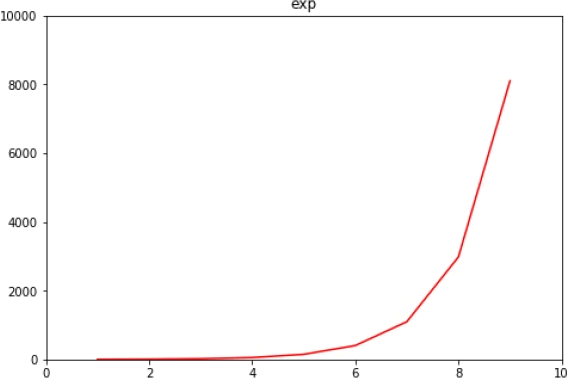

Matplotlib 可以根据自变量与因变量的取值范围，自动设置 x 轴与 y 轴的数值大小。当然，您也可以用自定义的方式，通过 set_xlim() 和 set_ylim() 对 x、y 轴的数值范围进行设置。

当对 3D 图像进行设置的时，会增加一个 z 轴，此时使用 set_zlim() 可以对 z 轴进行设置。

下面示例分别对自动设置和自定义设置做了演示：第一种 Matplotlib 自动设置

```python
import matplotlib.pyplot as plt
import numpy as np
fig = plt.figure()
#添加绘图区域
a1 = fig.add_axes([0,0,1,1])
#准备数据
x = np.arange(1,10)
#绘制函数图像
a1.plot(x, np.exp(x))
#添加题目
a1.set_title('exp')
plt.show()
```

代码执行后，输出结果如下：



图1：输出结果


第二种：自定义设置，set_xlim() 将 x 轴的数值范围设置为（0到10)； set_ylim() 将 y 轴的范围设置为（0到10000）。

```python
import matplotlib.pyplot as plt
fig = plt.figure()
a1 = fig.add_axes([0,0,1,1])
import numpy as np
x = np.arange(1,10)
a1.plot(x, np.exp(x),'r')
a1.set_title('exp')
#设置y轴
a1.set_ylim(0,10000)
#设置x轴
a1.set_xlim(0,10)
plt.show()
```

输出结果如下：



图2：输出结果