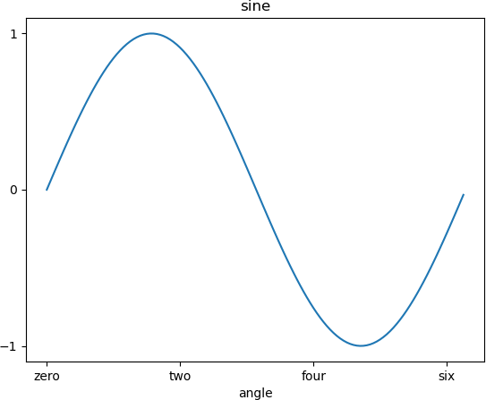

刻度指的是轴上数据点的标记，Matplotlib 能够自动的在 x 、y 轴上绘制出刻度。这一功能的实现得益于 Matplotlib 内置的刻度定位器和格式化器（两个内建类）。在大多数情况下，这两个内建类完全能够满足我们的绘图需求，但是在某些情况下，刻度标签或刻度也需要满足特定的要求，比如将刻度设置为“英文数字形式”或者“大写阿拉伯数字”，此时就需要对它们重新设置。

xticks() 和 yticks() 函数接受一个列表对象作为参数，列表中的元素表示对应数轴上要显示的刻度。如下所示：

ax.set_xticks([2,4,6,8,10])

x 轴上的刻度标记，依次为 2，4，6，8，10。您也可以分别通过 set_xticklabels() 和 set_yticklabels() 函数设置与刻度线相对应的刻度标签。

下面示例对刻度和标签的使用方法做了说明。

```python
import matplotlib.pyplot as plt
import numpy as np
import math
x = np.arange(0, math.pi*2, 0.05)
#生成画布对象
fig = plt.figure()
#添加绘图区域
ax = fig.add_axes([0.1, 0.1, 0.8, 0.8])
y = np.sin(x)
ax.plot(x, y)
#设置x轴标签
ax.set_xlabel('angle')
ax.set_title('sine')
ax.set_xticks([0,2,4,6])
#设置x轴刻度标签
ax.set_xticklabels(['zero','two','four','six'])
#设置y轴刻度
ax.set_yticks([-1,0,1])
plt.show()
```

输出结果如下：



图1：绘制坐标轴刻度与标签