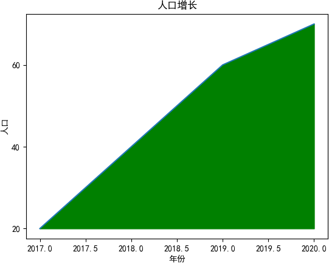
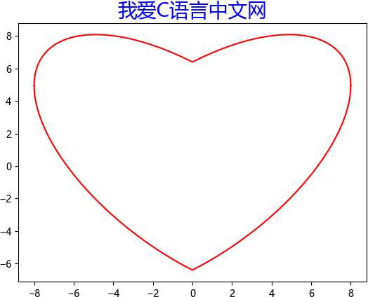

Matplotlib 默认不支持中文字体，这因为 Matplotlib 只支持 ASCII 字符，但中文标注更加符合中国人的阅读习惯。因此，本节重点讲解如何在 Windows 环境下让 Matplotlib 显示中文。

## Matplotlib中文乱码

当不对 Matplotlib 进行设置，而直接使用中文时，绘制的图像会出现中文乱码。下面是一个含有中文乱码的折线图：


从上图可以看出，本应该显示在红框内的中文字体没有显示出来（红框是自己标注出来的），下面给出了两种解决方案：第一种是临时解决方案，第二种是一劳永逸的解决方案。

## 重写配置文件

通过临时重写配置文件的方法，可以解决 Matplotlib 显示中文乱码的问题，代码如下所示：

```python
import matplotlib.pyplot as plt
plt.rcParams["font.sans-serif"]=["SimHei"] #设置字体
plt.rcParams["axes.unicode_minus"]=False #该语句解决图像中的“-”负号的乱码问题
```

将上述代码添加到您的绘图程序中，即可解决中文乱码的问题。这是一种非常灵活、便捷的解决方法。完整的程序代码如下：

```python
#绘制折线图
import matplotlib.pyplot as plt
plt.rcParams["font.sans-serif"]=["SimHei"] #设置字体
plt.rcParams["axes.unicode_minus"]=False #正常显示负号
year = [2017, 2018, 2019, 2020]
people = [20, 40, 60, 70]
#生成图表
plt.plot(year, people)
plt.xlabel('年份')
plt.ylabel('人口')
plt.title('人口增长')
#设置纵坐标刻度
plt.yticks([0, 20, 40, 60, 80])
#设置填充选项：参数分别对应横坐标，纵坐标，纵坐标填充起始值，填充颜色
plt.fill_between(year, people, 20, color = 'green')
#显示图表
plt.show()
```


输出结果如下：




不过上述解决方案适用于所有操作系统，其唯一弊端是每编写一个绘图程序就要添加一次相同的代码。

## 修改配置文件

下面介绍第二种方式：通过直接修改配置文件的方法，可以一劳永逸的解决 Matplotlib 的中文乱码问题。注意此过程在 Windows 环境下进行。

Matplotlib 从配置文件 matplotlibrc 中读取相关配置信息，比如字体、样式等，因此我们需要对该配置文件进行更改。首先查看 matplotlibrc 所在的目录，使用如下代码确定目录位置：

```python
import matplotlib
matplotlib.matplotlib_fname()
```

输出结果：

```
D:\python\python37\lib\site-packages\matplotlib\mpl-data\matplotlibrc
```

然后修改配置文件 matplotlibrc。打开配置文件后，找到以下信息：

```
#font.family: sans-serif

#font.serif: DejaVu Serif, Bitstream Vera Serif, Computer Modern Roman, New Century Schoolbook, Century Schoolbook L, Utopia, ITC Bookman, Bookman, Nimbus Roman No9 L, Times New Roman, Times, Palatino, Charter, serif
```

将上述配置项前面的`#`去掉，并修改的配置项，如下所示：

```
font.family   :  Microsoft YaHei, sans-serif
font.serif: Microsoft YaHei, DejaVu Serif, Bitstream Vera Serif, Computer Modern Roman, New Century Schoolbook, Century Schoolbook L, Utopia, ITC Bookman, Bookman, Nimbus Roman No9 L, Times New Roman, Times, Palatino, Charter, serif
```

注意，由于版本问题，上述内容配置信息可能存在一些差异，请自动忽略。

最后，在以下目录中复制中文字体微软雅黑：

```
C:\Windows\Fonts\Microsoft YaHei UI
```

复制完成后，将字体粘贴至以下路径文件中：

```
D:\python\python37\lib\site-packages\matplotlib\mpl-data\fonts\ttf
```

字体粘贴后会出现一个 MSYH.ttc 的字体文件，如下所示：


编写如下代码进行测试：

```python
import matplotlib.pyplot as plt
import numpy as np
x = np.linspace(-8, 8, 1024)
y1 = 0.618 * np.abs(x) - 0.8 * np.sqrt(64 - x ** 2)
y2 = 0.618 * np.abs(x) + 0.8 * np.sqrt(64 - x ** 2)
plt.plot(x, y1, color='r')
plt.plot(x, y2, color='r')
plt.title("我爱C语言中文网",fontsize=20,color="b")
plt.show()
```

输出结果如下：





如果你对自己编写的程序没有强烈的“洁癖”，可以接受重复的代码，那么建议您选择第一种解决方法，因为这种方法灵活、轻便。当然您也可以选择第二种方式，一劳永逸的解决中文乱码问题。