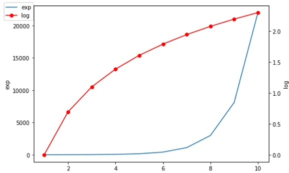

在一些应用场景中，有时需要绘制两个 x 轴或两个 y 轴，这样可以更直观地显现图像，从而获取更有效的数据。Matplotlib 提供的 twinx() 和 twiny() 函数，除了可以实现绘制双轴的功能外，还可以使用不同的单位来绘制曲线，比如一个轴绘制对函数，另外一个轴绘制指数函数。

下面示例绘制了一个具有两个 y 轴的图形，一个显示指数函数 exp(x)，另一个显示对数函数 log(x)。

```python
在一些应用场景中，有时需要绘制两个 x 轴或两个 y 轴，这样可以更直观地显现图像，从而获取更有效的数据。Matplotlib 提供的 twinx() 和 twiny() 函数，除了可以实现绘制双轴的功能外，还可以使用不同的单位来绘制曲线，比如一个轴绘制对函数，另外一个轴绘制指数函数。

下面示例绘制了一个具有两个 y 轴的图形，一个显示指数函数 exp(x)，另一个显示对数函数 log(x)。
import matplotlib.pyplot as plt
import numpy as np
#创建图形对象
fig = plt.figure()
#添加子图区域
a1 = fig.add_axes([0,0,1,1])
#准备数据
x = np.arange(1,11)
#绘制指数函数
a1.plot(x,np.exp(x))
a1.set_ylabel('exp')
#添加双轴
a2 = a1.twinx()
#‘ro’表示红色圆点
a2.plot(x, np.log(x),'ro-')
#绘制对数函数
a2.set_ylabel('log')
#绘制图例
fig.legend(labels = ('exp','log'),loc='upper left')
plt.show()
输出结果：

matplotlib绘图
图1：输出结果
```

输出结果：



图1：输出结果