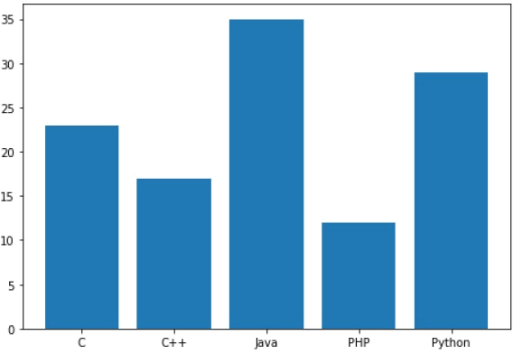

柱状图是一种用矩形柱来表示数据分类的图表，柱状图可以垂直绘制，也可以水平绘制，它的高度与其所表示的数值成正比关系。柱状图显示了不同类别之间的比较关系，图表的水平轴 X 指定被比较的类别，垂直轴 Y 则表示具体的类别值。

Matplotlib 提供了`bar()`函数来绘制柱状图，它可以应用在 MATLAB 样式以及面向对象的绘图方法中。当它与 axes 对象一起使用时，其语法格式如下：

```
ax.bar(x, height, width, bottom, align)
```

该函数的参数说明，如下表所示：

| x      | 一个标量序列，代表柱状图的x坐标，默认x取值是每个柱状图所在的中点位置，或者也可以是柱状图左侧边缘位置。 |
| ------ | ------------------------------------------------------------ |
| height | 一个标量或者是标量序列，代表柱状图的高度。                   |
| width  | 可选参数，标量或类数组，柱状图的默认宽度值为 0.8。           |
| bottom | 可选参数，标量或类数组，柱状图的y坐标默认为None。            |
| algin  | 有两个可选项 {"center","edge"}，默认为 'center'，该参数决定 x 值位于柱状图的位置。 |


该函数的返回值是一个 Matplotlib 容器对象，该对象包含了所有柱状图。

下面是一个关于 Matplotlib 柱状图的简单示例。它用来显示了不同编程语言的学习人数。

```python
import matplotlib.pyplot as plt
#创建图形对象
fig = plt.figure()
#添加子图区域，参数值表示[left, bottom, width, height ]
ax = fig.add_axes([0,0,1,1])
#准备数据
langs = ['C', 'C++', 'Java', 'Python', 'PHP']
students = [23,17,35,29,12]
#绘制柱状图
ax.bar(langs,students)
plt.show()
```

输出结果如下：



图1：matplotlib bar()绘图
 

通过调整柱状图的宽度，可以实现在同一 x 轴位置绘制多个柱状图。您可以将它们设置成不同的颜色，从而使它们更容易区分。下面示例描述了某工程学院过去四年中，三个专业录取的统招学生数量。

```python
import numpy as np
import matplotlib.pyplot as plt
#准备数据
data = 
[[30, 25, 50, 20],
[40, 23, 51, 17],
[35, 22, 45, 19]]
X = np.arange(4)
fig = plt.figure()
#添加子图区域
ax = fig.add_axes([0,0,1,1])
#绘制柱状图
ax.bar(X + 0.00, data[0], color = 'b', width = 0.25)
ax.bar(X + 0.25, data[1], color = 'g', width = 0.25)
ax.bar(X + 0.50, data[2], color = 'r', width = 0.25)
```

上述代码执行后，将显示四个柱状图，将每个柱状图又均分为三个小柱状图，每个柱状图占据 0.25 个单位。


图2：matplotlib绘图


柱状图除了上述使用方法外，还有另外一种堆叠柱状图。所谓堆叠柱状图就是将不同数组别的柱状图堆叠在一起，堆叠后的柱状图高度显示了两者相加的结果值。

bar() 函数提供了一个可选参数`bottom`，该参数可以指定柱状图开始堆叠的起始值，一般从底部柱状图的最大值开始，依次类推。

下面是一个不同国家参加奥林匹克运动会所得奖牌（金银铜）的柱状堆叠图示例，如下所示：

```python
import numpy as np
import matplotlib.pyplot as plt

countries = ['USA', 'India', 'China', 'Russia', 'Germany'] 
bronzes = np.array([38, 17, 26, 19, 15]) 
silvers = np.array([37, 23, 18, 18, 10]) 
golds = np.array([46, 27, 26, 19, 17]) 
# 此处的 _ 下划线表示将循环取到的值放弃，只得到[0,1,2,3,4]
ind = [x for x, _ in enumerate(countries)] 
#绘制堆叠图
plt.bar(ind, golds, width=0.5, label='golds', color='gold', bottom=silvers+bronzes) 
plt.bar(ind, silvers, width=0.5, label='silvers', color='silver', bottom=bronzes) 
plt.bar(ind, bronzes, width=0.5, label='bronzes', color='#CD853F') 
#设置坐标轴
plt.xticks(ind, countries) 
plt.ylabel("Medals") 
plt.xlabel("Countries") 
plt.legend(loc="upper right") 
plt.title("2019 Olympics Top Scorers")
plt.show()
```

在上述代码中，第一次调用`plt.bar()`绘制了黄色柱状图， 第二次调用`plot.bar()`时绘制了灰色柱状图，最后一次调用`plt.bar()`则绘制最底部的柱状图。两个柱状图相接触的位置就是顶部与底部的位置，这样就构成了柱状堆叠图。


图3：柱状堆叠图