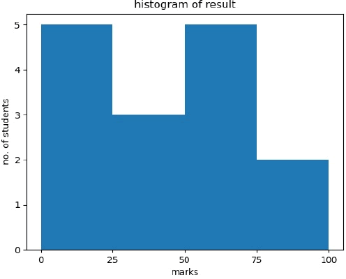

直方图（Histogram），又称质量分布图，它是一种条形图的一种，由一系列高度不等的纵向线段来表示数据分布的情况。 直方图的横轴表示数据类型，纵轴表示分布情况。

首先，我们需要了解柱状图和直方图的区别。直方图用于概率分布，它显示了一组数值序列在给定的数值范围内出现的概率；而柱状图则用于展示各个类别的频数。

例如，我们对某工厂的员工年龄做直方图统计，首先我们要统计出每一位员工的年龄，然后设定一个 20 至 65 的数值范围，并将该数值范围细分为 4 个区间段 (20,35),(35,45),(45,55),(55,65) , 最后通过直方图的形式，展示该工厂员工在相应年龄区间的分布情况。

如果想要构建直方图，必须遵循以下步骤：

- 将整个值范围划分为一系列区间。
- 区间值（bin）的取值，不可遗漏数据；
- 计算每个区间中有多少个值。

通常将 bin 指定为连续且不重叠的数值区间，而 bin 值指区间开始和结束的数值。

您可以使用下面的函数来绘制直方图：

matplotlib.pyplot.hist（）

该函数的参数说明如下：


| x        | 必填参数，数组或者数组序列。                                 |
| -------- | ------------------------------------------------------------ |
| bins     | 可选参数，整数或者序列，bins 表示每一个间隔的边缘（起点和终点）默认会生成10个间隔。 |
| range    | 指定全局间隔的下限与上限值 (min,max)，元组类型，默认值为 None。 |
| density  | 如果为 True，返回概率密度直方图；默认为 False，返回相应区间元素的个数的直方图。 |
| histtype | 要绘制的直方图类型，默认值为“bar”，可选值有 barstacked(堆叠条形图)、step(未填充的阶梯图)、stepfilled(已填充的阶梯图)。 |


以下示例绘制了班级学生得分情况的直方图。其中定义了四个区间（bins）分别是：0-25、26-50、51-75 和 76-100。直方图显示了相应范围的学生人数。

```python
from matplotlib import pyplot as plt
import numpy as np
#创建图形对象和轴域对象
fig,ax = plt.subplots(1,1)
a = np.array([22,87,5,43,56,73,55,54,11,20,51,5,79,31,27])
#绘制直方图
ax.hist(a, bins = [0,25,50,75,100])
#设置坐标轴
ax.set_title("histogram of result")
ax.set_xticks([0,25,50,75,100])
ax.set_xlabel('marks')
ax.set_ylabel('no.of students')
plt.show()
```

上述代码执行后，输出结果如下：



图1：直方图绘制结果