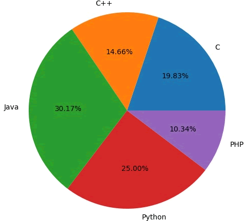

饼状图用来显示一个数据系列，具体来说，饼状图显示一个数据系列中各项目的占项目总和的百分比。

Matplotlib 提供了一个 pie() 函数，该函数可以生成数组中数据的饼状图。您可使用 x/sum(x) 来计算各个扇形区域占饼图总和的百分比。pie() 函数的参数说明如下：


| X       | 数组序列，数组元素对应扇形区域的数量大小。                   |
| ------- | ------------------------------------------------------------ |
| labels  | 列表字符串序列，为每个扇形区域备注一个标签名字。             |
| color   | 为每个扇形区域设置颜色，默认按照颜色周期自动设置。           |
| autopct | 格式化字符串"fmt%pct"，使用百分比的格式设置每个扇形 区的标签，并将其放置在扇形区内。 |


以下示例：关于不同计算机语言学习人数的饼状图。autopct 参数设置为 %1.2f% ，并将各项所占总和的百分比显示在相对应的扇形区内。

```python
from matplotlib import pyplot as plt
import numpy as np
#添加图形对象
fig = plt.figure()
ax = fig.add_axes([0,0,1,1])
#使得X/Y轴的间距相等
ax.axis('equal')
#准备数据
langs = ['C', 'C++', 'Java', 'Python', 'PHP']
students = [23,17,35,29,12]
#绘制饼状图
ax.pie(students, labels = langs,autopct='%1.2f%%')
plt.show()
```

输出结果如下：



图1：Matplotlib饼状图