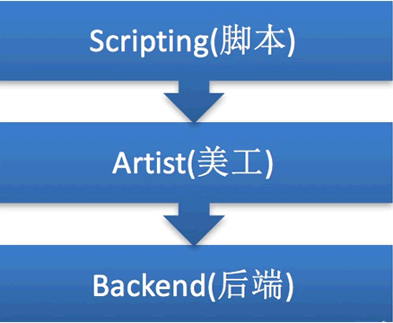
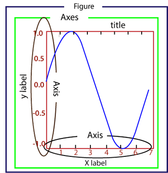

Matplotlib 是一款用于数据可视化的 Python 软件包，支持跨平台运行，它能够根据 NumPy ndarray 数组来绘制 2D 图像，它使用简单、代码清晰易懂，深受广大技术爱好者喜爱。

NumPy 是 Python 科学计算的软件包，ndarray 则是 NumPy 提供的一种数组结构。

Matplotlib 由 **John D. Hunter** 在 2002 年开始编写， 2003 年 Matplotlib 发布了第一个版本，并加入了 BSD 开源软件组织。Matplotlib 1.4 是最后一个支持 Python 2 的版本，它的最新版本 3.1.1 已于 2019 年 7 月 1 日发布。

图1：Matplotlib 图标

Matplotlib 提供了一个套面向绘图对象编程的 API 接口，能够很轻松地实现各种图像的绘制，并且它可以配合 Python GUI 工具（如 PyQt、Tkinter 等）在应用程序中嵌入图形。同时 Matplotlib 也支持以脚本的形式嵌入到 IPython shell、Jupyter 笔记本、web 应用服务器中使用。

## Matplotlib架构组成

Matplotlib 由三个不同的层次结构组成，分别是脚本层、美工层和后端层。

图2：Matplotlib架构图

#### 1) 脚本层

脚本层是 Matplotlib 结构中的最顶层。我们编写的绘图代码大部分代码都在该层运行，它的主要工作是负责生成图形与坐标系。

#### 2) 美工层

美工层是结构中的第二层，它提供了绘制图形的元素时的给各种功能，例如，绘制标题、轴标签、坐标刻度等。

#### 3) 后端层

后端层是 Matplotlib 最底层，它定义了三个基本类，首先是 FigureCanvas（图层画布类），它提供了绘图所需的画布，其次是 Renderer（绘图操作类），它提供了在画布上进行绘图的各种方法，最后是 Event（事件处理类），它提供了用来处理鼠标和键盘事件的方法。

## Matplotlib图形组成

Matplotlib 生成的图形主要由以下几个部分构成：

图3：Matplotlib图像组成

- Figure：指整个图形，您可以把它理解成一张画布，它包括了所有的元素，比如标题、轴线等；
- Axes：绘制 2D 图像的实际区域，也称为轴域区，或者绘图区；
- Axis：指坐标系中的垂直轴与水平轴，包含轴的长度大小（图中轴长为 7）、轴标签（指 x 轴，y轴）和刻度标签；
- Artist：您在画布上看到的所有元素都属于 Artist 对象，比如文本对象（title、xlabel、ylabel）、Line2D 对象（用于绘制2D图像）等。

## Matplotlib功能扩展包

许多第三方工具包都对 Matplotlib 进行了功能扩展，其中有些安装包需要单独安装，也有一些允许与 Matplotlib 一起安装。常见的工具包如下：

- Bashmap：这是一个地图绘制工具包，其中包含多个地图投影，海岸线和国界线；
- Cartopy：这是一个映射库，包含面向对象的映射投影定义，以及任意点、线、面的图像转换能力；
- Excel tools： 这是 Matplotlib 为了实现与 Microsoft Excel 交换数据而提供的工具；
- Mplot3d：它用于 3D 绘图；
- Natgrid：这是 Natgrid 库的接口，用于对间隔数据进行不规则的网格化处理。