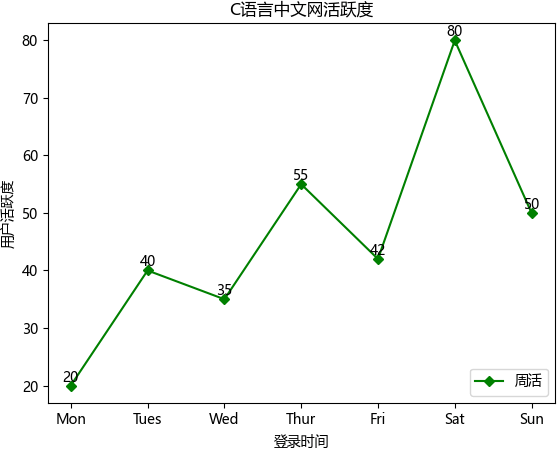
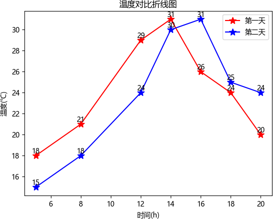

折线图（line chart）是我们日常工作、学习中经常使用的一种图表，它可以直观的反映数据的变化趋势。与绘制柱状图、饼状图等图形不同，Matplotlib 并没有直接提供绘制折线图的函数，因此本节着重讲解如何绘制一幅折线图。

## 绘制单条折线

下面示例是关于 C语言中文网用户活跃度的折线图：

```python
import matplotlib.pyplot as plt
#准备绘制数据
x = ["Mon", "Tues", "Wed", "Thur", "Fri","Sat","Sun"]
y = [20, 40, 35, 55, 42, 80, 50]
# "g" 表示红色，marksize用来设置'D'菱形的大小
plt.plot(x, y, "g", marker='D', markersize=5, label="周活")
#绘制坐标轴标签
plt.xlabel("登录时间")
plt.ylabel("用户活跃度")
plt.title("C语言中文网活跃度")
#显示图例
plt.legend(loc="lower right")
#调用 text()在图像上绘制注释文本
#x1、y1表示文本所处坐标位置，ha参数控制水平对齐方式, va控制垂直对齐方式，str(y1)表示要绘制的文本
for x1, y1 in zip(x, y):
    plt.text(x1, y1, str(y1), ha='center', va='bottom', fontsize=10)
#保存图片
plt.savefig("1.jpg")
plt.show()
```

显示结果如下：



## 绘制多条折线图

当学习完如何绘制单条折线的绘制后，再绘制多条折线也变的容易，只要准备好绘制多条折线图的数据即可。

下面是一个简单示例，绘制了两天内同一时刻，天气温度随时间变化的折线图：

```python
import matplotlib.pyplot as plt
#对比两天内同一时刻温度的变化情况
x = [5, 8, 12, 14, 16, 18, 20]
y1 = [18, 21, 29, 31, 26, 24, 20]
y2 = [15, 18, 24, 30, 31, 25, 24]
#绘制折线图，添加数据点，设置点的大小
# * 表示绘制五角星；此处也可以不设置线条颜色，matplotlib会自动为线条添加不同的颜色
plt.plot(x, y1, 'r',marker='*', markersize=10)
plt.plot(x, y2, 'b', marker='*',markersize=10)
plt.title('温度对比折线图')  # 折线图标题
plt.xlabel('时间(h)')  # x轴标题
plt.ylabel('温度(℃)')  # y轴标题
#给图像添加注释，并设置样式
for a, b in zip(x, y1):
    plt.text(a, b, b, ha='center', va='bottom', fontsize=10)
for a, b in zip(x, y2):
    plt.text(a, b, b, ha='center', va='bottom', fontsize=10)

#绘制图例
plt.legend(['第一天', '第二天'])
#显示图像
plt.show()
```

显示结果如下：

