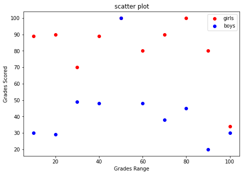

散点图用于在水平轴和垂直轴上绘制数据点，它表示了因变量随自变量变化的趋势。通俗地讲，它反映的是一个变量受另一个变量的影响程度。

散点图将序列显示为一组点，其中每个散点值都由该点在图表中的坐标位置表示。对于不同类别的点，则由图表中不同形状或颜色的标记符表示。同时，您也可以设置标记符的颜色或大小。

下面示例，绘制了学生考试成绩的散点图，其中蓝色代表男孩成绩，红色表示女孩的成绩。

```python
import matplotlib.pyplot as plt
girls_grades = [89, 90, 70, 89, 100, 80, 90, 100, 80, 34]
boys_grades = [30, 29, 49, 48, 100, 48, 38, 45, 20, 30]
grades_range = [10, 20, 30, 40, 50, 60, 70, 80, 90, 100]
fig=plt.figure()
#添加绘图区域
ax=fig.add_axes([0,0,1,1])
ax.scatter(grades_range, girls_grades, color='r',label="girls")
ax.scatter(grades_range, boys_grades, color='b',label="boys")
ax.set_xlabel('Grades Range')
ax.set_ylabel('Grades Scored')
ax.set_title('scatter plot')
#添加图例
plt.legend()
plt.show()
```

代码执行后，输出结果如下：



图1：绘制散点图