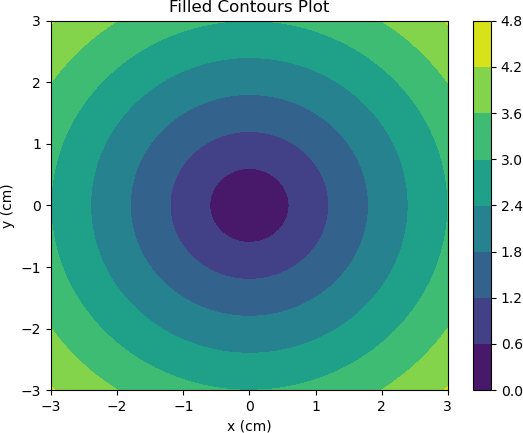

等高线图（也称“水平图”）是一种在二维平面上显示 3D 图像的方法。等高线有时也被称为 “Z 切片”，如果您想要查看因变量 Z 与自变量 X、Y 之间的函数图像变化（即 Z=f(X,Y)），那么采用等高线图最为直观。

自变量 X 和 Y 需要被限制在矩形网格内，您可以将 x 、y 数组作为参数传递给 numpy.meshgrid() 函数来构建一个网格点矩阵。

关于 meshgrid() 函数用法可参考《[numpy.meshgrid()用法详解](https://www.jb51.net/article/166704.htm)》。

Matplotlib API 提供了绘制等高线（contour）与填充等高线（ contourf）的函数。这两个函数都需要三个参数，分别是 X、Y 与 Z。

```python
import numpy as np
import matplotlib.pyplot as plt
#创建xlist、ylist数组
xlist = np.linspace(-3.0, 3.0, 100)
ylist = np.linspace(-3.0, 3.0, 100)
#将上述数据变成网格数据形式
X, Y = np.meshgrid(xlist, ylist)
#定义Z与X,Y之间的关系
Z = np.sqrt(X**2 + Y**2)
fig,ax=plt.subplots(1,1)
#填充等高线颜色
cp = ax.contourf(X, Y, Z)
fig.colorbar(cp) # 给图像添加颜色柱
ax.set_title('Filled Contours Plot')
ax.set_xlabel('x (cm)')
ax.set_ylabel('y (cm)')
#画等高线
plt.contour(X,Y,Z)
plt.show()
```

代码执行后，输出结果如下：



图1：等高线示例图
 

左侧图像绘制了两个变量 X、Y ，右侧的颜色柱（colorbar）则表示 X 的取值，颜色越深表示值越小，中间深色部分的圆心点表示 x=0，y=0，z=0。