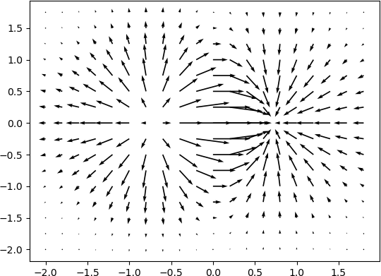

振动图也叫磁场图，或量场图，其图像的表现形式是一组矢量箭头，其数学含义是在点 (x,y) 处具有分向量 (u,v)。

Matplotlib 提供绘制量场图的函数，如下所示：

quiver(x,y,u,v)

上述函数表示，在指定的 (x,y) 坐标上以箭头的形式绘制向量，参数说明如下：


| 参数 | 说明                                          |
| ---- | --------------------------------------------- |
| x    | 一维、二维数组或者序列，表示箭头位置的x坐标。 |
| y    | 一维、二维数组或者序列，表示箭头位置的y坐标。 |
| u    | 一维、二维数组或者序列，表示箭头向量的x分量。 |
| v    | 一维、二维数组或者序列，表示箭头向量的y分量。 |
| c    | 一维、二维数组或者序列，表示箭头颜色。        |


以下示例，绘制了一个简单的振动图：

```python
import matplotlib.pyplot as plt
import numpy as np
x,y = np.meshgrid(np.arange(-2, 2, 0.2), np.arange(-2, 2, 0.25))
z = x*np.exp(-x**2 - y**2)
#计算数组中元素的梯度
v, u = np.gradient(z, 0.2, 0.2)
fig, ax = plt.subplots()
q = ax.quiver(x,y,u,v)
plt.show()
```

上述代码执行后，输出结果如下：



图1：振动示例图