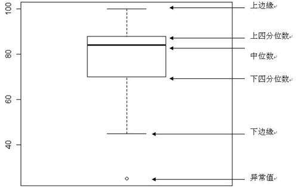

箱型图（也称为盒须图）于 1977 年由美国著名统计学家**约翰·图基**（John Tukey）发明。它能显示出一组数据的最大值、最小值、中位数、及上下四分位数。

在箱型图中，我们从上四分位数到下四分位数绘制一个盒子，然后用一条垂直触须（形象地称为“盒须”）穿过盒子的中间。上垂线延伸至上边缘（最大值），下垂线延伸至下边缘（最小值）。箱型图结构如下所示：



图1：箱型如结构图
 

首先准备创建箱型图所需数据：您可以使用`numpy.random.normal()`函数来创建一组基于正态分布的随机数据，该函数有三个参数，分别是正态分布的平均值、标准差以及期望值的数量。如下所示：

```python
#利用随机数种子使每次生成的随机数相同
np.random.seed(10)
collectn_1 = np.random.normal(100, 10, 200)
collectn_2 = np.random.normal(80, 30, 200)
collectn_3 = np.random.normal(90, 20, 200)
collectn_4 = np.random.normal(70, 25, 200)
data_to_plot=[collectn_1,collectn_2,collectn_3,collectn_4]
```

然后用 data_to_plot 变量指定创建箱型图所需的数据序列，最后用 boxplot() 函数绘制箱型图，如下所示：

```PY
fig = plt.figure()
#创建绘图区域
ax = fig.add_axes([0,0,1,1])
#创建箱型图
bp = ax.box
plot(data_to_plot)
plt.show()
```

上述代码执行后，输出结果如下：


图2：箱型图输出结果