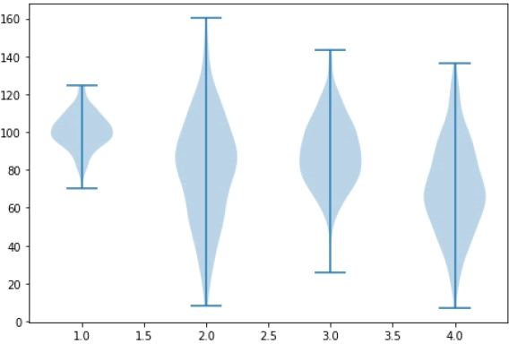

小提琴图（Violin Plot）是用来展示数据分布状态以及概率密度的图表。这种图表结合了箱形图和密度图的特征。小提琴图跟箱形图类似，不同之处在于小提琴图还显示数据在不同数值下的概率密度。

小提琴图使用核密度估计（KDE）来计算样本的分布情况，图中要素包括了中位数、四分位间距以及置信区间。在数据量非常大且不方便一一展示的时候，小提琴图特别适用。

概率密度估计、置信区间、四分位间距都属于统计学中的概念，可自行查阅，这里不做说明。

小提琴图比箱型图能提供了更多的信息。虽然箱型图显示了均值、中位数和上、下四分位数等统计信息，但是小提琴图却显示了数据的完整分布情况，这更利于数据的分析与比对。下面是小提琴图的使用示例：

```python
import matplotlib.pyplot as plt
np.random.seed(10)
collectn_1 = np.random.normal(100, 10, 200)
collectn_2 = np.random.normal(80, 30, 200)
collectn_3 = np.random.normal(90, 20, 200)
collectn_4 = np.random.normal(70, 25, 200)
#创建绘制小提琴图的数据序列
data_to_plot = [collectn_1, collectn_2, collectn_3, collectn_4]
#创建一个画布
fig = plt.figure()
#创建一个绘图区域
ax = fig.add_axes([0,0,1,1])
# 创建一个小提琴图
bp = ax.violinplot(data_to_plot)
plt.show()
```

输出结果如下：



图1：小提琴图绘制