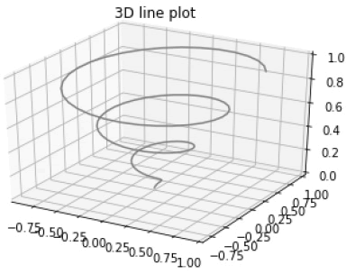
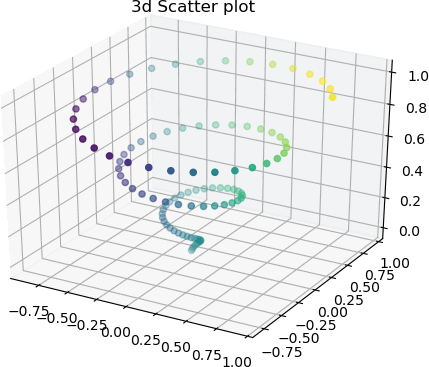
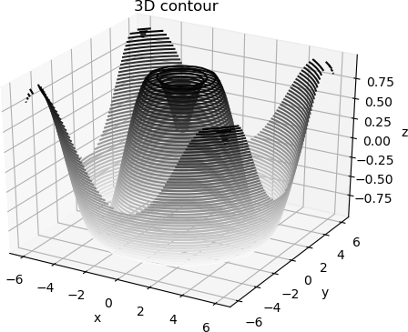
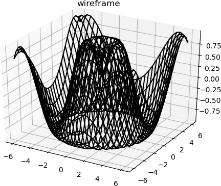
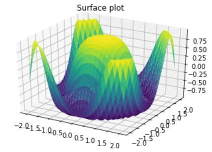

最初开发的 Matplotlib，仅支持绘制 2d 图形，后来随着版本的不断更新， Matplotlib 在二维绘图的基础上，构建了一部分较为实用的 3D 绘图程序包，比如 `mpl_toolkits.mplot3d`，通过调用该程序包一些接口可以绘制 3D散点图、3D曲面图、3D线框图等

mpl_toolkits 是 Matplotlib 的绘图工具包。

## 第一个三维绘图程序

下面编写第一个三维绘图程序。

首先创建一个三维绘图区域， plt.axes() 函数提供了一个参数`projection`，将其参数值设置为 "3d"。如下所示：

```python
#导入三维工具包mplot3d
from mpl_toolkits import mplot3d
import numpy as np
import matplotlib.pyplot as plt
fig = plt.figure()
#创建3d绘图区域
ax = plt.axes(projection='3d')
```

有了三维绘图区域，接下来就要构建 3d 图像，如下所示：

```python
#从三个维度构建
z = np.linspace(0, 1, 100)
x = z * np.sin(20 * z)
y = z * np.cos(20 * z)
```

最后调用 plot3D() 方法绘制 3d 图形，代码如下：

```python
#调用 ax.plot3D创建三维线图
ax.plot3D(x, y, z, 'gray')
ax.set_title('3D line plot')
plt.show()
```

完整程序如下所示：

```python
from mpl_toolkits import mplot3d
import numpy as np
import matplotlib.pyplot as plt
fig = plt.figure()
#创建3d绘图区域
ax = plt.axes(projection='3d')
#从三个维度构建
z = np.linspace(0, 1, 100)
x = z * np.sin(20 * z)
y = z * np.cos(20 * z)
#调用 ax.plot3D创建三维线图
ax.plot3D(x, y, z, 'gray')
ax.set_title('3D line plot')
plt.show()
```

输出结果如下所示：



图1：三维线图(3D Line)


上述代码中的 ax.plot3D() 函数可以绘制各种三维图形，这些三维图都要根据`(x，y，z)`三元组类来创建。

## 3D散点图

通过 ax.scatter3D() 函数可以绘制 3D 散点图，示例代码如下：

```python
from mpl_toolkits import mplot3d
import numpy as np
import matplotlib.pyplot as plt
fig = plt.figure()
#创建绘图区域
ax = plt.axes(projection='3d')
#构建xyz
z = np.linspace(0, 1, 100)
x = z * np.sin(20 * z)
y = z * np.cos(20 * z)
c = x + y
ax.scatter3D(x, y, z, c=c)
ax.set_title('3d Scatter plot')
plt.show()
```

输出结果图：



图2：Matplotlib 3D绘图

## 3D等高线图

ax.contour3D() 可以用来创建三维等高线图，该函数要求输入数据均采用二维网格式的矩阵坐标。同时，它可以在每个网格点`(x,y)`处计算出一个 z 值。

以下示例展示了如何绘制三维正弦等高线图。代码如下：

```python
from mpl_toolkits import mplot3d
import numpy as np
import matplotlib.pyplot as plt
def f(x, y):
   return np.sin(np.sqrt(x ** 2 + y ** 2))
#构建x、y数据
x = np.linspace(-6, 6, 30)
y = np.linspace(-6, 6, 30)
#将数据网格化处理
X, Y = np.meshgrid(x, y)
Z = f(X, Y)
fig = plt.figure()
ax = plt.axes(projection='3d')
#50表示在z轴方向等高线的高度层级，binary颜色从白色变成黑色
ax.contour3D(X, Y, Z, 50, cmap='binary')
ax.set_xlabel('x')
ax.set_ylabel('y')
ax.set_zlabel('z')
ax.set_title('3D contour')
plt.show()
```

输出结果图如下：



图3：绘制三维轮廓图

## 3D线框图

线框图同样要采用二维网格形式的数据，与绘制等高线图类似。

线框图可以将数据投影到指定的三维表面上，并输出可视化程度较高的三维效果图。通过 plot_wireframe() 能够绘制 3D 线框图。代码如下：

```python
from mpl_toolkits import mplot3d
import numpy as np
import matplotlib.pyplot as plt
#要绘制函数图像
def f(x, y):
   return np.sin(np.sqrt(x ** 2 + y ** 2))
#准备x,y数据
x = np.linspace(-6, 6, 30)
y = np.linspace(-6, 6, 30)
#生成x、y网格化数据
X, Y = np.meshgrid(x, y)
#准备z值
Z = f(X, Y)
#绘制图像
fig = plt.figure()
ax = plt.axes(projection='3d')
#调用绘制线框图的函数plot_wireframe()
ax.plot_wireframe(X, Y, Z, color='black')
ax.set_title('wireframe')
plt.show()
```

输出结果如下：



图4：Matplotlib绘制线框图


## 3D曲面图

曲面图表示一个指定的因变量`y`与两个自变量`x`和`z`之间的函数关系。

3D 曲面图是一个三维图形，它非常类似于线框图。不同之处在于，线框图的每个面都由多边形填充而成。Matplotlib 提供的 plot_surface() 函数可以绘制 3D 曲面图，该函数需要接受三个参数值 x，y 和 z 。示例代码如下：

```python
from mpl_toolkits import mplot3d
import numpy as np
import matplotlib.pyplot as plt
#求向量积(outer()方法又称外积)
x = np.outer(np.linspace(-2, 2, 30), np.ones(30))
#矩阵转置
y = x.copy().T 
#数据z
z = np.cos(x ** 2 + y ** 2)
#绘制曲面图
fig = plt.figure()
ax = plt.axes(projection='3d')
调用plot_surface()函数
ax.plot_surface(x, y, z,cmap='viridis', edgecolor='none')
ax.set_title('Surface plot')
plt.show()
```

输出结果图：



图5：Matplotlib绘制曲面图