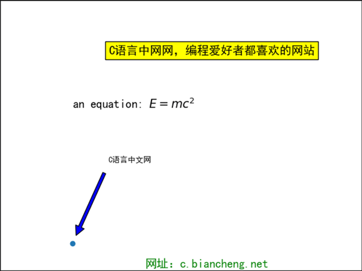

Matplotlib 支持广泛的文本格式，比如 TTF 页面语言、Unicode 字符等。这是因为 Matplotlib 内置了 matplotlib.font_manager 字体管理器，它是一个实现了跨平台，并符合 W3C 字体查找算法的字体集合。

TTF（TrueType Font） 是苹果公司和微软公司合作开发的页面描述语言，用来描述字符的轮廓，结合了光栅技术和矢量技术的优点。

用户可以对文本属性进行控制，比如字体大小、粗细、位置和颜色等。

与此同时，Matplotlib 也支持绘制 TeX 包含的数学符号。TeX 是一套功能强大、十分灵活的排版语言，它可以用来绘制文本、符号、数学表达式等。通过下表中的方法可以绘制出相应的内容：


| text     | 在绘图区域的任意位置添加文本。               |
| -------- | -------------------------------------------- |
| annotate | 在绘图区域的任意位置添加带有可选箭头的注释。 |
| xlabel   | 在绘图区域的 x 轴上添加标签。                |
| ylabel   | 在绘图区域的 y 轴上添加标签。                |
| title    | 为绘图区域添加标题。                         |
| figtext  | 在画布的任意位置添加文本。                   |
| suptitle | 为画布中添加标题。                           |


Matplotlib 使用`pyplot`模块中的 text() 函数绘制文本，函数的语法格式如下：

```
plt.text(x, y, string, weight="bold", color="b")
```

参数说明如下：

- x: 注释文本内容所在位置的横坐标；
- y：注释文本内容所在位置的纵坐标；
- string：注释文本内容；
- weight：注释文本内容的粗细风格；


下面使用 text() 函数会创建一个文本对象。示例如下：

```python
import matplotlib.pyplot as plt
plt.rcParams["font.sans-serif"]=["SimHei"] #设置字体
plt.rcParams["axes.unicode_minus"]=False #正常显示负号
fig = plt.figure()
#添加绘图区域
ax = fig.add_axes([0,0,1,1])
#设置格式
ax.set_title('axes title')
ax.set_xlabel('xlabel')
ax.set_ylabel('ylabel')
# 3,8 表示x，y的坐标点；style设置字体样式为斜体；bbox用来设置盒子的属性，比如背景色
ax.text(3, 8, 'C语言中网网，编程爱好者都喜欢的网站', style='italic',bbox = {'facecolor': 'yellow'},fontsize=15)
#绘制数学表达式,用$符包裹
ax.text(2, 6, r'an equation: $E = mc^2$', fontsize = 15)
#添加文字，并设置样式
ax.text(4, 0.05, '网址：c.biancheng.net',verticalalignment = 'bottom', color = 'green', fontsize = 15)
ax.plot([2], [1], 'o')
#xy为点的坐标；xytext为注释内容坐标；arrowprops设置箭头的属性
ax.annotate('C语言中文网', xy = (2, 1), xytext = (3, 4),arrowprops = dict(facecolor = 'blue', shrink = 0.1))
#设置坐标轴x,y
ax.axis([0, 10, 0, 10])
plt.show()
```

代码执行结果如下：

 


图1：Matplotlib文本绘图