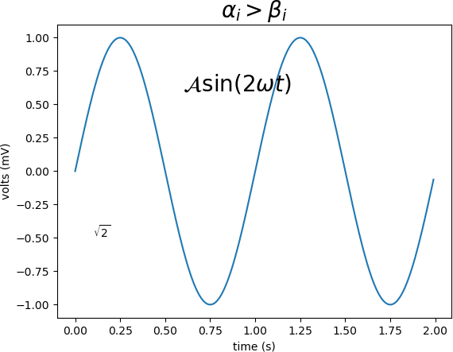

Matplotlib 中的文本字符串都可以使用 Text Markup（一种文本标记语言）显现出来，具体的使用方法是将文本标记符放在一对美元符号`$`内，语法格式如下：

```
#数学表达式
plt.title(r'$\alpha > \beta$')
```

如果要绘制下标和上标，您需要使用`'_'`和`'^'`符号，下面是一个简单的示例：

```python
#绘制表达式 r'$\alpha_i> \beta_i$'
import numpy as np
import matplotlib.pyplot as plt
t = np.arange(0.0, 2.0, 0.01)
s = np.sin(2*np.pi*t)
#绘制函数图像
plt.plot(t,s)
#设置标题
plt.title(r'$\alpha_i> \beta_i$', fontsize=20)
#设置数学表达式
plt.text(0.6, 0.6, r'$\mathcal{A}\mathrm{sin}(2 \omega t)$', fontsize = 20)
#设置数学表达式
plt.text(0.1, -0.5, r'$\sqrt{2}$', fontsize=10)
plt.xlabel('time (s)')
plt.ylabel('volts (mV)')
plt.show()
```

上面代码的输出结果：



Matplotlib数学表达式绘制

从上述示例可以看出，虽然数学表达式种类繁多，但是 Matplotlib 对各种数学符号都做了良好的支持。