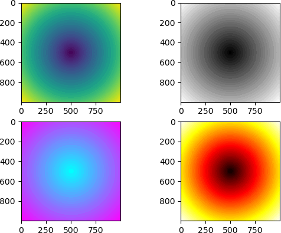

Matplotlib 软件包中的`image`模块提供了加载、缩放和显示图像的功能，该模块只能支持 PNG 格式的图片，如果格式不符，需要对图片的格式进行转换。

Matplotlib 支持的图片格式非常有限，所以通常情况下，建议采用 Python 图像处理库 Pillow 来处理图像，若感兴趣可以自行了解。

下面示例，imread() 函数用于读取图像数据并形成 ndarray 数组 ，其数据类型为 float32。

```python
import matplotlib.pyplot as plt
import matplotlib.image as mpimg
import numpy as np
img = mpimg.imread('mtplogo.png')
```

假设在当前目录中存在名为 mtplogo.png 的图像。


图1：mtplogo图像


通过执行 imsave() 函数，可以将包含图像数据的 ndarray 数组保存到磁盘文件中。

plt.imsave("logo.png", img, cmap = 'gray', origin = 'lower')

如下所示，将 imsave()方法的`origin`参数设置为 lower 实现了原始图像的垂直翻转。


图2：垂直翻转图


通过 imshow() 函数可以在 Matplotlib 查看器上绘制出相应的图像。其函数格式如下：

imgplot = plt.imshow(img)

下面列举一组示例：

```python
import matplotlib.pyplot as plt
import numpy as np
fig=plt.figure()
ax1=fig.add_subplot(221)
ax2=fig.add_subplot(222)
ax3=fig.add_subplot(223)
ax4=fig.add_subplot(224)
#准备数据
#绘制z = sqrt(x^2+y^2)图像
points=np.arange(-5,5,0.01)
# meshgrid 接受两个一维数组，然后产生两个二维矩阵
xs,ys=np.meshgrid(points,points)
#绘制图像
z=np.sqrt(xs**2+ys**2)
ax = fig.add_subplot(221)
#默认
ax.imshow(z)
ax = fig.add_subplot(222)
ax.imshow(z,cmap = "gray")
ax = fig.add_subplot(223)
ax.imshow(z,cmap="cool")
ax = fig.add_subplot(224)
ax.imshow(z,cmap="hot")
#显示图像
plt.show()
```

输出结果如下：



图3：输出结果