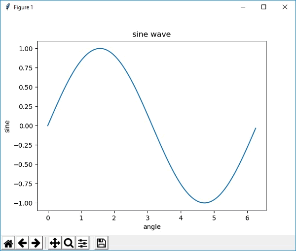

本节学习第一个 Matplotlib 绘图程序，如何使用 Matplotlib 绘制一个简单的折线图。下面绘制一个简单正弦曲线图，它显示了角度与正弦函数值之间的关系。

## 第一个绘图程序

首先导入 Matplotlib 包中的 Pyplot 模块，并以 as 别名的形式简化引入包的名称。

import matplotlib.pyplot as plt

接下来，使用 NumPy 提供的函数 arange() 创建一组数据来绘制图像。

```python
#引入numpy包
import numpy as np
#获得0到2π之间的ndarray对象
x = np.arange(0, math.pi*2, 0.05)
```

上述所得 x 的值作用到 x 轴上，而该值对应的正弦值，也就是 y 值，使用以下方法获取：

y = np.sin(x)

使用 plot() 函数对 x、y 进行绘制。

plt.plot(x,y)

主要的绘图工作已经完成，不过还需要绘制一些细节，需要我们补充一下，比如图像的标题(title)、x 轴与 y 轴的标签（label）等。

```python
plt.xlabel("angle")
plt.ylabel("sine")
plt.title('sine wave')
```

完整的程序代码如下：

```python
在一些应用场景中，有时需要绘制两个 x 轴或两个 y 轴，这样可以更直观地显现图像，从而获取更有效的数据。Matplotlib 提供的 twinx() 和 twiny() 函数，除了可以实现绘制双轴的功能外，还可以使用不同的单位来绘制曲线，比如一个轴绘制对函数，另外一个轴绘制指数函数。

下面示例绘制了一个具有两个 y 轴的图形，一个显示指数函数 exp(x)，另一个显示对数函数 log(x)。
import matplotlib.pyplot as plt
import numpy as np
#创建图形对象
fig = plt.figure()
#添加子图区域
a1 = fig.add_axes([0,0,1,1])
#准备数据
x = np.arange(1,11)
#绘制指数函数
a1.plot(x,np.exp(x))
a1.set_ylabel('exp')
#添加双轴
a2 = a1.twinx()
#‘ro’表示红色圆点
a2.plot(x, np.log(x),'ro-')
#绘制对数函数
a2.set_ylabel('log')
#绘制图例
fig.legend(labels = ('exp','log'),loc='upper left')
plt.show()
输出结果：

matplotlib绘图
图1：输出结果
```

代码执行后，显示结果如下：



图1：sine正弦函数图像


您也可以在 Jupyter 笔记本中运行 Matplotlib 的绘图程序。通过命令行或者开始菜单的方式启动 Jupyter 笔记本。启动成功后，将上述代码拷贝到输入行内，如下所示：


图2：Jupyter交互式笔记本

注意：%matplotlib inline 是 Jupyter 提供的魔法命令，它可以把输出图显示在笔记本内部，否则会以查看器的形式单独显示。