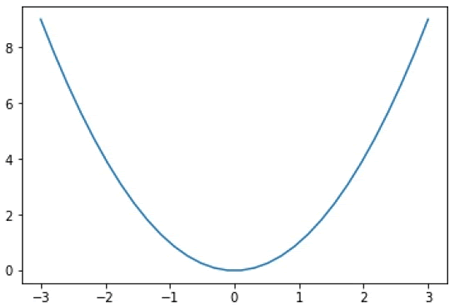
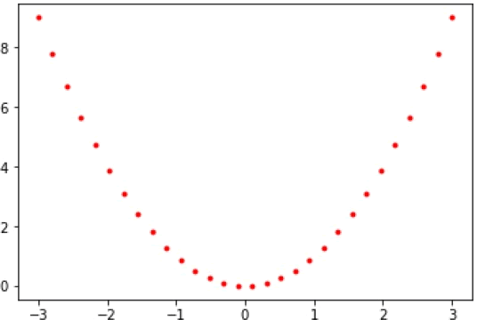

PyLab 是一个面向 Matplotlib 的绘图库接口，其语法和 MATLAB 十分相近。它和 Pyplot 模快都够实现 Matplotlib 的绘图功能。PyLab 是一个单独的模块，随 Matplotlib 软件包一起安装，该模块的导包方式和 Pyplot 不同，如下所示：

```python
#Pyplot导包方式
from matplotlib import pyplot as plt
#PyLab导包有两种方式
import pylab
from pylab import *
```

PyLab 是一个很便捷的模块，下面对它的使用方法做相应的介绍。

## 基本绘图

提供一对相同长度的数组（或序列），然后使用`plot()`绘制曲线，示例如下：

```python
from numpy import *
from pylab import *
x = linspace(-3, 3, 30)
y = x**2
plot(x, y)
show()
```

输出结果：



图1：绘制曲线图


如果您要绘制特殊类型的线条，并想添加一些颜色，PyLab 提供了如下方法：


| 符号 | '-'，'--'，'-.'，':'，'.'，','，，o，^，v，<，>，s，+，x，D，d，1，2，3，4，h，H，p，\| ，_ |
| ---- | ------------------------------------------------------------ |
| 颜色 | b(蓝色)，g(绿色)，r(红色)，c(青色)，m(品红)，y(黄色)，k(黑色)，w(白色) |


使用示例如下：

```python
from pylab import *
x = linspace(-3, 3, 30)
y = x**2
plot(x, y, 'r.')
show()
```

输出结果：


图2：红点曲线图


如果您想在同一绘图区域内绘制多个图形，只需要使用多个绘图命令。示例如下：

```python
from pylab import *
x = linspace(-3, 3, 30)
y = x**2
plot(x, y, 'r.')
show()
```

输出结果：


图3：绘制多条不同曲线

如果您想清除图像，直接在程序末尾调用 clf() 方法即可。