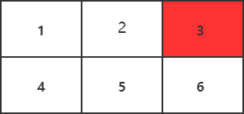
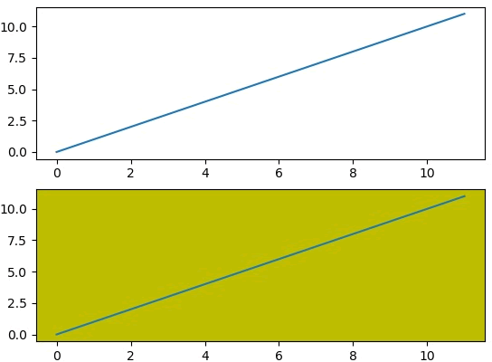
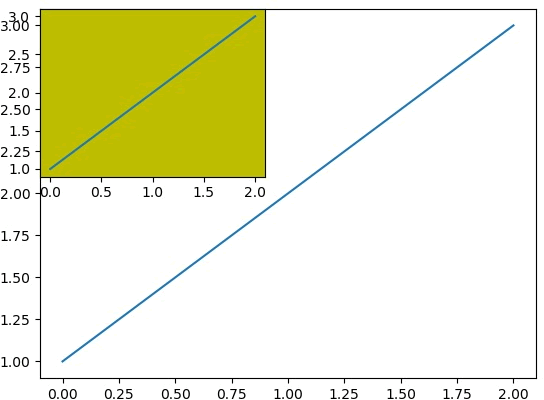
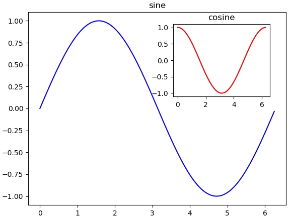

在使用 Matplotlib 绘图时，我们大多数情况下，需要将一张画布划分为若干个子区域，之后，我们就可以在这些区域上绘制不用的图形。在本节，我们将学习如何在同一画布上绘制多个子图。

`matplotlib.pyplot`模块提供了一个 subplot() 函数，它可以均等地划分画布，该函数的参数格式如下：

plt.subplot(nrows, ncols, index)

nrows 与 ncols 表示要划分几行几列的子区域（nrows*nclos表示子图数量），index 的初始值为1，用来选定具体的某个子区域。

例如： subplot(233)表示在当前画布的右上角创建一个两行三列的绘图区域（如下图所示），同时，选择在第 3 个位置绘制子图。



图1：示意图


如果新建的子图与现有的子图重叠，那么重叠部分的子图将会被自动删除，因为它们不可以共享绘图区域。

```python
import matplotlib.pyplot as plt
plt.plot([1,2,3])
#现在创建一个子图，它表示一个有2行1列的网格的顶部图。
#因为这个子图将与第一个重叠，所以之前创建的图将被删除
plt.subplot(211)
plt.plot(range(12))
#创建带有黄色背景的第二个子图
plt.subplot(212, facecolor='y')
plt.plot(range(12))
```

上述代码运行结果，如下图所示：



图2：subplot绘制结果


如果不想覆盖之前的图，需要使用 add_subplot() 函数，代码如下：

```python
import matplotlib.pyplot as plt
fig = plt.figure()
ax1 = fig.add_subplot(111)
ax1.plot([1,2,3])
ax2 = fig.add_subplot(221, facecolor='y')
ax2.plot([1,2,3])
```

执行上述代码，输出结果如下：



图3：add_subplot()绘图结果

通过给画布添加 axes 对象可以实现在同一画布中插入另外的图像。

```python
import matplotlib.pyplot as plt
import numpy as np
import math
x = np.arange(0, math.pi*2, 0.05)
fig=plt.figure()
axes1 = fig.add_axes([0.1, 0.1, 0.8, 0.8]) # main axes
axes2 = fig.add_axes([0.55, 0.55, 0.3, 0.3]) # inset axes
y = np.sin(x)
axes1.plot(x, y, 'b')
axes2.plot(x,np.cos(x),'r')
axes1.set_title('sine')
axes2.set_title("cosine")
plt.show()
```

输出结果如下：


图4：输出结果图