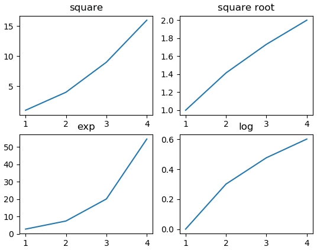

`matplotlib.pyplot`模块提供了一个 subplots() 函数，它的使用方法和 subplot() 函数类似。其不同之处在于，subplots() 既创建了一个包含子图区域的画布，又创建了一个 figure 图形对象，而 subplot() 只是创建一个包含子图区域的画布。

subplots 的函数格式如下：

fig , ax = plt.subplots(nrows, ncols)

nrows 与 ncols 表示两个整数参数，它们指定子图所占的行数、列数。

函数的返回值是一个元组，包括一个图形对象和所有的 axes 对象。其中 axes 对象的数量等于 nrows * ncols，且每个 axes 对象均可通过索引值访问（从1开始）。

下面我们创建了一个 2 行 2 列的子图，并在每个子图中显示 4 个不同的图像。

```python
import matplotlib.pyplot as plt
fig,a =  plt.subplots(2,2)
import numpy as np
x = np.arange(1,5)
#绘制平方函数
a[0][0].plot(x,x*x)
a[0][0].set_title('square')
#绘制平方根图像
a[0][1].plot(x,np.sqrt(x))
a[0][1].set_title('square root')
#绘制指数函数
a[1][0].plot(x,np.exp(x))
a[1][0].set_title('exp')
#绘制对数函数
a[1][1].plot(x,np.log10(x))
a[1][1].set_title('log')
plt.show()
```

上述代码的输出结果如下：



图1:输出结果