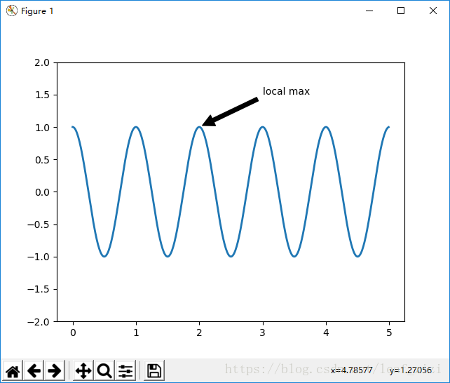
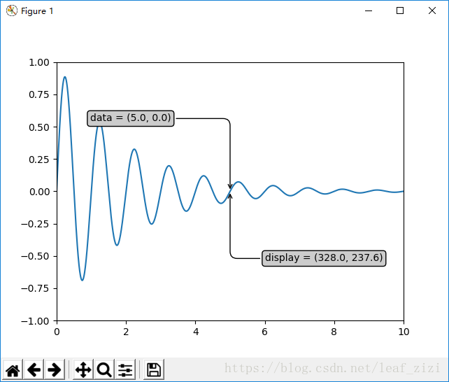
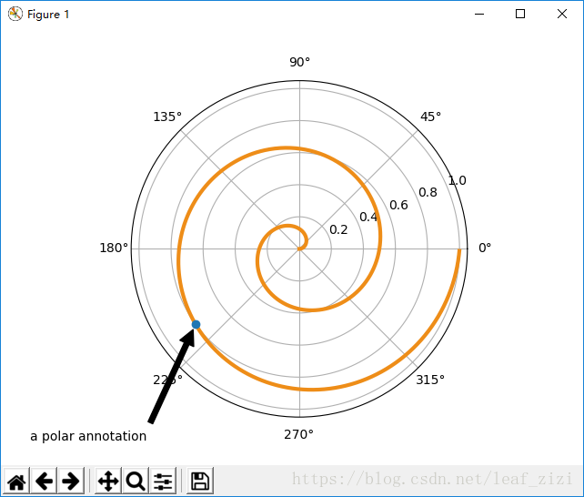
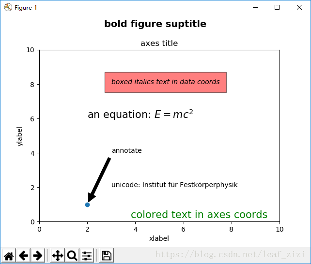

annotate用于在图形上给数据添加文本注解，而且支持带箭头的划线工具，方便我们在合适的位置添加描述信息。

https://matplotlib.org/stable/tutorials/text/mathtext.html

### 参数说明：

```
Axes.annotate(s, xy, *args, **kwargs)
```

- **s：**注释文本的内容
- **xy：**被注释的坐标点，二维元组形如(x,y)
- **xytext：**注释文本的坐标点，也是二维元组，默认与xy相同
- **xycoords：**被注释点的坐标系属性，允许输入的值如下

| 属性值            | 含义                                                         |
| :---------------- | :----------------------------------------------------------- |
| 'figure points'   | 以绘图区左下角为参考，单位是点数                             |
| 'figure pixels'   | 以绘图区左下角为参考，单位是像素数                           |
| 'figure fraction' | 以绘图区左下角为参考，单位是百分比                           |
| 'axes points'     | 以子绘图区左下角为参考，单位是点数（一个figure可以有多个axex，默认为1个） |
| 'axes pixels'     | 以子绘图区左下角为参考，单位是像素数                         |
| 'axes fraction'   | 以子绘图区左下角为参考，单位是百分比                         |
| 'data'            | 以被注释的坐标点xy为参考 (默认值)                            |
| 'polar'           | *不使用本地数据坐标系，使用极坐标系*                         |

- **textcoords** ：注释文本的坐标系属性，默认与xycoords属性值相同，也可设为不同的值。除了允许输入xycoords的属性值，还允许输入以下两种：

| 属性值          | 含义                                   |
| :-------------- | :------------------------------------- |
| 'offset points' | 相对于被注释点xy的偏移量（单位是点）   |
| 'offset pixels' | 相对于被注释点xy的偏移量（单位是像素） |

**arrowprops：**箭头的样式，dict（字典）型数据，如果该属性非空，则会在注释文本和被注释点之间画一个箭头。如果不设置`'arrowstyle'` 关键字，则允许包含以下关键字：

| 关键字     | 说明                                                |
| :--------- | :-------------------------------------------------- |
| width      | 箭头的宽度（单位是点）                              |
| headwidth  | 箭头头部的宽度（点）                                |
| headlength | 箭头头部的长度（点）                                |
| shrink     | 箭头两端收缩的百分比（占总长）                      |
| ?          | 任何 `matplotlib.patches.FancyArrowPatch中的关键字` |

如果设置了‘arrowstyle’关键字，以上关键字就不能使用。允许的值有：

| 箭头的样式 | 属性                                          |
| :--------- | :-------------------------------------------- |
| `'-'`      | None                                          |
| `'->'`     | head_length=0.4,head_width=0.2                |
| `'-['`     | widthB=1.0,lengthB=0.2,angleB=None            |
| `'|-|'`    | widthA=1.0,widthB=1.0                         |
| `'-|>'`    | head_length=0.4,head_width=0.2                |
| `'<-'`     | head_length=0.4,head_width=0.2                |
| `'<->'`    | head_length=0.4,head_width=0.2                |
| `'<|-'`    | head_length=0.4,head_width=0.2                |
| `'<|-|>'`  | head_length=0.4,head_width=0.2                |
| `'fancy'`  | head_length=0.4,head_width=0.4,tail_width=0.4 |
| `'simple'` | head_length=0.5,head_width=0.5,tail_width=0.2 |
| `'wedge'`  | tail_width=0.3,shrink_factor=0.5              |

`FancyArrowPatch的关键字包括`:

| Key             | Description                                                  |
| :-------------- | :----------------------------------------------------------- |
| arrowstyle      | 箭头的样式                                                   |
| connectionstyle | 连接线的样式                                                 |
| relpos          | 箭头起始点相对注释文本的位置，默认为 (0.5, 0.5)，即文本的中心，（0，0）表示左下角，（1，1）表示右上角 |
| patchA          | 箭头起点处的图形（matplotlib.patches对象），默认是注释文字框 |
| patchB          | 箭头终点处的图形（matplotlib.patches对象），默认为空         |
| shrinkA         | 箭头起点的缩进点数，默认为2                                  |
| shrinkB         | 箭头终点的缩进点数，默认为2                                  |
| mutation_scale  | default is text size (in points)                             |
| mutation_aspect | default is 1.                                                |
| ?               | any key for [`matplotlib.patches.PathPatch`](https://matplotlib.org/api/_as_gen/matplotlib.patches.PathPatch.html#matplotlib.patches.PathPatch) |

- **annotation_clip** : 布尔值，可选参数，默认为空。设为True时，只有被注释点在子图区内时才绘制注释；设为False时，无论被注释点在哪里都绘制注释。仅当xycoords为‘data’时，默认值空相当于True。

### 返回值：

**Annotation对象**

### **示例：**

- 一个基本的注释示例，设置了箭头的颜色和缩进，感兴趣的话可以以此为基础尝试更多的属性和样式。

```python
import numpy as np
import matplotlib.pyplot as plt
fig, ax = plt.subplots()
# 绘制一个余弦曲线
t = np.arange(0.0, 5.0, 0.01)
s = np.cos(2*np.pi*t)
line, = ax.plot(t, s, lw=2)
# 绘制一个黑色，两端缩进的箭头
ax.annotate('local max', xy=(2, 1), xytext=(3, 1.5),
            xycoords='data',
            arrowprops=dict(facecolor='black', shrink=0.05))
ax.set_ylim(-2, 2)
plt.show()
```



- 坐标转换示例——在本例中，我们学习用不同的坐标体系绘制注释。

```python
import numpy as np
import matplotlib.pyplot as plt
 
# 以步长0.005绘制一个曲线
x = np.arange(0, 10, 0.005)
y = np.exp(-x/2.) * np.sin(2*np.pi*x)
 
fig, ax = plt.subplots()
ax.plot(x, y)
ax.set_xlim(0, 10)
ax.set_ylim(-1, 1)
 
# 被注释点的数据轴坐标和所在的像素
xdata, ydata = 5, 0
xdisplay, ydisplay = ax.transData.transform_point((xdata, ydata))
 
# 设置注释文本的样式和箭头的样式
bbox = dict(boxstyle="round", fc="0.8")
arrowprops = dict(
    arrowstyle = "->",
    connectionstyle = "angle,angleA=0,angleB=90,rad=10")
 
# 设置偏移量
offset = 72
# xycoords默认为'data'数据轴坐标，对坐标点（5,0）添加注释
# 注释文本参考被注释点设置偏移量，向左2*72points，向上72points
ax.annotate('data = (%.1f, %.1f)'%(xdata, ydata),
            (xdata, ydata), xytext=(-2*offset, offset), textcoords='offset points',
            bbox=bbox, arrowprops=arrowprops)
 
# xycoords以绘图区左下角为参考，单位为像素
# 注释文本参考被注释点设置偏移量，向右0.5*72points，向下72points
disp = ax.annotate('display = (%.1f, %.1f)'%(xdisplay, ydisplay),
            (xdisplay, ydisplay), xytext=(0.5*offset, -offset),
            xycoords='figure pixels',
            textcoords='offset points',
            bbox=bbox, arrowprops=arrowprops)
 
 
plt.show()
```



- 极坐标上的注释——在此例中，我们会在极坐标系绘图，并在极坐标系设置被注释点，以绘图区的百分比为参数放置注释文本。

```python
import numpy as np
import matplotlib.pyplot as plt
 
# 绘制一个极地坐标，再以0.001为步长，画一条螺旋曲线
fig = plt.figure()
ax = fig.add_subplot(111, polar=True)
r = np.arange(0,1,0.001)
theta = 2 * 2*np.pi * r
line, = ax.plot(theta, r, color='#ee8d18', lw=3)
 
# 对索引为800处画一个圆点，并做注释
ind = 800
thisr, thistheta = r[ind], theta[ind]
ax.plot([thistheta], [thisr], 'o')
ax.annotate('a polar annotation',
            xy=(thistheta, thisr),  # 被注释点遵循极坐标系，坐标为角度和半径
            xytext=(0.05, 0.05),    # 注释文本放在绘图区的0.05百分比处
            textcoords='figure fraction',
            arrowprops=dict(facecolor='black', shrink=0.05),# 箭头线为黑色，两端缩进5%
            horizontalalignment='left',# 注释文本的左端和低端对齐到指定位置
            verticalalignment='bottom',
            )
plt.show()
```



- 不同样式的注释文本示例

```python
import matplotlib.pyplot as plt
 
# 设置绘图区标题
fig = plt.figure()
fig.suptitle('bold figure suptitle', fontsize=14, fontweight='bold')
 
# 设置子绘图区标题
ax = fig.add_subplot(111)
fig.subplots_adjust(top=0.85)
ax.set_title('axes title')
 
# 设置x y坐标轴的标识
ax.set_xlabel('xlabel')
ax.set_ylabel('ylabel')
 
# 红色、透明度0.5、边框留白10
ax.text(3, 8, 'boxed italics text in data coords', style='italic',
        bbox={'facecolor':'red', 'alpha':0.5, 'pad':10})
 
# 文字中有数学公式
ax.text(2, 6, r'an equation: $E=mc^2$', fontsize=15)
 
# 文字中有ASCII码
ax.text(3, 2, 'unicode: Institut f\374r Festk\366rperphysik')
 
# 转换坐标系
ax.text(0.95, 0.01, 'colored text in axes coords',
        verticalalignment='bottom', horizontalalignment='right',
        transform=ax.transAxes,
        color='green', fontsize=15)
 
# 在2,1处画个圆点，添加注释
ax.plot([2], [1], 'o')
ax.annotate('annotate', xy=(2, 1), xytext=(3, 4),
            arrowprops=dict(facecolor='black', shrink=0.05))
 
ax.axis([0, 10, 0, 10])
 
plt.show()
```



