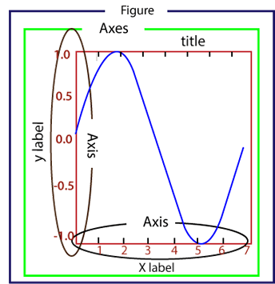
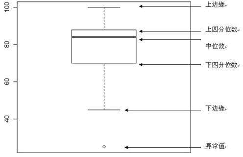

### Matplotlib画图图形组成




- Figure：指整个图形，您可以把它理解成一张画布，它包括了所有的元素，比如标题、轴线等；

- Axes：绘制 2D 图像的实际区域，也称为轴域区，或者绘图区；

- Axis：指坐标系中的垂直轴与水平轴，包含轴的长度大小（图中轴长为 7）、轴标签（指 x 轴，y轴）和刻度标签；

- Artist：您在画布上看到的所有元素都属于 Artist 对象，比如文本对象（title、xlabel、ylabel）、Line2D 对象（用于绘制2D图像）等。

  

#### 中文字体配置

```python
plt.rcParams["font.sans-serif"]=["SimHei"] #设置字体
plt.rcParams["axes.unicode_minus"]=False #该语句解决图像中的“-”负号的乱码问题
```

#### 配置figure相关属性

```python
plt.xlabel('年份') #设置X轴名称
plt.ylabel('年份') #设置Y轴名称
plt.title('年份') #设置图表标题
plt.yscale('log')
fig.tight_layout()#或fig.subplots_adjust() 避免多图重叠 
for x1, y1 in zip(x, y): # x,y表示显示内容的坐标位置
    plt.text(x1, y1, str(y1), ha='center', va='bottom', fontsize=10)
```

### figure画布设置

| 参数      | 说明                                                   |
| --------- | ------------------------------------------------------ |
| figsize   | 指定画布的大小，(宽度,高度)，单位为英寸。              |
| dpi       | 指定绘图对象的分辨率，即每英寸多少个像素，默认值为80。 |
| facecolor | 背景颜色。                                             |
| dgecolor  | 边框颜色。                                             |
| frameon   | 是否显示边框。                                         |

### legend()绘制图例

axes 或figure类的 legend() 方法负责绘制画布中的图例，它需要三个参数，如下所示：

```python
ax.legend(handles, labels, loc='best', bbox_to_anchor=(0.5, 0., 0.5, 0.5))
plt.legend(handles, labels, loc='upper right', bbox_to_anchor=(0.5, 0.5))
# labels需传入列表或者元组，否则会出现内容显示不全的情况
```

- labels 是一个字符串序列，用来指定标签的名称；
- loc 是指定图例位置的参数，其参数值可以用字符串或整数来表示；
- handles 参数，它也是一个序列，它包含了所有线型的实例；

#### subplot分割画布

```python
#绘图区域会被覆盖
plt.plot([1,2,3])
#现在创建一个子图，它表示一个有2行1列的网格的顶部图。
#因为这个子图将与第一个重叠，所以之前创建的图将被删除
plt.subplot(211)
plt.plot(range(12))
#创建带有黄色背景的第二个子图
plt.subplot(212, facecolor='y')
plt.plot(range(12))
```

```python
#绘图区不会被覆盖
fig = plt.figure()
ax1 = fig.add_subplot(111)
ax1.plot([1,2,3])
ax2 = fig.add_subplot(221, facecolor='y')
ax2.plot([1,2,3])
```

```python
#在一个绘画区中添加子图
x = np.arange(0, math.pi*2, 0.05)
fig=plt.figure()
axes1 = fig.add_axes([0.1, 0.1, 0.8, 0.8]) # main axes
axes2 = fig.add_axes([0.55, 0.55, 0.3, 0.3]) # inset axes
y = np.sin(x)
axes1.plot(x, y, 'b')
axes2.plot(x,np.cos(x),'r')
axes1.set_title('sine')
axes2.set_title("cosine")
plt.show()
```

#### Subplots 的函数格式如下：

使用方法和 subplot() 函数类似。其不同之处在于，subplots() 既创建了一个包含子图区域的画布，又创建了一个 figure 图形对象，而 subplot() 只是创建一个包含子图区域的画布。

```python
fig , ax = plt.subplots(nrows, ncols)
```

nrows 与 ncols 表示两个整数参数，它们指定子图所占的行数、列数。

函数的返回值是一个元组，包括一个图形对象和所有的 axes 对象。其中 axes 对象的数量等于 nrows * ncols，且每个 axes 对象均可通过索引值访问（从1开始）。

下面我们创建了一个 2 行 2 列的子图，并在每个子图中显示 4 个不同的图像。

```python
import matplotlib.pyplot as plt
fig,a =  plt.subplots(2,2)
import numpy as np
x = np.arange(1,5)
#绘制平方函数
a[0][0].plot(x,x*x)
a[0][0].set_title('square')
#绘制平方根图像
a[0][1].plot(x,np.sqrt(x))
a[0][1].set_title('square root')
#绘制指数函数
a[1][0].plot(x,np.exp(x))
a[1][0].set_title('exp')
#绘制对数函数
a[1][1].plot(x,np.log10(x))
a[1][1].set_title('log')
plt.show()
```

#### subplot2grid() 

该函数能够在画布的特定位置创建 axes 对象（即绘图区域）。不仅如此，它还可以使用不同数量的行、列来创建跨度不同的绘图区域。与 subplot() 和 subplots() 函数不同，subplot2gird() 函数以非等分的形式对画布进行切分，并按照绘图区域的大小来展示最终绘图结果。

函数语法格式如下：

```python
plt.subplot2grid(shape, location, rowspan, colspan)
```

参数含义如下：

- shape：把该参数值规定的网格区域作为绘图区域；
- location：在给定的位置绘制图形，初始位置 (0,0) 表示第1行第1列；
- rowsapan/colspan：这两个参数用来设置让子区跨越几行几列。

#### 创建绘图区

下面使用 figure() 创建一个空白画布：

```python
fig = plt.figure()
```

我们使用 add_axes() 将 axes 轴域添加到画布中。如下所示：

```python
ax=fig.add_axes([0,0,1,1])
```

add_axes() 的参数值是一个序列，序列中的 4 个数字分别对应图形的左侧，底部，宽度，和高度，且每个数字必须介于 0 到 1 之间。

#### 配置绘图区相关属性

```python
ax.set_ylim(0,10000) #设置y轴范围
ax.set_xlim(0,10000)
ax.set_title("sine wave")
ax.set_xlabel('angle',labelpad = 10) #labelpad 设置与边框的距离,也可以替换成 ax.xaxis.labelpad = 10
ax.set_ylabel('sine')
ax.set_yscale("log")
ax.spines['bottom'].set_color('blue')
ax.spines['left'].set_linewidth(2)
#将侧轴、顶部轴设置为None
ax.spines['right'].set_color(None)
ax.set_xticks([0,2,4,6])
#设置x轴刻度标签
ax.set_xticklabels(['zero','two','four','six'])
#设置y轴刻度
ax.set_yticks([-1,0,1])
```

#### 双轴图

```python
#创建图形对象
fig = plt.figure()
#添加子图区域
a1 = fig.add_axes([0,0,1,1])
#准备数据
x = np.arange(1,11)
#绘制指数函数
a1.plot(x,np.exp(x))
a1.set_ylabel('exp')
#添加双轴
a2 = a1.twinx()
#‘ro’表示红色圆点
a2.plot(x, np.log(x),'ro-')
#绘制对数函数
a2.set_ylabel('log')
#绘制图例
fig.legend(labels = ('exp','log'),loc='upper left')
plt.show()
```

### **折线图**

```python
#准备绘制数据
x = ["Mon", "Tues", "Wed", "Thur", "Fri","Sat","Sun"]
y = [20, 40, 35, 55, 42, 80, 50]
# "g" 表示红色，marksize用来设置'D'菱形的大小
plt.plot(x, y, "g", marker='D', markersize=5, label="周活")
#绘制坐标轴标签
plt.xlabel("登录时间")
plt.ylabel("用户活跃度")
plt.title("C语言中文网活跃度")
#显示图例
plt.legend(loc="lower right")
#调用 text()在图像上绘制注释文本
#x1、y1表示文本所处坐标位置，ha参数控制水平对齐方式, va控制垂直对齐方式，str(y1)表示要绘制的文本
for x1, y1 in zip(x, y):
    plt.text(x1, y1, str(y1), ha='center', va='bottom', fontsize=10)
for x1, y1 in zip(x, df.info): # x,y表示显示内容的坐标位置
    plt.text(x1, y1,'%.3f'%(y1*100)+'%', ha='center', va='bottom', fontsize=10)
#保存图片
plt.savefig("1.jpg")
plt.show()
```

```python
plt.plot(year, people,color = 'green')
#折线图 带色块的折线图
plt.fill_between(year, people, 20, color = 'green')
```

折线图样式配置

| 符号 | '-'，'--'，'-.'，':'，'.'，','，，o，^，v，<，>，s，+，x，D，d，1，2，3，4，h，H，p，\| ，_ |
| ---- | ------------------------------------------------------------ |
| 颜色 | b(蓝色)，g(绿色)，r(红色)，c(青色)，m(品红)，y(黄色)，k(黑色)，w(白色) |


#### 柱状图

```python
#创建图形对象
fig = plt.figure()
#添加子图区域，参数值表示[left, bottom, width, height ]
ax = fig.add_axes([0,0,1,1])
#准备数据
langs = ['C', 'C++', 'Java', 'Python', 'PHP']
students = [23,17,35,29,12]
#绘制柱状图
ax.bar(langs,students)
plt.show()
```

```python
data = 
[[30, 25, 50, 20],
[40, 23, 51, 17],
[35, 22, 45, 19]]
X = np.arange(4)
fig = plt.figure()
#添加子图区域
ax = fig.add_axes([0,0,1,1])
#绘制柱状图
ax.bar(X + 0.00, data[0], color = 'b', width = 0.25)
ax.bar(X + 0.25, data[1], color = 'g', width = 0.25)
ax.bar(X + 0.50, data[2], color = 'r', width = 0.25)
```

```python
countries = ['USA', 'India', 'China', 'Russia', 'Germany'] 
bronzes = np.array([38, 17, 26, 19, 15]) 
silvers = np.array([37, 23, 18, 18, 10]) 
golds = np.array([46, 27, 26, 19, 17]) 
# 此处的 _ 下划线表示将循环取到的值放弃，只得到[0,1,2,3,4]
ind = [x for x, _ in enumerate(countries)] 
#绘制堆叠图
plt.bar(ind, golds, width=0.5, label='golds', color='gold', bottom=silvers+bronzes) 
plt.bar(ind, silvers, width=0.5, label='silvers', color='silver', bottom=bronzes) 
plt.bar(ind, bronzes, width=0.5, label='bronzes', color='#CD853F') 
#设置坐标轴
plt.xticks(ind, countries) 
plt.ylabel("Medals") 
plt.xlabel("Countries") 
plt.legend(loc="upper right") 
plt.title("2019 Olympics Top Scorers")
plt.show()
```

#### 直方图

```python
#创建图形对象和轴域对象
fig,ax = plt.subplots(1,1)
a = np.array([22,87,5,43,56,73,55,54,11,20,51,5,79,31,27])
#绘制直方图
ax.hist(a, bins = [0,25,50,75,100])
#设置坐标轴
ax.set_title("histogram of result")
ax.set_xticks([0,25,50,75,100])
ax.set_xlabel('marks')
ax.set_ylabel('no.of students')
plt.show()
```

#### 饼状图

```python
#添加图形对象
fig = plt.figure()
ax = fig.add_axes([0,0,1,1])
#使得X/Y轴的间距相等
ax.axis('equal')
#准备数据
langs = ['C', 'C++', 'Java', 'Python', 'PHP']
students = [23,17,35,29,12]
#绘制饼状图
ax.pie(students, labels = langs,autopct='%1.2f%%')
plt.show()
```

#### 散点图

```python
girls_grades = [89, 90, 70, 89, 100, 80, 90, 100, 80, 34]
boys_grades = [30, 29, 49, 48, 100, 48, 38, 45, 20, 30]
grades_range = [10, 20, 30, 40, 50, 60, 70, 80, 90, 100]
fig=plt.figure()
#添加绘图区域
ax=fig.add_axes([0,0,1,1])
ax.scatter(grades_range, girls_grades, color='r',label="girls")
ax.scatter(grades_range, boys_grades, color='b',label="boys")
ax.set_xlabel('Grades Range')
ax.set_ylabel('Grades Scored')
ax.set_title('scatter plot')
#添加图例
plt.legend()
plt.show()
```

#### 等高线图

```python
#创建xlist、ylist数组
xlist = np.linspace(-3.0, 3.0, 100)
ylist = np.linspace(-3.0, 3.0, 100)
#将上述数据变成网格数据形式
X, Y = np.meshgrid(xlist, ylist)
#定义Z与X,Y之间的关系
Z = np.sqrt(X**2 + Y**2)
fig,ax=plt.subplots(1,1)
#填充等高线颜色
cp = ax.contourf(X, Y, Z)
fig.colorbar(cp) # 给图像添加颜色柱
ax.set_title('Filled Contours Plot')
ax.set_xlabel('x (cm)')
ax.set_ylabel('y (cm)')
#画等高线
plt.contour(X,Y,Z)
plt.show()
```

#### 振动图

```python
x,y = np.meshgrid(np.arange(-2, 2, 0.2), np.arange(-2, 2, 0.25))
z = x*np.exp(-x**2 - y**2)
#计算数组中元素的梯度
v, u = np.gradient(z, 0.2, 0.2)
fig, ax = plt.subplots()
q = ax.quiver(x,y,u,v)
plt.show()
```

#### 箱型图

箱型图（也称为盒须图）于 1977 年由美国著名统计学家**约翰·图基**（John Tukey）发明。它能显示出一组数据的最大值、最小值、中位数、及上下四分位数。

在箱型图中，我们从上四分位数到下四分位数绘制一个盒子，然后用一条垂直触须（形象地称为“盒须”）穿过盒子的中间。上垂线延伸至上边缘（最大值），下垂线延伸至下边缘（最小值）。箱型图结构如下所示：



图1：箱型如结构图


首先准备创建箱型图所需数据：您可以使用`numpy.random.normal()`函数来创建一组基于正态分布的随机数据，该函数有三个参数，分别是正态分布的平均值、标准差以及期望值的数量。如下所示：

```python
#利用随机数种子使每次生成的随机数相同
np.random.seed(10)
collectn_1 = np.random.normal(100, 10, 200)
collectn_2 = np.random.normal(80, 30, 200)
collectn_3 = np.random.normal(90, 20, 200)
collectn_4 = np.random.normal(70, 25, 200)
data_to_plot=[collectn_1,collectn_2,collectn_3,collectn_4]
fig = plt.figure()
#创建绘图区域
ax = fig.add_axes([0,0,1,1])
#创建箱型图
bp = ax.boxplot(data_to_plot)
plt.show()
```

#### 提琴图

小提琴图（Violin Plot）是用来展示数据分布状态以及概率密度的图表。这种图表结合了箱形图和密度图的特征。小提琴图跟箱形图类似，不同之处在于小提琴图还显示数据在不同数值下的概率密度。

小提琴图使用核密度估计（KDE）来计算样本的分布情况，图中要素包括了中位数、四分位间距以及置信区间。在数据量非常大且不方便一一展示的时候，小提琴图特别适用。

概率密度估计、置信区间、四分位间距都属于统计学中的概念，可自行查阅，这里不做说明。

小提琴图比箱型图能提供了更多的信息。虽然箱型图显示了均值、中位数和上、下四分位数等统计信息，但是小提琴图却显示了数据的完整分布情况，这更利于数据的分析与比对。下面是小提琴图的使用示例：

```python
np.random.seed(10)
collectn_1 = np.random.normal(100, 10, 200)
collectn_2 = np.random.normal(80, 30, 200)
collectn_3 = np.random.normal(90, 20, 200)
collectn_4 = np.random.normal(70, 25, 200)
#创建绘制小提琴图的数据序列
data_to_plot = [collectn_1, collectn_2, collectn_3, collectn_4]
#创建一个画布
fig = plt.figure()
#创建一个绘图区域
ax = fig.add_axes([0,0,1,1])
# 创建一个小提琴图
bp = ax.violinplot(data_to_plot)
plt.show()
```

绘制文本