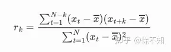
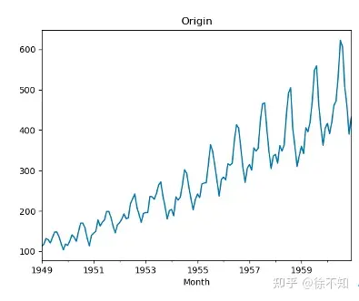
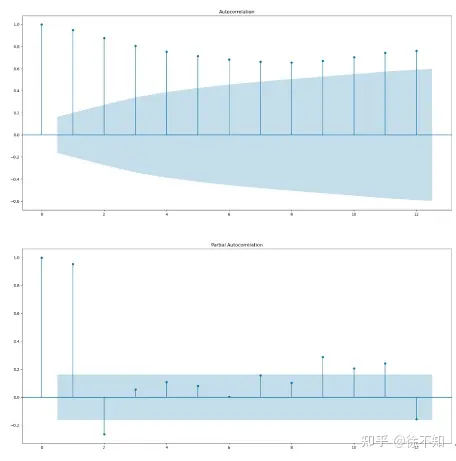
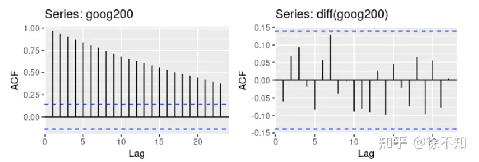
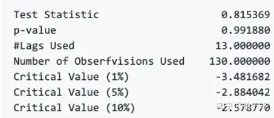
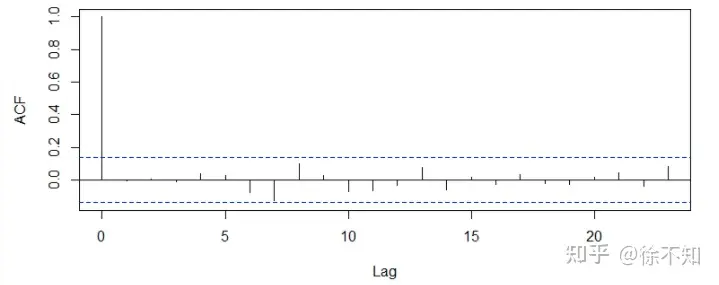

最近在做[时序预测](https://zhida.zhihu.com/search?q=时序预测&zhida_source=entity&is_preview=1)方面的项目，从零开始一路摸索，也踩了不少坑，终于对这个领域有了一定的了解。在此做一个基本教程，重在概念理解与知识点疏通，帮助对该领域不熟悉的同学快速入门。

由于时序预测任务涉及的知识点较多，我准备用三篇文章分述，分别介绍**基础知识、传统方法以及深度学习方法**。本篇是该系列的第一篇文章，主要介绍基础知识，要点如下：

1. 时间序列
   1.1 定义
   1.2 基本任务（预测、[异常检测](https://zhida.zhihu.com/search?q=异常检测&zhida_source=entity&is_preview=1)等）
2. 平稳性
   2.1 概念
   2.2 检验方法（ACF、PACF、[假设检验](https://zhida.zhihu.com/search?q=假设检验&zhida_source=entity&is_preview=1)）
   2.3 平稳性转换方法
   2.4 [白噪声](https://zhida.zhihu.com/search?q=白噪声&zhida_source=entity&is_preview=1)
3. 评价指标

------

## 1. 时间序列

**1.1 定义**

时间序列（英语：time series）是一组按照时间发生先后顺序进行排列的数据点序列。通常一组时间序列的时间间隔为一恒定值（如1秒，5分钟，12小时，7天，1年），因此时间序列可以作为离散时间数据进行分析处理。

定义应该很好理解，日常生活中时间序列无处不在：CPU负载、上证指数、商场每天的人流量、商品每日价格。

**1.2 基本任务**

**单指标时序预测任务**：给定某一个指标的历史变化情况，预测其在未来一段时间内的变化。

**多指标时序预测任务**：给定某几个指标的历史变化情况，预测其在未来一段时间内的变化。该任务与单指标时序预测任务的区别在于，几个指标之间不一定相互独立，而是存在某种影响。

**时序异常检测任务**：从正常的时间序列中识别不正常的事件或行为的过程。可以从历史数据中检测，也可以基于时序预测对尚未发生的异常做出预警。

**时序指标聚类**：将变化趋势类似的时序指标归至同一类别。在实际运维工作中，面对的指标可能成百上千，分别对其进行分析，工作量太大，可以在聚类的基础上再做建模分析。

**指标[关联分析](https://zhida.zhihu.com/search?q=关联分析&zhida_source=entity&is_preview=1)**：即分析指标A是否会对指标B有影响，以及有什么样的影响（正向/负向、先后关系、多少时间步后造成影响等等）。

## 2. 平稳性

**1.1 概念**

平稳性是时序分析的重要概念，时序分析基本上是以[平稳时间序列](https://zhida.zhihu.com/search?q=平稳时间序列&zhida_source=entity&is_preview=1)为基础的。

平稳性包括弱平稳与强平稳，其中强平稳的证明很困难。好消息是我们一般不需要关注强平稳，常见的[时序分析](https://zhida.zhihu.com/search?q=时序分析&zhida_source=entity&is_preview=1)任务都是基于弱平稳做的。

什么是**弱平稳**呢？简单来说需要满足以下三点：

- 均值（即从t=0到当前时间步的均值）为常数
- 方差收敛
- [协方差](https://zhida.zhihu.com/search?q=协方差&zhida_source=entity&is_preview=1)仅与时间间隔有关，与位置无关。

可能有人会好奇，协方差的计算需要两个向量，那么给定一条时间序列，为什么有协方差呢？其实时间序列中的协方差，通过一定间隔的两个时间步的值计算，记间隔为 𝑙𝑎𝑔=𝑘，则协方差为 𝑐𝑜𝑣(𝑥𝑡,𝑥𝑡−𝑘) 。

**2.1 检验方法**

常用平稳性检验方法有两种**。**一种是ACF、PACF图，另一种是假设检验。

***2.1.1 ACF、PACF\***

**ACF指自相关性系数**，通常用 𝑟𝑘 表示，用于测量时间序列滞后值之间的线性关系，公式如下（可见 𝑟0=1 ）：

**PACF指偏自相关性系数**，指剔除了中间k-1个随机变量的影响后， 𝑥𝑡−𝑘 对 𝑥𝑡 影响的相关度量。计算较为复杂，这里不介绍了（其实我也没仔细看）。

以时序预测任务中常见的航班数据集为例（AirPassengers.csv，下载点[这里](https://link.zhihu.com/?target=https%3A//github.com/xuawai/TSFrame-time-series-forecasting/blob/master/AirPassengers.csv)），绘图如下：

该数据集的[自相关函数](https://zhida.zhihu.com/search?q=自相关函数&zhida_source=entity&is_preview=1)ACF与偏自相关函数PACF的[示意图](https://zhida.zhihu.com/search?q=示意图&zhida_source=entity&is_preview=1)如下所示，其中横坐标表示间隔为 𝑙𝑎𝑔=𝑘，纵坐标表示 𝑟𝑘 ，：

至此关于ACF、PACF的概念介绍结束，那么**它们如何作用于平稳性检验呢**？对于一个平稳时间序列，自相关系数（ACF）会快速的下降到接近 0 的水平，然而非平稳时间序列的[自相关系数](https://zhida.zhihu.com/search?q=自相关系数&zhida_source=entity&is_preview=1)会下降的比较缓慢；同样的，非平稳时间序列的自相关系数通常非常大并且为正值。据此，上图中的航班数据集是非平稳的。

我们再举个例子，下图来自于谷歌股价数据集。左图：非平稳；右图：平稳。

***2.2.2 假设检验\***

常用的用于检测平稳性的假设检验是**ADF（Augmented Dickey-Fuller Test）检验**，[p值](https://zhida.zhihu.com/search?q=p值&zhida_source=entity&is_preview=1)小于0.05便可以认为平稳。航班数据集的检验结果如下：

**2.3 平稳性转换方法**

给定一个非平稳的时间序列，一般需要将它转换为[平稳序列](https://zhida.zhihu.com/search?q=平稳序列&zhida_source=entity&is_preview=1)，再做建模。常用的平稳性转换方法如下：

- 变形（[log函数](https://zhida.zhihu.com/search?q=log函数&zhida_source=entity&is_preview=1)等）
- 减去移动平均、指数平均等
- 差分

哲理要重点说一下**差分**。所谓差分，就是用 𝑥𝑡−𝑥𝑡−1 的值代替 𝑥𝑡 ，这是一阶差分。在[一阶差分](https://zhida.zhihu.com/search?q=一阶差分&zhida_source=entity&is_preview=1)的基础上，继续做差分，就是[二阶差分](https://zhida.zhihu.com/search?q=二阶差分&zhida_source=entity&is_preview=1)。对于大部分[时序数据](https://zhida.zhihu.com/search?q=时序数据&zhida_source=entity&is_preview=1)来说，二阶差分后，都可以得到平稳序列，很少用到更高阶的差分。

值得一提的是，对于很多时序预测模型尤其是深度学习模型来说，我们会发现，代码中可能并没有平稳性转换这一步。这是因为这些模型中往往有自动[特征提取](https://zhida.zhihu.com/search?q=特征提取&zhida_source=entity&is_preview=1)的步骤，从而隐性地完成平稳性转换。

**2.4 白噪声**

关于白噪声，网上的描述有很多用词不精准或者相互矛盾之处。我梳理了不少资料，在此将白噪声相关的知识点枚举如下：

- “白噪声”是一个对所有时间其自相关系数为零的[随机过程](https://zhida.zhihu.com/search?q=随机过程&zhida_source=entity&is_preview=1)，如果时序数据是白噪声的话，是没有预测意义的。其ACF图如下（注意 𝑙𝑎𝑔=0 时， 𝑟𝑘=𝑟0=1 。如果不理解，可回顾2.1.1小节）：

- 白噪声和[残差](https://zhida.zhihu.com/search?q=残差&zhida_source=entity&is_preview=1)完全是两个概念，不要混淆。“残差”在[数理统计](https://zhida.zhihu.com/search?q=数理统计&zhida_source=entity&is_preview=1)中是指实际观察值与估计值（拟合值）之间的差。
- 时间序列分解时，残差应该为白噪声才合理。如果不是白噪声，可以考虑对残差继续进行时序建模。[时间序列分解](https://zhida.zhihu.com/search?q=时间序列分解&zhida_source=entity&is_preview=1)会在本系列的下一篇文章中介绍。
- 白噪声是平稳的，但是[随机游走](https://zhida.zhihu.com/search?q=随机游走&zhida_source=entity&is_preview=1)（或纯随机序列）并非平稳。“随机游走”指基于过去的表现，无法预测将来的发展步骤和方向。
- 平稳的序列并不一定是白噪声。
- Box-Pierce检验（升级版：Ljung-Box检验）用于判断时间序列是否为白噪声。

**3. 评价指标**

- RMSE：均方根误差，最常见的一种。
- MAE：[平均绝对误差](https://zhida.zhihu.com/search?q=平均绝对误差&zhida_source=entity&is_preview=1)。
- MAPE：平均绝对百分比误差。
- MASE：平均绝对比例误差，这个用得不多。
- R-square：小于0很差，等于0相当于将结果预测为均值，等于1则完全预测正确。这个也比较常见。
- Adjusted R-square：消除了R-square中样本数量的影响。

关于以上度量指标，具体公式可以百度，都很简单，这里不再赘述。