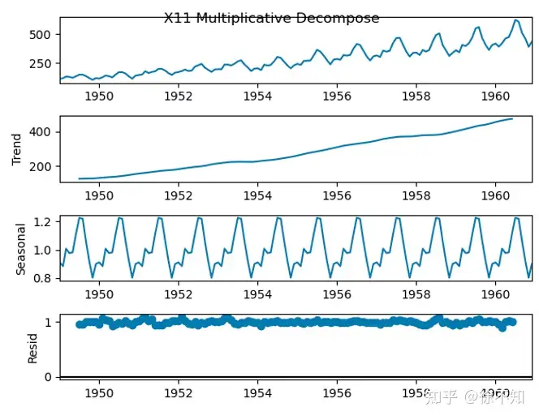
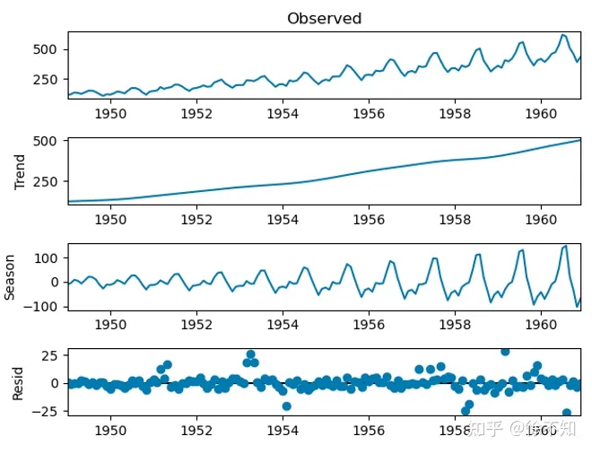
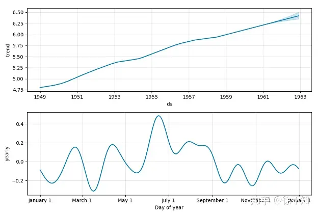
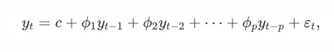
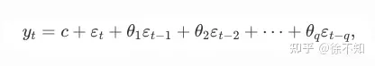
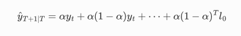
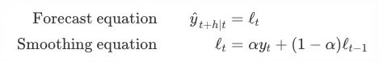
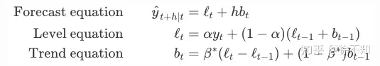
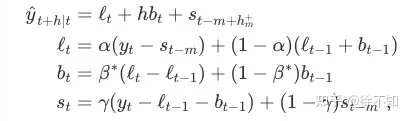
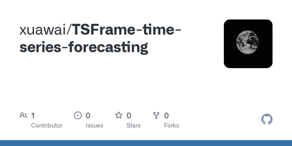

本文介绍时间序列分解方法以及常见的几种时序预测方法，目录如下：

1. [时间序列分解](https://zhida.zhihu.com/search?q=时间序列分解&zhida_source=entity&is_preview=1)
   1.1 概念（趋势项、季节项、残差项、乘性/加性分解）
   1.2 常见分解方法（经典分解、X11、SEATS、STL、fbprophet）
2. ARIMA模型
3. Holt模型
4. Prophet模型
5. TSFrame项目

------

## 1. 时间序列分解

**1.1 概念**

时间序列分解，指将时间序列分解为三部分：**趋势项、季节项、残差项**。

一般包括**乘性分解与加性分解**，前者即时间序列=趋势项*季节项*残差项，后者即时间序列=趋势项+季节项+残差项。

对于乘法性模型，可以取对数，将其转化为加法性模型。

如果季节性波动的幅度或者趋势周期项的波动不随时间序列水平的变化而变化，那么加法模型是最为合适的。当季节项或趋势周期项的变化与时间序列的水平成比例时，则乘法模型更为合适。例如，在经济时间序列中，乘法模型较为常用。

注意**季节性**不一定指每季，也可以指每年/月/周等。

中心[移动平均](https://zhida.zhihu.com/search?q=移动平均&zhida_source=entity&is_preview=1)是提取季节项的基础方法。

**1.2 常见分解方法**

***1.2.1 经典分解法\***

经典算法步骤相对简单，在没有计算机和计算机算力不强的年代很是实用，同时它也是很多其他分解算法的基础。经典分解法假设周期性成分在每个周期内都是相同的（如每年的[月周期](https://zhida.zhihu.com/search?q=月周期&zhida_source=entity&is_preview=1)成分都相同）。经典分解法使用**[移动平均法](https://zhida.zhihu.com/search?q=移动平均法&zhida_source=entity&is_preview=1)**处理数据。

首先估计周期长度，以一周期为区间，对一块块数据取均值，得出趋势。然后使用原数据减去趋势，求不同块数据的均值，得出周期序列，而后根据该二者得出残差。乘法性模型的求解方法类似。

***1.2.2 X11分解法\***

X11方法基于经典分解法，包括很多其它的步骤和特点来克服经典分解法的一些不足。X11有一些复杂的方法来处理交易日、假期及一些其它已知的影响因素的影响。它能够处理加法性模型和乘法性模型。该方法[鲁棒性](https://zhida.zhihu.com/search?q=鲁棒性&zhida_source=entity&is_preview=1)强，能够处理时间序列中的异常值和数据突变。

Python的statsmodels.tsa.seasonal.seasonal_decompose使用的便是X11分解法。（一说经典分解法，未查到权威资料）



***1.2.3 SEATS分解法\***

“SEATS”全称“Seasonal Extraction in ARIMA Time Series”，也称X-13-ARIMA-SEATS方法。此方法由西班牙银行开发。这个算法只是针对季度性和月度数据。因此天级数据、小时级数据或者周数据，需要其他的方法。

Python内有X13库，但并不对外提供分解接口。

***1.2.4 STL分解法\***

STL是一种多功能、鲁棒的方法。全称“Seasonal and Trend decomposition using Loess”，其中Loess是一种鲁棒的[回归算法](https://zhida.zhihu.com/search?q=回归算法&zhida_source=entity&is_preview=1)。

特点：

- 与SEATS与X11不同，STL可以处理任意季节性数据，而非局限于月度或季度数据
- 季节部分可以随时间变化，变化率可以由用户控制。STL的一大特点便是提供对季节性的单独乘法趋势，可以在采用加法型模型时，使加上去的趋势的幅度不断扩大。且该变化率是自动检测的。
- 趋势周期的平滑度可以由用户控制
- 可以对[异常值](https://zhida.zhihu.com/search?q=异常值&zhida_source=entity&is_preview=1)鲁棒（使异常值不影响季节部分与趋势部分，但是影响残差），代码中一般有robust=True/False控制。

缺点：

- 不能自动处理节假日
- **不支持乘性分解**（可以通过log、box-cox变换实现）



***1.2.5 fbprophet分解***

由Facebook的fbprophet库提供的分解接口，具体原理未知，资料显示其类似于[STL](https://zhida.zhihu.com/search?q=STL&zhida_source=entity&is_preview=1)算法，可以设定多个独立运作的周期，可以指定节假日，可以和STL一样设定周期的乘法性，指定诸多参数。功能全面且强大，性能也强于STL。主要缺陷有：同STL一样不提供乘法性分解（可以使用log处理达到效果），且似乎没有提供独立的分解序列的方法，只能训练完模型后查看分解结果，因此难以将其当做独立的分解方法用于其它预测方法。

航班数据集分解结果如下：



## **2. ARIMA模型**

**最重要的时序[预测模型](https://zhida.zhihu.com/search?q=预测模型&zhida_source=entity&is_preview=1)。**在任何一篇关于时序预测的介绍中，都能看到这个模型的身影。

ARIMA模型本质上由三部分组成，**AR（p阶自回归模型）+I（i阶差分）+MA（q阶[移动平均模型](https://zhida.zhihu.com/search?q=移动平均模型&zhida_source=entity&is_preview=1)）**。

AR的公式为：



MA的公式为：



其中 𝜖 是白噪声，均值为0，方差为1。

ARIMA首先要确定差分阶数i，以确保数据在i阶差分后平稳；接着，再确定是AR（q=0）、MA（p=0）还是ARMA（p、q均不为0）。

参数p、q可以通过ACF图与PACF图选定。但是在学习过程中，我发现许多文章关于p、q的选定方法有自相矛盾之处，且这种方法多基于感性认识（如拖尾/截尾、快速下降、明显突起的判断等），不够精确。再次不再详细介绍这方面的内容。实际工程中，一般会通过**网格搜索**的方式确定p、i、q的最优取值，一般以**AIC/BIC信息准则**作为变量的选择依据。

注意ARIMA还有一个季节性版本，会额外多一组p、i、q参数，一般代码中会使用该版本，具体可以参见python的**pmdarima**库。

## **3. Holt模型**

对于没有明显趋势或季节因素的数据，可以使用“简单指数平滑”(一次指数平滑，或**一阶holt**)，直观理解就是离当前时间步越近的历史值，影响越大：



也可以写作：



Holt将简单指数平滑扩展至趋势性数据(二次指数平滑，或**二阶holt**)：



Holt-Winter将Holt拓展至季节性数据(三次指数平滑，或**三阶holt**)：



在实际使用中，一般都会用Holt-Winter。python中的**statsmodels.tsa**库提供了holt模型。

再次总结一下ARIMA与Holt的联系：

- 一阶Holt—Winters假设数据是stationary的（静态分布）
- 二阶Holt假设数据有一个趋势
- 三阶Holt在二阶的假设基础上，多了一个周期性的成分。
- AR/MA/ARMA假设数据是平稳的
- ARIMA假设数据是非平稳的，且通过一次/两次差分可以实现平稳（也就是参数中i的含义）

## **4. Prophet模型**

- 分段线性或逻辑增长曲线趋势。 Prophet通过从数据中选择改变点，自动检测趋势的变化。
- 用傅里叶级数模拟每年的季节性分量。
- 用[虚拟变量](https://zhida.zhihu.com/search?q=虚拟变量&zhida_source=entity&is_preview=1)来模拟每周的周期性分量。
- 用户提供的重要节日列表

关于fbprophet库的重要参数说明：

- 制定[预测值](https://zhida.zhihu.com/search?q=预测值&zhida_source=entity&is_preview=1)的上限、下限，从而来进行饱和性预测，这种情况下只能用“logistic”，不能用“linear”

```python3
m = Prophet(growth='logistic') 
df['cap'] = 6 
m.fit(df) 
future = m.make_future_dataframe(periods=prediction_length, freq='min') 
future['cap'] = 6
```

- 在 Prophet 算法中，需要给出变点的位置，个数，以及增长的变化率的（可以采用默认）。
  - changepoint_range 指的是百分比，需要在前 changepoint_range 那么长的时间序列中设置变点，在默认的函数中是 changepoint_range = 0.8。
  - n_changepoint 表示变点的个数，在默认的函数中是 n_changepoint = 25。
  - changepoint_prior_scale 表示变点增长率的分布情况。

## 5. TSFrame项目

个人项目，使用统一接口整合了多种时序分解方法与时序预测方法，保留核心参数，降低使用成本，方便快速上手尝试：

[GitHub - xuawai/TSFrame-time-series-forecastinggithub.com/xuawai/TSFrame-time-series-forecasting](https://link.zhihu.com/?target=https%3A//github.com/xuawai/TSFrame-time-series-forecasting)

- 支持的时间序列分解方法包括：STL、RobustSTL、X11
- 支持的时间序列预测方法包括：Arima、Holt、Prophet
- 在无分解模式下，直接对时序数据进行预测。
- 在分解模式下，首先将时序数据分解为[趋势项](https://zhida.zhihu.com/search?q=趋势项&zhida_source=entity&is_preview=1)、季节项与残差项；接着，使用指定模型对每一项分别进行预测；最后，聚合各项预测结果，最后[时序数据](https://zhida.zhihu.com/search?q=时序数据&zhida_source=entity&is_preview=1)的最终预测结果。
- 支持in-sample & out-of-sample预测
- 轻松拓展至更多模型