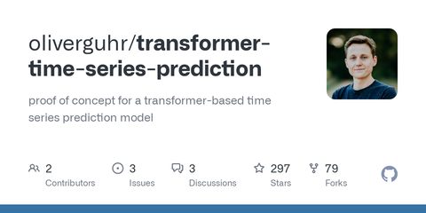
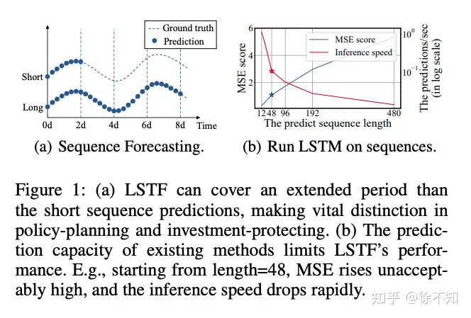
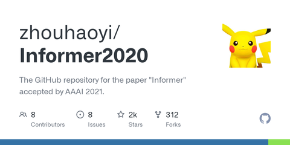
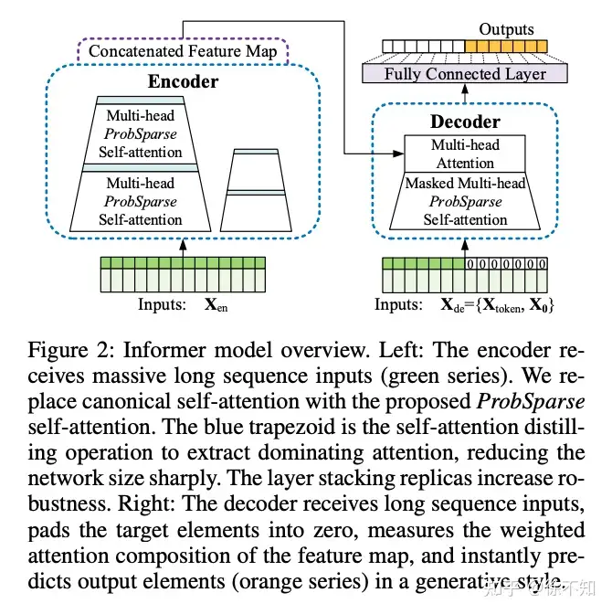

本文介绍时序预测任务中的常见深度学习方法，目录如下：

1. LSTM
2. Transformer
3. Informer
4. 一些重要的库

------

## 1. LSTM

模型的基本结构如下：

```python3
class LSTM(nn.Module):
    def __init__(self, input_size=1, hidden_layer_size=100, output_size=1):
        super().__init__()
        self.hidden_layer_size = hidden_layer_size

        self.lstm = nn.LSTM(input_size, hidden_layer_size)

        self.linear = nn.Linear(hidden_layer_size, output_size)

        self.hidden_cell = (torch.zeros(1,1,self.hidden_layer_size),
                            torch.zeros(1,1,self.hidden_layer_size)) # (num_layers * num_directions, batch_size, hidden_size)

    def forward(self, input_seq):
        lstm_out, self.hidden_cell = self.lstm(input_seq.view(len(input_seq) ,1, -1), self.hidden_cell)
        predictions = self.linear(lstm_out.view(len(input_seq), -1))
        return predictions[-1]
```

网上有很多使用LSTM进行[时序预测](https://zhida.zhihu.com/search?q=时序预测&zhida_source=entity&is_preview=1)的教程，在此介绍一些实现时的细节问题：

- [数据预处理](https://zhida.zhihu.com/search?q=数据预处理&zhida_source=entity&is_preview=1)阶段可以用MinMaxScaler缩放，效果更好
- 输入一般有两种形式：一种是以 (𝑥𝑡 )一维向量作为每个时间步的输入，另一种则是以（ 𝑥𝑡 ，年，月，日，时，分，秒）n维向量作为输入。
- [全连接层](https://zhida.zhihu.com/search?q=全连接层&zhida_source=entity&is_preview=1)拼接在LSTM的最后一个单元。
- 一般仅支持单步预测，例如1～80时间步预测第81时间步。当然，把LSTM改写为多步预测也可以，即每次预测多步，例如1～80时间步预测第81～85时间步。
- 无论是单步还是多步，如果希望继续往后预测，则需要结合teacher-force或no-teacher-force。以单步预测为例：
  - teacher-force：将真实值作为输入，例如用2～81时间步的真实值预测第82个。
  - no-teacher-force：将[预测值](https://zhida.zhihu.com/search?q=预测值&zhida_source=entity&is_preview=1)作为输入，例如用2～80时间步的真实值拼接第81时间步的预测值，预测第82个。

## 2. Transformer

可以参考这份代码学习transformer在时序预测的应用：

[GitHub - oliverguhr/transformer-time-series-prediction: proof of concept for a transformer-based time series prediction modelgithub.com/oliverguhr/transformer-time-series-prediction](https://link.zhihu.com/?target=https%3A//github.com/oliverguhr/transformer-time-series-prediction)

- 本质上该代码使用的是Transformer的encoder部分。
- 支持多步预测。
- 输入为1～100时间步，其中最后5个时间步全部替换为0，输出为1～100时间步的真实值。

## 3. Informer

大名鼎鼎的Informer，AAAI 2021 Best Paper提出的模型，是对Transformer的改进。

首先介绍一个新任务，LSTF（Long Sequence Time-Series Forecasting），即长序列预测任务。刚刚我们提到的LSTM模型，往往以[滑动窗口](https://zhida.zhihu.com/search?q=滑动窗口&zhida_source=entity&is_preview=1)（或动态解码）的形式做长序列预测，随着时间步的增长，预测误差会逐渐放大。



Transformer可以同时预测多步，在一定程度上缓解了这个问题，但是Transformer仍然存在一定不足，主要体现在以下三点：

1. [self attention](https://zhida.zhihu.com/search?q=self+attention&zhida_source=entity&is_preview=1)的计算复杂度为 𝑂(𝐿2) (每个Q要与L个K做[点乘](https://zhida.zhihu.com/search?q=点乘&zhida_source=entity&is_preview=1)，共有L个Q)
2. 长序列作为输入时，J个block需要的内存为 𝑂(𝐽∗𝐿2)
3. 动态解码的时间开销过大

Informer的改进如下：

1. 提出ProbSparse Self-Attention Mechanism，将[时间复杂度](https://zhida.zhihu.com/search?q=时间复杂度&zhida_source=entity&is_preview=1)降低至 𝑂(𝐿𝐾𝑙𝑜𝑔𝐿𝑄) ,注意 𝐿𝐾=𝐿𝑄=𝐿
2. 在Encoder上提出Self-attention Distilling，逐层降低输入序列的长度，将[空间复杂度](https://zhida.zhihu.com/search?q=空间复杂度&zhida_source=entity&is_preview=1)降低至 𝑂((2−𝜖)𝐿𝑙𝑜𝑔𝐿)
3. 在Decoder上提出Generative Inference，一次预测多个时间步（实验中达到了960个时间步）。

可以参考这份代码学习Informer，是作者的官方代码：

[GitHub - zhouhaoyi/Informer2020: The GitHub repository for the paper "Informer" accepted by AAAI 2021.github.com/zhouhaoyi/Informer2020](https://link.zhihu.com/?target=https%3A//github.com/zhouhaoyi/Informer2020)

```text
args.seq_len = 48 # input sequence length of Informer encoder
args.label_len = 24 # start token length of Informer decoder
args.pred_len = 24 # prediction sequence length
```

代码中的以上参数配置表示：1~48时间步为encoder输入，25～72时间步为[decoder](https://zhida.zhihu.com/search?q=decoder&zhida_source=entity&is_preview=1)输入（其中49～72时间步被置为0），25～72时间步为decoder输出。可以结合着下图来理解。



另一个容易混淆的参数是timeenc。timeenc = 0 if args.embed!='timeF' else 1，如果timeenc为1，将考虑更多可能的周期信息。

**4. 一些重要的库**

**以下是一些学习过程中接触到的、关于时序任务的开源库的整理。**

[https://github.com/linkedin/luminol](https://link.zhihu.com/?target=https%3A//github.com/linkedin/luminol)

luminol支持两大功能：时序异常检测、两条时间序列的相关性计算。


[GitHub - jdb78/pytorch-forecasting: Time series forecasting with PyTorch](https://link.zhihu.com/?target=https%3A//github.com/jdb78/pytorch-forecasting)

pytorch-forecasting是一个基于pytorch的时序预测库，内嵌了一系列模型，如LSTM、DeepAR、Transformer、N-BEATS等。


[Anomaly Detection Toolkit (ADTK)](https://link.zhihu.com/?target=https%3A//arundo-adtk.readthedocs-hosted.com/en/stable/)

adtk提供了通过三大组件，提供基本的[异常检测算法](https://zhida.zhihu.com/search?q=异常检测算法&zhida_source=entity&is_preview=1)（Detector）、异常特征加工（Transformer）、处理流程控制（Aggregator）等功能。注意这里真的只是基本算法，例如在异常检测中，通过阈值/分位数/滑动窗口/[自回归](https://zhida.zhihu.com/search?q=自回归&zhida_source=entity&is_preview=1)等方式判断异常，没有高级的检测模型。


[https://github.com/alexminnaar/time-series-classification-and-clustering](https://link.zhihu.com/?target=https%3A//github.com/alexminnaar/time-series-classification-and-clustering)

[https://github.com/FilippoMB/Time-series-classification-and-clustering-with-Reservoir-Computing](https://link.zhihu.com/?target=https%3A//github.com/FilippoMB/Time-series-classification-and-clustering-with-Reservoir-Computing)

[GitHub - wannesm/dtaidistance: Time series distances: Dynamic Time Warping (DTW)](https://link.zhihu.com/?target=https%3A//github.com/wannesm/dtaidistance)

[tslearn’s documentation - tslearn 0.5.1.0 documentation](https://link.zhihu.com/?target=https%3A//tslearn.readthedocs.io/en/stable/)

以上几个项目与时间序列聚类任务相关。


[GitHub - MaxBenChrist/awesome_time_series_in_python: This curated list contains python packages for time series analysis](https://link.zhihu.com/?target=https%3A//github.com/MaxBenChrist/awesome_time_series_in_python)

时间序列相关工具、模型、数据集汇总。