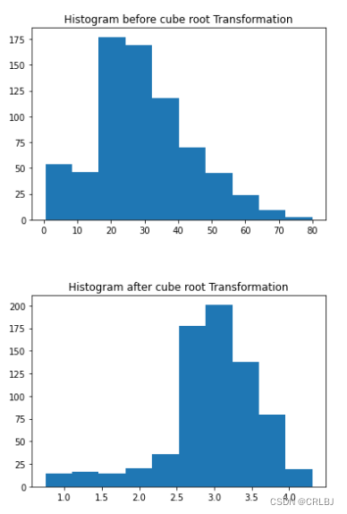

#### [异常值](https://so.csdn.net/so/search?q=异常值&spm=1001.2101.3001.7020)的检查与处理

- [异常值概述](https://blog.csdn.net/weixin_45272208/article/details/128637045?ops_request_misc=%7B%22request%5Fid%22%3A%22984A057A-D8F9-4A4B-A39F-9CBD76959C4D%22%2C%22scm%22%3A%2220140713.130102334..%22%7D&request_id=984A057A-D8F9-4A4B-A39F-9CBD76959C4D&biz_id=0&utm_medium=distribute.pc_search_result.none-task-blog-2~all~top_positive~default-1-128637045-null-null.142^v100^pc_search_result_base9&utm_term=异常值的检测与处理&spm=1018.2226.3001.4187#_2)
- - [异常值简介](https://blog.csdn.net/weixin_45272208/article/details/128637045?ops_request_misc=%7B%22request%5Fid%22%3A%22984A057A-D8F9-4A4B-A39F-9CBD76959C4D%22%2C%22scm%22%3A%2220140713.130102334..%22%7D&request_id=984A057A-D8F9-4A4B-A39F-9CBD76959C4D&biz_id=0&utm_medium=distribute.pc_search_result.none-task-blog-2~all~top_positive~default-1-128637045-null-null.142^v100^pc_search_result_base9&utm_term=异常值的检测与处理&spm=1018.2226.3001.4187#_5)
  - [导致异常值的原因](https://blog.csdn.net/weixin_45272208/article/details/128637045?ops_request_misc=%7B%22request%5Fid%22%3A%22984A057A-D8F9-4A4B-A39F-9CBD76959C4D%22%2C%22scm%22%3A%2220140713.130102334..%22%7D&request_id=984A057A-D8F9-4A4B-A39F-9CBD76959C4D&biz_id=0&utm_medium=distribute.pc_search_result.none-task-blog-2~all~top_positive~default-1-128637045-null-null.142^v100^pc_search_result_base9&utm_term=异常值的检测与处理&spm=1018.2226.3001.4187#_22)
- [异常值检查](https://blog.csdn.net/weixin_45272208/article/details/128637045?ops_request_misc=%7B%22request%5Fid%22%3A%22984A057A-D8F9-4A4B-A39F-9CBD76959C4D%22%2C%22scm%22%3A%2220140713.130102334..%22%7D&request_id=984A057A-D8F9-4A4B-A39F-9CBD76959C4D&biz_id=0&utm_medium=distribute.pc_search_result.none-task-blog-2~all~top_positive~default-1-128637045-null-null.142^v100^pc_search_result_base9&utm_term=异常值的检测与处理&spm=1018.2226.3001.4187#_30)
- - [1.GRUBBS TEST](https://blog.csdn.net/weixin_45272208/article/details/128637045?ops_request_misc=%7B%22request%5Fid%22%3A%22984A057A-D8F9-4A4B-A39F-9CBD76959C4D%22%2C%22scm%22%3A%2220140713.130102334..%22%7D&request_id=984A057A-D8F9-4A4B-A39F-9CBD76959C4D&biz_id=0&utm_medium=distribute.pc_search_result.none-task-blog-2~all~top_positive~default-1-128637045-null-null.142^v100^pc_search_result_base9&utm_term=异常值的检测与处理&spm=1018.2226.3001.4187#1GRUBBS_TEST_38)
  - [2.Z分数法（Z-score method）](https://blog.csdn.net/weixin_45272208/article/details/128637045?ops_request_misc=%7B%22request%5Fid%22%3A%22984A057A-D8F9-4A4B-A39F-9CBD76959C4D%22%2C%22scm%22%3A%2220140713.130102334..%22%7D&request_id=984A057A-D8F9-4A4B-A39F-9CBD76959C4D&biz_id=0&utm_medium=distribute.pc_search_result.none-task-blog-2~all~top_positive~default-1-128637045-null-null.142^v100^pc_search_result_base9&utm_term=异常值的检测与处理&spm=1018.2226.3001.4187#2ZZscore_method_79)
  - [3.稳健z分数（Robust Z-score）](https://blog.csdn.net/weixin_45272208/article/details/128637045?ops_request_misc=%7B%22request%5Fid%22%3A%22984A057A-D8F9-4A4B-A39F-9CBD76959C4D%22%2C%22scm%22%3A%2220140713.130102334..%22%7D&request_id=984A057A-D8F9-4A4B-A39F-9CBD76959C4D&biz_id=0&utm_medium=distribute.pc_search_result.none-task-blog-2~all~top_positive~default-1-128637045-null-null.142^v100^pc_search_result_base9&utm_term=异常值的检测与处理&spm=1018.2226.3001.4187#3zRobust_Zscore_110)
  - [4.四分位距法（IQR METHOD）](https://blog.csdn.net/weixin_45272208/article/details/128637045?ops_request_misc=%7B%22request%5Fid%22%3A%22984A057A-D8F9-4A4B-A39F-9CBD76959C4D%22%2C%22scm%22%3A%2220140713.130102334..%22%7D&request_id=984A057A-D8F9-4A4B-A39F-9CBD76959C4D&biz_id=0&utm_medium=distribute.pc_search_result.none-task-blog-2~all~top_positive~default-1-128637045-null-null.142^v100^pc_search_result_base9&utm_term=异常值的检测与处理&spm=1018.2226.3001.4187#4IQR_METHOD_137)
  - [5.截尾处理（Winsorization method(Percentile Capping)）](https://blog.csdn.net/weixin_45272208/article/details/128637045?ops_request_misc=%7B%22request%5Fid%22%3A%22984A057A-D8F9-4A4B-A39F-9CBD76959C4D%22%2C%22scm%22%3A%2220140713.130102334..%22%7D&request_id=984A057A-D8F9-4A4B-A39F-9CBD76959C4D&biz_id=0&utm_medium=distribute.pc_search_result.none-task-blog-2~all~top_positive~default-1-128637045-null-null.142^v100^pc_search_result_base9&utm_term=异常值的检测与处理&spm=1018.2226.3001.4187#5Winsorization_methodPercentile_Capping_167)
  - [6.DBSCAN聚类（DBSCAN Clustering）](https://blog.csdn.net/weixin_45272208/article/details/128637045?ops_request_misc=%7B%22request%5Fid%22%3A%22984A057A-D8F9-4A4B-A39F-9CBD76959C4D%22%2C%22scm%22%3A%2220140713.130102334..%22%7D&request_id=984A057A-D8F9-4A4B-A39F-9CBD76959C4D&biz_id=0&utm_medium=distribute.pc_search_result.none-task-blog-2~all~top_positive~default-1-128637045-null-null.142^v100^pc_search_result_base9&utm_term=异常值的检测与处理&spm=1018.2226.3001.4187#6DBSCANDBSCAN_Clustering_187)
  - [7.孤立森林（Isolation Forest）](https://blog.csdn.net/weixin_45272208/article/details/128637045?ops_request_misc=%7B%22request%5Fid%22%3A%22984A057A-D8F9-4A4B-A39F-9CBD76959C4D%22%2C%22scm%22%3A%2220140713.130102334..%22%7D&request_id=984A057A-D8F9-4A4B-A39F-9CBD76959C4D&biz_id=0&utm_medium=distribute.pc_search_result.none-task-blog-2~all~top_positive~default-1-128637045-null-null.142^v100^pc_search_result_base9&utm_term=异常值的检测与处理&spm=1018.2226.3001.4187#7Isolation_Forest_226)
- [异常值处理](https://blog.csdn.net/weixin_45272208/article/details/128637045?ops_request_misc=%7B%22request%5Fid%22%3A%22984A057A-D8F9-4A4B-A39F-9CBD76959C4D%22%2C%22scm%22%3A%2220140713.130102334..%22%7D&request_id=984A057A-D8F9-4A4B-A39F-9CBD76959C4D&biz_id=0&utm_medium=distribute.pc_search_result.none-task-blog-2~all~top_positive~default-1-128637045-null-null.142^v100^pc_search_result_base9&utm_term=异常值的检测与处理&spm=1018.2226.3001.4187#_315)
- - [1.删除异常值](https://blog.csdn.net/weixin_45272208/article/details/128637045?ops_request_misc=%7B%22request%5Fid%22%3A%22984A057A-D8F9-4A4B-A39F-9CBD76959C4D%22%2C%22scm%22%3A%2220140713.130102334..%22%7D&request_id=984A057A-D8F9-4A4B-A39F-9CBD76959C4D&biz_id=0&utm_medium=distribute.pc_search_result.none-task-blog-2~all~top_positive~default-1-128637045-null-null.142^v100^pc_search_result_base9&utm_term=异常值的检测与处理&spm=1018.2226.3001.4187#1_325)
  - [2.转换值](https://blog.csdn.net/weixin_45272208/article/details/128637045?ops_request_misc=%7B%22request%5Fid%22%3A%22984A057A-D8F9-4A4B-A39F-9CBD76959C4D%22%2C%22scm%22%3A%2220140713.130102334..%22%7D&request_id=984A057A-D8F9-4A4B-A39F-9CBD76959C4D&biz_id=0&utm_medium=distribute.pc_search_result.none-task-blog-2~all~top_positive~default-1-128637045-null-null.142^v100^pc_search_result_base9&utm_term=异常值的检测与处理&spm=1018.2226.3001.4187#2_347)
  - [3.插补法](https://blog.csdn.net/weixin_45272208/article/details/128637045?ops_request_misc=%7B%22request%5Fid%22%3A%22984A057A-D8F9-4A4B-A39F-9CBD76959C4D%22%2C%22scm%22%3A%2220140713.130102334..%22%7D&request_id=984A057A-D8F9-4A4B-A39F-9CBD76959C4D&biz_id=0&utm_medium=distribute.pc_search_result.none-task-blog-2~all~top_positive~default-1-128637045-null-null.142^v100^pc_search_result_base9&utm_term=异常值的检测与处理&spm=1018.2226.3001.4187#3_428)
  - [4.分组处理](https://blog.csdn.net/weixin_45272208/article/details/128637045?ops_request_misc=%7B%22request%5Fid%22%3A%22984A057A-D8F9-4A4B-A39F-9CBD76959C4D%22%2C%22scm%22%3A%2220140713.130102334..%22%7D&request_id=984A057A-D8F9-4A4B-A39F-9CBD76959C4D&biz_id=0&utm_medium=distribute.pc_search_result.none-task-blog-2~all~top_positive~default-1-128637045-null-null.142^v100^pc_search_result_base9&utm_term=异常值的检测与处理&spm=1018.2226.3001.4187#4_499)


## 异常值概述

 

### 异常值简介

异常值，也叫离群值（outlier），是指在数值上与其余数据有距离的观测值，或者简单地说，它是超出范围的值。

举个例子。

|        | 无异常值的数据 | 有异常值的数据      |
| ------ | -------------- | ------------------- |
| 数据   | 1,2,3,3,4,5,4  | 1,2,3,3,4,5,**400** |
| Mean   | 3.142          | 59.714              |
| Median | 3              | 3                   |
| SD     | 1.345          | 150.057             |

可以看到，具有异常值的数据集具有显著不同的平均值和[标准差](https://so.csdn.net/so/search?q=标准差&spm=1001.2101.3001.7020)。平均值由3.14直接飙升至59.71，标准差也由1.345飙升到150.057，这些会对数据总体的估计产生巨大的影响。

再举一个真实的例子。一家拥有50名员工的公司中，45人的月薪为6000元，5名高级员工的月薪为10万元。如果你计算公司员工的平均月薪是14500元，这将给你一个错误的结论（大多数员工的工资低于145000元）。但如果你看工资[中位数](https://so.csdn.net/so/search?q=中位数&spm=1001.2101.3001.7020)，它是6000元，这比平均水平更合理。因此，中位数比平均值更合适。这里可以看到异常值的影响。（下图非常非常贴切，Mean和Median本来很接近，但Outlier的出现，让Mean‘变心’了。）


### 导致异常值的原因

- 数据输入错误
  人为错误(例如在数据收集、记录或输入期间引起的错误)可能导致数据中的异常值。
- 测量误差
  这是异常值最常见的来源。这类异常是由于所使用的测量仪器出现故障造成的。
- 自然的异常值：
  当一个异常值不是人为造成的（由于错误），它就是一个自然异常值。大多数真实世界的数据都属于这一类

## 异常值检查

有很多种检测异常值的方法：1.假设检验、2.z分数法（Z-score method）、3.稳健z分数（Robust Z-score）、4.四分位距法（IQR METHOD）、5.截尾处理（Winsorization method(Percentile Capping)）、6.DBSCAN聚类（DBSCAN Clustering）、7.孤立森林（Isolation Forest）、8.可视化数据（Visualizing the data）。

【代码示例使用到的数据集链接】：
**house-prices-advanced-regression-techniques数据集**： https://www.kaggle.com/competitions/house-prices-advanced-regression-techniques/data
**titanic数据集**：https://www.kaggle.com/competitions/titanic/data
**Cost of living数据集**：https://www.kaggle.com/datasets/andytran11996/cost-of-living

### 1.GRUBBS TEST

Grubbs’ test 是一个假设检验方法。
原假设H 0 H_0*H*0​：数据集中无异常值；备择假设H 1 H_1*H*1​：数据集中有一个异常值。
其统计量被定义为：
G c a l c u l a t e d = max ⁡ ∣ X i − X ‾ ∣ S D G_{calculated} = \frac{\max|X_{i} - \overline{X}|}{SD}*G**c**a**l**c**u**l**a**t**e**d*​=*S**D*max∣*X**i*​−*X*∣​
其中X ‾ \overline{X}*X*和S D SD*S**D*分别代表样本均值和样本标准差。
G c r i t i c a l = ( N − 1 ) N ( t α / ( 2 N ) , N − 2 ) 2 N − 2 + ( t α / ( 2 N ) , N − 2 ) 2 G_{critical} = \frac{(N-1)}{\sqrt{N}} \sqrt{\frac{(t_{\alpha /(2N),N-2})^{2}}{N-2+(t_{\alpha /(2N),N-2})^{2}}}*G**cr**i**t**i**c**a**l*​=*N*​(*N*−1)​*N*−2+(*t**α*/(2*N*),*N*−2​)2(*t**α*/(2*N*),*N*−2​)2​​
如果估计值G c a l c u l a t e d G_{calculated}*G**c**a**l**c**u**l**a**t**e**d*​大于临界值G c r i t i c a l G_{critical}*G**cr**i**t**i**c**a**l*​，拒绝原假设，即数据集中有一个值是异常值。

```python
import numpy as np
import scipy.stats as stats
x = np.array([12,13,14,19,21,23])
y = np.array([12,13,14,19,21,23,45])
def grubbs_test(x):
    n = len(x)
    mean_x = np.mean(x)
    sd_x = np.std(x)
    numerator = max(abs(x-mean_x))
    g_calculated = numerator/sd_x
    print("Grubbs Calculated Value:",g_calculated)
    t_value = stats.t.ppf(1 - 0.05 / (2 * n), n - 2)
    g_critical = ((n - 1) * np.sqrt(np.square(t_value))) / (np.sqrt(n) * np.sqrt(n - 2 + np.square(t_value)))
    print("Grubbs Critical Value:",g_critical)
    if g_critical > g_calculated:
        print("从Grubbs_test中我们观察到计算值小于临界值，接受零假设，得出结论：不存在异常值")
    else:
        print("从Grubbs_test中我们观察到计算值大于临界值，拒绝零假设，得出结论：存在一个异常值")
grubbs_test(x)
grubbs_test(y)

# 输出结果：
# Grubbs Calculated Value: 1.4274928542926593
# Grubbs Critical Value: 1.887145117792422
# 从Grubbs_test中我们观察到计算值小于临界值，接受零假设，得出结论：不存在异常值

# Grubbs Calculated Value: 2.2765147221587774
#　Grubbs Critical Value: 2.019968507680656
# 从Grubbs_test中我们观察到计算值大于临界值，拒绝零假设，得出结论：存在一个异常值
1234567891011121314151617181920212223242526272829
```

### 2.Z分数法（Z-score method）

使用Z分数法，我们可以找出距离平均值有多少个标准差值

上图为正态曲线下面积及标准差所占面积。

- 68%的数据点位于 +1 或 -1个标准差之间
- 95%的数据点位于 +2 或 -2个标准差之间
- 99.7%的数据点位于 +3 或 -3个标准差之间

z-score公式：
Z s c o r e = X − M e a n S D Zscore = \frac{X-Mean}{SD}*Z**score*=*S**D**X*−*M**e**an*​
如果一个数据点的Z分数大于3（因为± 3 σ \pm 3 \sigma±3*σ*覆盖了99.7%的面积），则表明该数据值与其他值有较大差异，视为异常值。

```python
import pandas as pd
import numpy as np
train = pd.read_csv('../house-prices-advanced-regression-techniques/train.csv')
out=[]
def Zscore_outlier(df):
    m = np.mean(df)
    sd = np.std(df)
    for i in df: 
        z = (i-m)/sd
        if np.abs(z) > 3: 
            out.append(i)
    print("Outliers:",out)
Zscore_outlier(train['LotArea'])

# 输出：
# Outliers: [50271, 159000, 215245, 164660, 53107, 70761, 53227, 46589, 115149, 53504, 45600, 63887, 57200]
12345678910111213141516
```

### 3.稳健z分数（Robust Z-score）

也被称为中位数绝对偏差法。它类似于Z-score方法，只是参数有所变化。由于平均值和标准差受异常值的影响很大，因此我们使用中位数和中位数的绝对偏差来改变这个参数。

稳健z分数公式：
R . Z . s c o r e = 0.675 ∗ ( X i − M e d i a n ) M A D R.Z.score = \frac{0.675 * (X_i - Median)}{MAD}*R*.*Z*.*score*=*M**A**D*0.675∗(*X**i*​−*M**e**d**ian*)​
其中M A D = m e d i a n ( ∣ X i − M e d i a n ∣ ) MAD=median(| X_{i}-Median|)*M**A**D*=*m**e**d**ian*(∣*X**i*​−*M**e**d**ian*∣)
假设x服从标准正态分布。MAD会收敛于半正态分布的中位数，也就是正态分布的75%百分位，并且N(0.75)≃0.6745。

```python
import pandas as pd
import numpy as np
train = pd.read_csv('../house-prices-advanced-regression-techniques/train.csv')
out=[]
def ZRscore_outlier(df):
    med = np.median(df)
    ma = stats.median_absolute_deviation(df)
    for i in df: 
        z = (0.6745*(i-med))/ (np.median(ma))
        if np.abs(z) > 3: 
            out.append(i)
    print("Outliers:",out)
ZRscore_outlier(train['LotArea'])

# output:
# Outliers: [50271, 31770, 22950, 25419, 159000, 39104, 215245, 164660, 53107, 34650, 70761, 53227, 40094, 32668, 25095, 46589, 26178, 115149, 53504, 28698, 45600, 25286, 27650, 24090, 25000, 29959, 23257, 35760, 35133, 32463, 24682, 23595, 36500, 63887, 25339, 57200, 26142]
12345678910111213141516
```

### 4.四分位距法（IQR METHOD）

在这种方法中，我们使用四分位范围(IQR)来检测异常值。IQR告诉我们数据集的变化。任何超出-1.5 x IQR到1.5 x IQR范围的值都被视为异常值。


- Q1 代表数据的下四分位数
- Q2 代表数据的中位数
- Q3 代表数据的上四分位数
- (Q1–1.5 *IQR) 代表数据的最小值的下界，(Q3+1.5 *IQR)代表数据的最大值的上界

```python
import pandas as pd
import numpy as np
train = pd.read_csv('../house-prices-advanced-regression-techniques/train.csv')
out=[]
def iqr_outliers(df):
    q1 = df.quantile(0.25)
    q3 = df.quantile(0.75)
    iqr = q3-q1
    Lower_tail = q1 - 1.5 * iqr
    Upper_tail = q3 + 1.5 * iqr
    for i in df:
        if i > Upper_tail or i < Lower_tail:
            out.append(i)
    print("Outliers:",out)
iqr_outliers(train['LotArea'])

# output:
# Outliers: [50271, 19900, 21000, 21453, 19378, 31770, 22950, 25419, 159000, 19296, 39104, 19138, 18386, 215245, 164660, 20431, 18800, 53107, 34650, 22420, 21750, 70761, 53227, 40094, 32668, 21872, 21780, 25095, 46589, 20896, 18450, 21535, 26178, 115149, 21695, 53504, 21384, 28698, 45600, 17920, 25286, 27650, 24090, 25000, 1300, 21286, 1477, 21750, 29959, 18000, 23257, 17755, 35760, 18030, 35133, 32463, 18890, 24682, 23595, 17871, 36500, 63887, 20781, 25339, 57200, 20544, 19690, 21930, 26142]
123456789101112131415161718
```

### 5.截尾处理（Winsorization method(Percentile Capping)）

该方法类似于IQR法。如果一个值超过了第99个百分位数的值，并且低于给定值的第1个百分位数，则被视为异常值。

```python
import pandas as pd
import numpy as np
train = pd.read_csv('../input/titanic/train.csv')
out=[]
def Winsorization_outliers(df):
    q1 = np.percentile(df , 1)
    q3 = np.percentile(df , 99)
    for i in df:
        if i > q3 or i < q1:
            out.append(i)
    print("Outliers:",out)
Winsorization_outliers(train['Fare'])

12345678910111213
```

### 6.DBSCAN聚类（DBSCAN Clustering）

DBSCAN是一种基于密度的聚类算法，它将数据集划分为高密度区域的子组，并将稀疏区域聚类识别为异常值。DBSCAN在多元离群值检测中具有最佳的检测效果。

DBSCAN需要两个参数：
1.epsilon: 一个距离参数，定义搜索附近邻居的半径。
2.k：形成集群所需的最小点数。

核心点 —— 在其半径内至少有最小数量的其他点(minPts)的点。
边界点 —— 一个点在核心点的半径内，但小于其自身半径内其他点(minPts)的最小数量。
噪声点 —— 既不是核心点也不是边界点的点

```python
import pandas as pd
from sklearn.cluster import DBSCAN
train = pd.read_csv('../input/titanic/train.csv')
def DB_outliers(df):
    outlier_detection = DBSCAN(eps = 2, metric='euclidean', min_samples = 5)
    clusters = outlier_detection.fit_predict(df.values.reshape(-1,1))
    data = pd.DataFrame()
    data['cluster'] = clusters
    print(data['cluster'].value_counts().sort_values(ascending=False))
DB_outliers(train['Fare']) 

# output:
#  0     705
# 2      50
# 4      36
#-1      32
# 6      15
# 1      12
# 7       8
# 5       7
# 8       7
# 9       7
# 3       6
# 10      6
# Name: cluster, dtype: int64
12345678910111213141516171819202122232425
```

### 7.孤立森林（Isolation Forest）

它是一种聚类算法，属于集成决策树家族，在原理上类似于随机森林。


1. 它将数据点分类为异常值和非异常值，并适用于非常高维的数据。
2. 该方法基于决策树，分离出异常值。
3. 如果结果是-1，这意味着这个特定的数据点是一个异常值。如果结果为1，则意味着该数据点不是异常值。

```python
from sklearn.ensemble import IsolationForest
import numpy as np
import pandas as pd
train = pd.read_csv('../input/titanic/train.csv')
train['Fare'].fillna(train[train.Pclass==3]['Fare'].median(),inplace=True)
def Iso_outliers(df):
    iso = IsolationForest( behaviour = 'new', random_state = 1, contamination= 'auto')
    preds = iso.fit_predict(df.values.reshape(-1,1))
    data = pd.DataFrame()
    data['cluster'] = preds
    print(data['cluster'].value_counts().sort_values(ascending=False))
Iso_outliers(train['Fare']) 

# output
# /opt/conda/lib/python3.7/site-packages/sklearn/ensemble/_iforest.py:255: FutureWarning: 'behaviour' is deprecated in 0.22 and will be removed in 0.24. You should not pass or set this parameter.
#  FutureWarning
# 1    706
# -1    185
# Name: cluster, dtype: int64
12345678910111213141516171819
```

8.可视化数据（Visualizing the data）
数据可视化对于数据清理、数据挖掘、异常值和异常组的检测、趋势和集群识别等都很有用。下面是用于发现异常值的数据可视化图列表。

1. Box and whisker plot (box plot). 箱线图
2. Scatter plot. 散点图
3. Histogram. 直方图
4. Distribution Plot. 分布图
5. QQ plot. Q-Q图

```python
import pandas as pd
import seaborn as sns
from matplotlib import pyplot as plt
from statsmodels.graphics.gofplots import qqplot
train = pd.read_csv('../input/titanic/train.csv')
def Box_plots(df):
    plt.figure(figsize=(10, 4))
    plt.title("Box Plot")
    sns.boxplot(df)
    plt.show()
Box_plots(train['Age'])

def hist_plots(df):
    plt.figure(figsize=(10, 4))
    plt.hist(df)
    plt.title("Histogram Plot")
    plt.show()
hist_plots(train['Age'])

def scatter_plots(df1,df2):
    fig, ax = plt.subplots(figsize=(10,4))
    ax.scatter(df1,df2)
    ax.set_xlabel('Age')
    ax.set_ylabel('Fare')
    plt.title("Scatter Plot")
    plt.show()
scatter_plots(train['Age'],train['Fare'])

def dist_plots(df):
    plt.figure(figsize=(10, 4))
    sns.distplot(df)
    plt.title("Distribution plot")
    sns.despine()
    plt.show()
dist_plots(train['Fare'])

def qq_plots(df):
    plt.figure(figsize=(10, 4))
    qqplot(df,line='s')
    plt.title("Normal QQPlot")
    plt.show()
qq_plots(train['Fare'])
123456789101112131415161718192021222324252627282930313233343536373839404142
```


## 异常值处理

*在检测到异常值后，我们应该删除/处理异常值，因为它是一个沉默的杀手 。*

- 离群值严重影响数据集的均值和标准差。这些可能在统计上给出错误的结果。
- 它增加了误差方差，降低了统计检验的力量。
- 如果异常值是非随机分布的，它们会降低正态性。
- 大多数机器学习算法在异常值存在时不能很好地工作。因此，检测和去除异常值是很有必要的。
- 它们还会影响回归、方差分析和其他统计模型假设的基本假设。

常用的异常值处理方法有：删除值、改变值、插补法和分组处理。

### 1.删除异常值

如果由于数据输入错误、数据处理错误或异常值观测值非常小，我们会删除异常值。我们还可以在两端使用修剪来去除异常值。但是当数据集很小的时候，删除观测结果并不是一个好主意。

```python
import pandas as pd
import numpy as np
import seaborn as sns
from matplotlib import pyplot as plt
train = pd.read_csv('../input/cost-of-living/cost-of-living-2018.csv')
sns.boxplot(train['Cost of Living Index'])
plt.title("Box Plot before outlier removing")
plt.show()
def drop_outliers(df, field_name):
    iqr = 1.5 * (np.percentile(df[field_name], 75) - np.percentile(df[field_name], 25))
    df.drop(df[df[field_name] > (iqr + np.percentile(df[field_name], 75))].index, inplace=True)
    df.drop(df[df[field_name] < (np.percentile(df[field_name], 25) - iqr)].index, inplace=True)
drop_outliers(train, 'Cost of Living Index')
sns.boxplot(train['Cost of Living Index'])
plt.title("Box Plot after outlier removing")
plt.show()
12345678910111213141516
```


### 2.转换值

转换变量也可以消除异常值。这些转换后的值减少了由极值引起的变化。

1. 范围缩放
2. 对数变换
3. 立方根归一化
4. Box-Cox转换

这些技术将数据集中的值转换为更小的值。如果数据有很多极端值或倾斜，此方法有助于使您的数据正常。但是这些技巧并不总是给你最好的结果。从这些方法中不会丢失数据。在所有这些方法中，box-cox变换给出了最好的结果。

```python
#Scalling
import pandas as pd
import numpy as np
import seaborn as sns
from matplotlib import pyplot as plt
from sklearn import preprocessing
train = pd.read_csv('../input/cost-of-living/cost-of-living-2018.csv')
plt.hist(train['Cost of Living Index'])
plt.title("Histogram before Scalling")
plt.show()
scaler = preprocessing.StandardScaler()
train['Cost of Living Index'] = scaler.fit_transform(train['Cost of Living Index'].values.reshape(-1,1))
plt.hist(train['Cost of Living Index'])
plt.title("Histogram after Scalling")
plt.show()
123456789101112131415
```


```python
#Log Transformation
import pandas as pd
import numpy as np
import seaborn as sns
from matplotlib import pyplot as plt
train = pd.read_csv('../input/cost-of-living/cost-of-living-2018.csv')
sns.distplot(train['Cost of Living Index'])
plt.title("Distribution plot before Log transformation")
sns.despine()
plt.show()
train['Cost of Living Index'] = np.log(train['Cost of Living Index'])
sns.distplot(train['Cost of Living Index'])
plt.title("Distribution plot after Log transformation")
sns.despine()
plt.show()
123456789101112131415
```


```python
#cube root Transformation
import pandas as pd
import numpy as np
import seaborn as sns
from matplotlib import pyplot as plt
train = pd.read_csv('../input/titanic/train.csv')
plt.hist(train['Age'])
plt.title("Histogram before cube root Transformation")
plt.show()
train['Age'] = (train['Age']**(1/3))
plt.hist(train['Age'])
plt.title("Histogram after cube root Transformation")
plt.show()
12345678910111213
```



```python
#Box-transformation
import pandas as pd
import numpy as np
import seaborn as sns
from matplotlib import pyplot as plt
import scipy
train = pd.read_csv('../input/cost-of-living/cost-of-living-2018.csv')
sns.boxplot(train['Rent Index'])
plt.title("Box Plot before outlier removing")
plt.show()
train['Rent Index'],fitted_lambda= scipy.stats.boxcox(train['Rent Index'] ,lmbda=None)
sns.boxplot(train['Rent Index'])
plt.title("Box Plot after outlier removing")
plt.show()
1234567891011121314
```


### 3.插补法

像缺失值的归责一样，我们也可以归责异常值。在这种方法中，我们可以使用平均值、中位数、零值。由于我们进行了输入，所以没有丢失数据。这里的中值是合适的，因为它不受异常值的影响。

```python
#mean imputation
import pandas as pd
import numpy as np
train = pd.read_csv('../input/titanic/train.csv')
sns.boxplot(train['Age'])
plt.title("Box Plot before mean imputation")
plt.show()
q1 = train['Age'].quantile(0.25)
q3 = train['Age'].quantile(0.75)
iqr = q3-q1
Lower_tail = q1 - 1.5 * iqr
Upper_tail = q3 + 1.5 * iqr
m = np.mean(train['Age'])
for i in train['Age']:
    if i > Upper_tail or i < Lower_tail:
            train['Age'] = train['Age'].replace(i, m)
sns.boxplot(train['Age'])
plt.title("Box Plot after mean imputation")
plt.show()   
12345678910111213141516171819
```


```python
#median imputation
import pandas as pd
import numpy as np
train = pd.read_csv('../input/titanic/train.csv')
sns.boxplot(train['Age'])
plt.title("Box Plot before median imputation")
plt.show()
q1 = train['Age'].quantile(0.25)
q3 = train['Age'].quantile(0.75)
iqr = q3-q1
Lower_tail = q1 - 1.5 * iqr
Upper_tail = q3 + 1.5 * iqr
med = np.median(train['Age'])
for i in train['Age']:
    if i > Upper_tail or i < Lower_tail:
            train['Age'] = train['Age'].replace(i, med)
sns.boxplot(train['Age'])
plt.title("Box Plot after median imputation")
plt.show()            
12345678910111213141516171819
```


```python
#Zero value imputation
import pandas as pd
import numpy as np
train = pd.read_csv('../input/titanic/train.csv')
sns.boxplot(train['Age'])
plt.title("Box Plot before Zero value imputation")
plt.show()
q1 = train['Age'].quantile(0.25)
q3 = train['Age'].quantile(0.75)
iqr = q3-q1
Lower_tail = q1 - 1.5 * iqr
Upper_tail = q3 + 1.5 * iqr
for i in train['Age']:
    if i > Upper_tail or i < Lower_tail:
            train['Age'] = train['Age'].replace(i, 0)
sns.boxplot(train['Age'])
plt.title("Box Plot after Zero value imputation")
plt.show()            
123456789101112131415161718
```


### 4.分组处理

在统计模型中，如果离群值较多且数据集较小，则应将它们分开处理。其中一种方法是将两个组视为两个不同的组，为两个组建立单独的模型，然后结合输出。但是，当数据集很大时，这种技术是繁琐的。

```python
df.groupby(['group_col1', 'group_col2'])['column_to_fill'].transform(lambda x: x.fillna(x.median()))

df.groupby(['group_col1', 'group_col2'])['column_to_fill'].apply(lambda x: x.interpolate(method='linear'))
```

