优化器就是在梯度下降过程中指引各个参数向着最优点前进的控制器，在优化的过程中，其会不断调节下降的大小，直到最优点。在梯度下降过程中我们最关键的是便是确定优化的方向(梯度)和前进多长的步子。方向主要是确定优化的方向，一般通过求导便可以求得，步子就是决定当前走多大，因为在[凸优化的掌上明珠-回归问题](https://zhuanlan.zhihu.com/p/577242897)中我们详细介绍过，如果学习率设的过大，梯度会在最优点来回跳动，设的过小又会需要很久的训练才能达到最优点。而优化器的存在就是确定优化的方向和面对当前的情况动态的调整步子。

## 标准梯度下降(Gradient Descent)

在之前的文章中我们介绍的正是标准梯度下降，

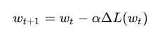

> 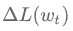为损失函数的一阶导数
> α 为学习率

梯度下降的主要问题是：

1. **训练速度慢**：每更新一次都要对损失函数求导，训练速度慢。在大型数据集中，每输入一个样本都要更新一次参数，且每次迭代都要遍历所有的样本。会使得训练过程及其缓慢，需要花费很长时间才能得到最优解。
2. **容易陷入局部最优解**：由于是在当前的优化视野点下进行优化，当陷入局部最优点的时候，模型会以为已经达到了最优点，在局部最优点来回跳动。所谓的局部最优点就是鞍点。落入鞍点，梯度为0，使得模型参数不在继续更新。

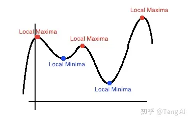

批量梯度下降(BGD)

批量梯度下降和GD的唯一区别在于GD是每次更新数据集的所有样本，而BGD是首先设定Batch size然后一个Batch一个Batch的更新梯度。这样子的做法是加快了训练速度，且每次下降的方向都是正确的。

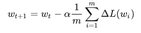

>  为损失函数的一阶导数
> α  为学习率
> m为batch size

## 随机梯度下降法(SGD)

随机梯度下降法和批量梯度下降的区别是，BGD是取一个batch样本的平均或者整体梯度去更新，而SGD是随机选择batch内的一个样本的梯度进行更新。

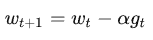

> α 为学习率
> 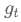 为batch内随机选择一个样本的梯度

随机梯度下降像是一个盲人下山，不用每走一步计算一次梯度，但是他总能下到山底，只不过过程会显得扭扭曲曲。

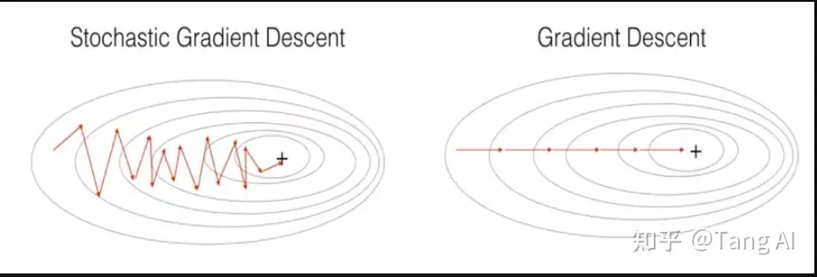

**SGD的优点：**

虽然SGD需要走很多步的样子，但是对梯度的要求很低（因为一次batch计算的时候只计算一个样本的梯度）。大量实验证明，只要噪声不是特别大，SGD都能很好地收敛，而且速度很快。

**SGD的缺点：**

1. SGD在随机选择梯度的同时会引入噪声，使得权值更新的方向不一定正确。
2. SGD也没能单独克服局部最优解的问题。

## 动量梯度下降

为了抑制SGD的震荡，SGDM(Stochastic Gradient Descent Momentum)认为梯度下降过程可以加入惯性。主要思想是下降过程中，如果发现是陡坡，那就利用惯性跑的快一些。因此，其在SGD基础上引入了一阶动量

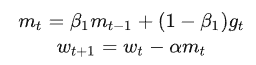

一阶动量是各个时刻梯度方向的指数移动平均值，也就是说，t 时刻的下降方向，不仅由当前点的梯度方向  决定，而且由此前累积的下降方向 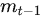决定。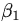的经验值为0.9（表示最大速度10倍于SGD)，这就意味着下降方向主要是此前累积的下降方向，并略微偏向当前时刻的下降方向。想象高速公路上汽车转弯，在高速向前的同时略微偏向，急转弯可是要出事的。

因为加入了动量因素，SGD-M缓解了SGD在局部最优点梯度为0，无法持续更新的问题和振荡幅度过大的问题，但是并没有完全解决，当局部沟壑比较深，动量加持用完了，依然会困在局部最优里来回振荡。

## 牛顿加速梯度(NAG, Nesterov accelerated gradient)

NAG是在SGD、SGD-M的基础上的进一步改进。我们知道在时刻�的主要下降方向是由累积动量决定的，自己的梯度方向说了也不算，那与其看当前梯度方向，不如先看看如果跟着累积动量走了一步，那个时候再怎么走。

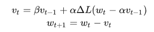

> 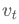 表示t时刻积攒的加速度
> β 表示动力大小
> α 表示学习率

在Momentun中梯度会盲目地跟从下坡的梯度，容易发生错误。所以需要一个更聪明的小球，能提前知道它要去哪里，还要知道走到坡底的时候速度慢下来而不是又冲上另一个坡。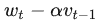 可以表示梯度点下一个位置大概在哪里。从而可以提前知道下一个位置的梯度，然后使用到当前位置来更新参数。

## 自适应学习率优化算法

自适应学习率优化算法针对于机器学习模型的学习率，传统的优化算法要么将学习率设置为常数要么根据训练次数调节学习率。极大忽视了学习率其他变化的可能性。然而，学习率对模型的性能有着显著的影响，因此需要采取一些策略来想办法更新学习率，从而提高训练速度。

## AdaGrad算法

AdaGrad算法，独立地适应所有模型参数的学习率，缩放每个参数反比于其所有梯度历史平均值总和的平方根。具有代价函数最大梯度的参数相应地有个快速下降的学习率，而具有小梯度的参数在学习率上有相对较小的下降。

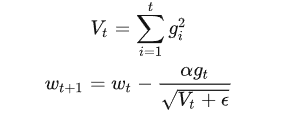

> 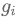为在第i时刻，所求参数的梯度
> α 为学习率，一般取0.01
> ε 是一个取值很小的数（一般为1e-8)为了避免分母为0

**AdaGrad的优点：**

对出现比较多的类别数据，Adagrad给予越来越小的学习率，而对于比较少的类别数据，会给予较大的学习率。因此**Adagrad适用于数据稀疏或者分布不平衡的数据集**。

**AdaGrad的缺点:**

随着迭代次数增多，学习率会越来越小，最终会趋近于0。

## RMSProp

由于AdaGrad单调递减的学习率变化过于激进，考虑一个改变二阶动量计算方法的策略：不累积全部历史梯度，而只关注过去一段时间窗口的下降梯度。

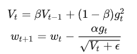

> 为在第t时刻，所求参数的梯度
> α 为学习率
> ε 是一个取值很小的数（一般为1e-8)为了避免分母为0
> β 为动力，通常为0.9

AdaGrad避免了二阶动量持续累积、导致训练过程提前结束的问题了。

## Adam

SGD-M在SGD基础上增加了一阶动量，AdaGrad在SGD基础上增加了二阶动量。把一阶动量和二阶动量都用起来，就是Adam-Adaptive + Momentum。

SGD的一阶动量：

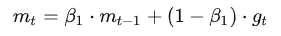

加上AdaDelta的二阶动量：

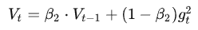

**Adam参数更新公式**如下，其

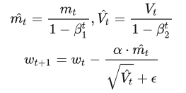

> α  是学习率
> 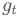 是当前参数的梯度
> 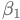 为一阶动量值，通常为0.9
> 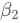 为二阶动量值，通常为0.999
> 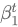 为  的t次方
> 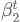为 的t次方

**Adam的优点**：

通过一阶动量和二阶动量，有效控制学习率步长和梯度方向，防止梯度的振荡和在鞍点的静止。

**Adam的缺点**：

1.**可能不收敛**：二阶动量是固定时间窗口内的累积，随着时间窗口的变化，遇到的数据可能发生巨变，使得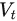可能会时大时小，不是单调变化。这就可能在训练后期引起学习率的震荡，导致模型无法收敛。

因此，由于Adam中的学习率主要是由二阶动量控制的，为了保证算法的收敛，可以对二阶动量的变化进行控制，避免上下波动。

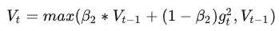

通过这样修改，就保证了 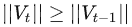 ，从而使得学习率单调递减。

2.**可能错过全局最优解：**

自适应学习率算法可能会对前期出现的特征过拟合，后期才出现的特征很难纠正前期的拟合效果。后期Adam的学习率太低，影响了有效的收敛。

## Nadam

Nadam就是在Adam的基础上加入牛顿加速梯度(NAG)的思想，

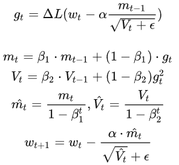

### AdamW

AdamW是在Adam+L2正则化的基础上进行改进的算法。因为使用Adam优化带L2正则的损失并不有效。

如果引入L2正则项，在计算梯度的时候会加上对正则项求梯度的结果。那么如果本身比较大的一些权重对应的梯度也会比较大，由于Adam计算步骤中减去项会除以**梯度平方的累积开根号**，使得减去项偏小。按常理说，越大的权重应该惩罚越大，但是在Adam并不是这样。分子分母相互抵消掉了。

而AdamW的做法就是每次优化参数 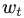 的时候，对于其梯度加上一个带衰减值的参数值 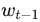 ，这么做的原因是L2的正则求完梯度的值为 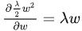 ，那么Adamw的更新公式为：

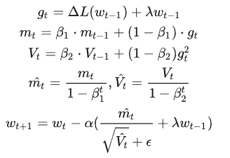

> λ 为L2正则的衰减权重

Adamw的主要优点是在Adam的基础上加入了L2的作用，增加了鲁棒性，减少了过拟合风险，无需再在模型加入正则化。

## 各种优化器的比较

- 自适应学习优化器下降速度明显比SGD系列的优化器要快
- SGD-M和NAG初期下降慢，但是随着训练加深越来越快，最后NAG甚至不弱于Adam
- SGD相对来说更容易进入鞍点，即陷入局部最优，不过，其实在一般数据集中很难陷入局部最优
- 收敛轨迹上来说SGD走的收敛路线是最直接和最平顺的，比起自适应学习器来说，SGD虽然慢，但是它更容易达到最优点。因此在模型设计实验过程中，要快速验证新模型的效果，可以先用Adam进行快速实验优化；在模型上线或者结果发布前，可以用精调的SGD进行模型的极致优化。

资料来源：https://zhuanlan.zhihu.com/p/584485233