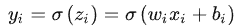
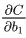
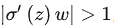

***总结***

为什么会产生：

​	1、损失函数计算的误差是通过梯度反向传播的（链式法则即连乘法则Chain Rule）

​	2、当梯度过大或过小时会导致梯度问题，常发生在深度模型中，因为会对N个数累乘

产生原因：

​	梯度消失：1、隐藏层层数过多 2、采用了不合适的激活函数

​		导致问题：越靠近输入层时，由于梯度消失现象，会导致靠近输入层的隐藏层权值更新缓慢或者更新停滞。这就导致在训练时，只等价于后面几层的浅层网络的学习。

​		1、梯度值变成0（比如值小于5e-4）

​			对于16位浮点数尤为严重

​		2、训练没有进展

​			不管如何选择学习率

​		3、对于底部（接近输入层）尤为严重

​			仅仅顶部层训练的较好

​			无法让神经网络更深

​	梯度爆炸：1、隐藏层层数过多 2、权值绝对值初始值太大

​		导致问题：①模型不稳定，导致更新过程中的损失出现显著变化；②训练过程中，在极端情况下，权重的值变得非常大，以至于溢出，导致模型损失变成 																																																																																																													NaN等等。

​	         1、值超出值域

​			对于16位浮点数尤为严重（数值区间6e-5~6e4），导致损失变成NaN

​		 2、对学习率敏感

​			学习率太大 > 大参数值 > 更大的梯度

​			学习率太小 > 训练无进展

​			我们可能需要在训练过程中不断调整学习率

目标：让梯度值在合理的范围内，如：[1e-6,1e3]

方法：

​	将乘法变加法，如：ResNet,LSTM

​	归一化，如：梯度归一化，梯度剪裁

​	合理的权重初始和激活函数

**一、为什么会产生梯度消失和梯度爆炸？**

目前优化神经网络的方法都是基于BP，即根据损失函数计算的误差通过梯度反向传播的方式，指导深度网络权值的更新优化。其中将误差从末层往前传递的过程需要**链式法则（Chain Rule）**的帮助，因此反向传播算法可以说是梯度下降在链式法则中的应用。

而链式法则是一个**连乘的形式**，所以当层数越深的时候，梯度将以指数形式传播。梯度消失问题和梯度爆炸问题一般随着网络层数的增加会变得越来越明显。在根据损失函数计算的误差通过梯度**反向传播**的方式对深度网络权值进行更新时，得到的**梯度值接近0**或**特别大**，也就是**梯度消失**或**爆炸**。梯度消失或梯度爆炸在本质原理上其实是一样的。

**二、分析产生梯度消失和梯度爆炸的原因**

**【梯度消失】**经常出现，产生的原因有：一是在**深层网络**中，二是采用了**不合适的激活函数**，比如sigmoid。当梯度消失发生时，接近于输出层的隐藏层由于其梯度相对正常，所以权值更新时也就相对正常，但是当越靠近输入层时，由于梯度消失现象，会导致靠近输入层的隐藏层权值更新缓慢或者更新停滞。这就导致在训练时，只等价于后面几层的浅层网络的学习。

**【梯度爆炸】**一般出现在**深层网络**和**权值初始化值太大**的情况下。在深层神经网络或循环神经网络中，**误差的梯度可在更新中累积相乘**。如果网络层之间的**梯度值的绝对值大于 1.0**，那么**重复相乘会导致梯度呈指数级增长**，梯度变的非常大，然后导致网络权重的大幅更新，并因此使网络变得不稳定。

梯度爆炸会伴随一些细微的信号，如：①模型不稳定，导致更新过程中的损失出现显著变化；②训练过程中，在极端情况下，权重的值变得非常大，以至于溢出，导致模型损失变成 NaN等等。

下面将从这3个角度分析一下产生这两种现象的根本原因

**（1）深层网络**

一个比较简单的深层网络如下：

由于深度网络是多层非线性函数的堆砌，整个深度网络可以视为是一个**复合的非线性多元函数**（这些非线性多元函数其实就是每层的激活函数），那么对loss function求不同层的权值偏导，相当于应用梯度下降的链式法则，链式法则是一个连乘的形式，所以当层数越深的时候，梯度将以指数传播。

如果接近输出层的激活函数求导后梯度值大于1，那么层数增多的时候，最终求出的梯度很容易指数级增长，就会产生**梯度爆炸**；相反，如果小于1，那么经过链式法则的连乘形式，也会很容易衰减至0，就会产生**梯度消失**。

从深层网络角度来讲，不同的层学习的速度差异很大，表现为网络中靠近输出的层学习的情况很好，靠近输入的层学习的很慢，有时甚至训练了很久，前几层的权值和刚开始随机初始化的值差不多。因此，梯度消失、爆炸，其根本原因在于反向传播训练法则，属于先天不足。

**（2）激活函数**

以下图的反向传播为例（假设每一层只有一个神经元且对于每一层

，其中**σ**为sigmoid函数)

可以推导出：

原因看下图，sigmoid导数的图像。

如果使用sigmoid作为损失函数，其梯度是不可能超过0.25的，而我们初始化的网络权值|ω|通常都小于1，因此

|σ′(z)ω|≤1/4，因此对于上面的链式求导，层数越多，求导结果越小，因而很容易发生梯度消失。

**（3）初始化权重的值过大**

如上图所示，当，也就是ω比较大的情况。根据链式相乘(反向传播)可得，则前面的网络层比后面的网络层梯度变化更快，很容易发生梯度爆炸的问题。

**三、解决方法**

梯度消失和梯度爆炸问题都是因为网络太深，网络权值更新不稳定造成的，本质上是因为梯度反向传播中的连乘效应。解决梯度消失、爆炸主要有以下几种方法：

**（1） pre-training+fine-tunning**

此方法来自Hinton在2006年发表的一篇论文，Hinton为了解决梯度的问题，提出采取无监督逐层训练方法，其基本思想是每次训练一层隐节点，训练时将上一层隐节点的输出作为输入，而本层隐节点的输出作为下一层隐节点的输入，此过程就是逐层“预训练”（pre-training）；在预训练完成后，再对整个网络进行“微调”（fine-tunning）。此思想相当于是先寻找局部最优，然后整合起来寻找全局最优，此方法有一定的好处，但是目前应用的不是很多了。

**（2） 梯度剪切：对梯度设定阈值**

梯度剪切这个方案主要是针对梯度爆炸提出的，其思想是设置一个梯度剪切阈值，然后更新梯度的时候，如果梯度超过这个阈值，那么就将其强制限制在这个范围之内。这可以防止梯度爆炸。

**（3） 权重正则化**

另外一种解决梯度爆炸的手段是采用权重正则化（weithts regularization），正则化主要是通过对网络权重做正则来限制过拟合。如果发生梯度爆炸，那么权值就会变的非常大，反过来，通过正则化项来限制权重的大小，也可以在一定程度上防止梯度爆炸的发生。比较常见的是 L1 正则和 L2 正则，在各个深度框架中都有相应的API可以使用正则化。

关于 L1 和 L2 正则化的详细内容可以参考我之前的文章——[欠拟合、过拟合及如何防止过拟合](https://zhuanlan.zhihu.com/p/72038532)

**（4） 选择relu等梯度大部分落在常数上的激活函数**

relu函数的导数在正数部分是恒等于1的，因此在深层网络中使用relu激活函数就不会导致梯度消失和爆炸的问题。

关于relu等激活函数的详细内容可以参考我之前的文章——[温故知新——激活函数及其各自的优缺点](https://zhuanlan.zhihu.com/p/71882757)

**（5） batch normalization**

BN就是通过对每一层的输出规范为均值和方差一致的方法，消除了权重参数放大缩小带来的影响，进而解决梯度消失和爆炸的问题，或者可以理解为BN将输出从饱和区拉倒了非饱和区。

关于Batch Normalization（BN）的详细内容可以参考我之前的文章——[常用的 Normalization 方法：BN、LN、IN、GN](https://zhuanlan.zhihu.com/p/72589565)

**（6） 残差网络的捷径（shortcut）**

说起残差结构的话，不得不提这篇论文了：Deep Residual Learning for Image Recognition。论文链接：[http://openaccess.thecvf.com/content_cvpr_2016/papers/He_Deep_Residual_Learning_CVPR_2016_paper.pdf](https://link.zhihu.com/?target=http%3A//openaccess.thecvf.com/content_cvpr_2016/papers/He_Deep_Residual_Learning_CVPR_2016_paper.pdf)

相比较于以前直来直去的网络结构，残差中有很多这样（如上图所示）的跨层连接结构，这样的结构在反向传播中具有很大的好处，可以避免梯度消失。

**（7） LSTM的“门（gate）”结构**

**LSTM**全称是长短期记忆网络（long-short term memory networks），LSTM的结构设计可以改善RNN中的梯度消失的问题。主要原因在于LSTM内部复杂的“门”(gates)，如下图所示。

LSTM 通过它内部的“门”可以在接下来更新的时候“记住”前几次训练的”残留记忆“。

资料来源：https://zhuanlan.zhihu.com/p/72589432